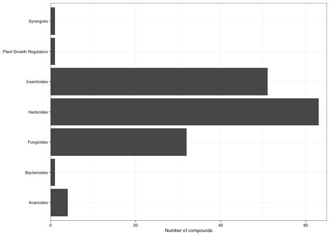
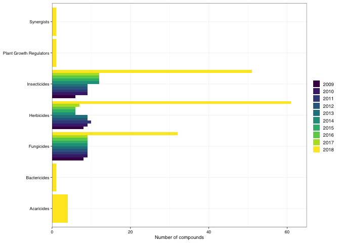

One important part of data exploration is **counting things**, whether this is as a summary variable, or as a check to better understand your data or ensure that the data is the way that you thought it was.

For this class we are going to use a slightly modified version of a [dataset](https://data.princeedwardisland.ca/Environment-and-Food/OD0001-Pesticide-Analysis-for-Stream-Water/jj4n-qqq2) of pesticide sample analyses results for stream water samples for the province of PEI's Pesticide Monitoring Program. The sampling includes a total of 9 rivers across PEI, with at least 3 of the rivers being sampled each year.


```r
pest_original <- read_csv(here("data", "pesticides.csv"))
```

```
## Parsed with column specification:
## cols(
##   compound = col_character(),
##   river = col_character(),
##   date_sampled = col_character(),
##   year = col_double(),
##   result = col_character(),
##   result_unit = col_character(),
##   group = col_character()
## )
```

```r
pest_data <- pest_original %>% 
  clean_names() %>% 
  glimpse
```

```
## Rows: 6,461
## Columns: 7
## $ compound     <chr> "Azinphos-Methyl", "Methamidophos", "Metconazole", "Imid…
## $ river        <chr> "Clyde River", "Huntley River", "Dunk River", "Clyde Riv…
## $ date_sampled <chr> "06/15/2017 12:00:00 AM", "10/05/2017 12:00:00 AM", "05/…
## $ year         <dbl> 2017, 2017, 2018, 2009, 2015, 2018, 2016, 2017, 2017, 20…
## $ result       <chr> "< 0.03", "< 5.0", "< 0.152", "< 0.1", "< 0.04", "< 0.01…
## $ result_unit  <chr> "ng/ml", "ng/ml", "ng/ml", "ng/ml", "ng/ml", "ng/ml", "n…
## $ group        <chr> "Insecticides", "Insecticides", "Fungicides", "Insectici…
```

```r
print(pest_data)
```

```
## # A tibble: 6,461 x 7
##    compound      river      date_sampled       year result result_unit group    
##    <chr>         <chr>      <chr>             <dbl> <chr>  <chr>       <chr>    
##  1 Azinphos-Met… Clyde Riv… 06/15/2017 12:00…  2017 < 0.03 ng/ml       Insectic…
##  2 Methamidophos Huntley R… 10/05/2017 12:00…  2017 < 5.0  ng/ml       Insectic…
##  3 Metconazole   Dunk River 05/28/2018 12:00…  2018 < 0.1… ng/ml       Fungicid…
##  4 Imidacloprid  Clyde Riv… 07/22/2009 12:00…  2009 < 0.1  ng/ml       Insectic…
##  5 Dimethoate    Wilmot Ri… 08/13/2015 12:00…  2015 < 0.04 ng/ml       Insectic…
##  6 Chlorpyrifos  Clyde Riv… 07/25/2018 12:00…  2018 < 0.01 ng/ml       Insectic…
##  7 Carbofuran    Morell Ri… 07/19/2016 12:00…  2016 < 0.02 ng/ml       Insectic…
##  8 Azinphos-Met… Wilmot Ri… 07/26/2017 12:00…  2017 < 0.03 ng/ml       Insectic…
##  9 Metalaxyl     Mill River 08/24/2017 12:00…  2017 < 0.03 ng/ml       Fungicid…
## 10 Clothianidin  Mill River 08/18/2014 12:00…  2014 0.01   ng/ml       Insectic…
## # … with 6,451 more rows
```
# Let's answer some questions about the data

## What rivers where sampled

If i wanted to get a list of all the rivers that were sampled each year, I can use `distinct()` which will just give me a list of unique character strings per year


```r
pest_data %>% 
  distinct(river)
```

```
## # A tibble: 9 x 1
##   river         
##   <chr>         
## 1 Clyde River   
## 2 Huntley River 
## 3 Dunk River    
## 4 Wilmot River  
## 5 Morell River  
## 6 Mill River    
## 7 Winter River  
## 8 West River    
## 9 Montague River
```
But, how many sites is this? I can just apply `count()` to this list and it will return the number of elements.


```r
pest_data %>% 
  distinct(river) %>% 
  tally()
```

```
## # A tibble: 1 x 1
##       n
##   <int>
## 1     9
```

## How many rivers were sampled per year

We can list several variables inside `distinct()`. This allows us to request the distinct combinations of those variables, in this case, unique combinations of year and river


```r
 pest_data %>%
  distinct(year, river) 
```

```
## # A tibble: 42 x 2
##    river          year
##    <chr>         <dbl>
##  1 Clyde River    2017
##  2 Huntley River  2017
##  3 Dunk River     2018
##  4 Clyde River    2009
##  5 Wilmot River   2015
##  6 Clyde River    2018
##  7 Morell River   2016
##  8 Wilmot River   2017
##  9 Mill River     2017
## 10 Mill River     2014
## # … with 32 more rows
```


```r
 pest_data %>%
  distinct(year, river) %>% 
  tally()
```

```
## # A tibble: 1 x 1
##       n
##   <int>
## 1    42
```

That didnt quite do what we wanted... It told us that there are 42 unique convinations of site and river, but not how many are for each speciffic year.

We need an extra step


```r
 pest_data %>%
  distinct(year, river) %>% 
  group_by(year) %>% 
  tally()
```

```
## # A tibble: 10 x 2
##     year     n
##    <dbl> <int>
##  1  2009     3
##  2  2010     3
##  3  2011     3
##  4  2012     3
##  5  2013     3
##  6  2014     3
##  7  2015     3
##  8  2016     3
##  9  2017     9
## 10  2018     9
```

Now we are talking! But, there is even an easier option. The function `count()` is a combination of `group_by()` and `tally()` all in one step!


```r
 pest_data %>%
  distinct(year, river) %>% 
  count(year) # here year means "by year"
```

```
## # A tibble: 10 x 2
##     year     n
##    <dbl> <int>
##  1  2009     3
##  2  2010     3
##  3  2011     3
##  4  2012     3
##  5  2013     3
##  6  2014     3
##  7  2015     3
##  8  2016     3
##  9  2017     9
## 10  2018     9
```

**NOTE**: It is a bit counter-intuitive, but what goes inside of the `count()` is not the thing you want to count (i dont want to count years, i want to count rivers!) but what groupings you want to do for your counting

## What compounds were analysed?

We can do exactly the same for the compounds


```r
pest_data %>% 
  distinct(compound)
```

```
## # A tibble: 153 x 1
##    compound       
##    <chr>          
##  1 Azinphos-Methyl
##  2 Methamidophos  
##  3 Metconazole    
##  4 Imidacloprid   
##  5 Dimethoate     
##  6 Chlorpyrifos   
##  7 Carbofuran     
##  8 Metalaxyl      
##  9 Clothianidin   
## 10 Hexazinone     
## # … with 143 more rows
```
How many compounds is that?


```r
pest_data %>% 
  distinct(compound) %>% 
  tally()
```

```
## # A tibble: 1 x 1
##       n
##   <int>
## 1   153
```

## How many compound of each pesticide group were analysed?

The different pesticides measured belong to different pesticide groups. In order to count how many pesticides of each group were measured, first we make a list of distinct pesticide/group combinations in the dataset with `distinct()` and then we count how many on each group using `count()`  


```r
pest_data %>% 
  distinct(compound, group)
```

```
## # A tibble: 153 x 2
##    compound        group       
##    <chr>           <chr>       
##  1 Azinphos-Methyl Insecticides
##  2 Methamidophos   Insecticides
##  3 Metconazole     Fungicides  
##  4 Imidacloprid    Insecticides
##  5 Dimethoate      Insecticides
##  6 Chlorpyrifos    Insecticides
##  7 Carbofuran      Insecticides
##  8 Metalaxyl       Fungicides  
##  9 Clothianidin    Insecticides
## 10 Hexazinone      Herbicides  
## # … with 143 more rows
```


```r
pest_groups <- pest_data %>% 
  distinct(compound, group) %>% 
  count(group)

print(pest_groups)
```

```
## # A tibble: 7 x 2
##   group                       n
##   <chr>                   <int>
## 1 Acaricides                  4
## 2 Bactericides                1
## 3 Fungicides                 32
## 4 Herbicides                 63
## 5 Insecticides               51
## 6 Plant Growth Regulators     1
## 7 Synergists                  1
```


```r
pest_groups %>% 
  ggplot() +
  geom_col(aes(x = n, y = group)) +
  scale_fill_viridis(discrete = TRUE) +
  scale_x_continuous(limits = c(0, 65), expand = expansion(mult = 0, add = 0)) +
  theme_pepe() +
  labs(y = NULL,
       x = "Number of compounds")
```

<!-- -->
What if i wanted to know this distribution **per year**?

This one is a bit trickier, but it is just a matter of doing things step by step (thank you pipes!). 

We want to know things also **by year** so now we can just add `year` to our 


```r
pest_group_year <- pest_data %>% 
  distinct(year, compound, group) %>%  # distinct combinations of year, compound and group
  count(year, group) # Jut like in group_by() we can ask it to count the combinations of more than one variable

print(pest_group_year)
```

```
## # A tibble: 34 x 3
##     year group            n
##    <dbl> <chr>        <int>
##  1  2009 Fungicides       8
##  2  2009 Herbicides       8
##  3  2009 Insecticides     6
##  4  2010 Fungicides       9
##  5  2010 Herbicides       9
##  6  2010 Insecticides     9
##  7  2011 Fungicides       9
##  8  2011 Herbicides      10
##  9  2011 Insecticides     9
## 10  2012 Fungicides       9
## # … with 24 more rows
```
This allows us to create some nice summary figures


```r
pest_group_year %>% 
  mutate(year = factor(year)) %>% 
  ggplot() +
  geom_col(aes(x = n, y = group, fill = year), position = "dodge") +
  scale_fill_viridis(discrete = TRUE) +
  scale_x_continuous(limits = c(0, 65), expand = expansion(mult = 0, add = 0)) +
  theme_pepe() +
  labs(y = NULL,
       x = "Number of compounds")
```

<!-- -->

# How many samples were collected

One common thing to report is the number of samples that were collected (or considered in an analysis). Calculating the number of samples in this dataset (and many other like it, remember this was taken from a government database) is a bit tricky, because the data is already in **long form**, as such, the *"one sample per row" does not apply anymore. Now each row is a specific measure of one compound, but a whole pannel of compounds were measured for each sample (i.e. each bottle taken of the river).

However we can still count the number of samples if we get a bit creative.

In this case, a particular sample is each individual combination of river and date. I went to a speciffic river, on a speciffic date and grabbed a bottle of water, that is a sammple. So if i count the number of unique combinations of date AND river, then i can count the samples


```r
pest_data %>% 
  distinct(date_sampled, river) %>% 
  tally()
```

```
## # A tibble: 1 x 1
##       n
##   <int>
## 1   192
```

Could we calculate the number of samples collected each year?


```r
pest_data %>% 
  distinct(year, date_sampled, river) %>% 
  count(year) # count "by_year"
```

```
## # A tibble: 10 x 2
##     year     n
##    <dbl> <int>
##  1  2009    12
##  2  2010     9
##  3  2011    12
##  4  2012    12
##  5  2013    12
##  6  2014    12
##  7  2015    12
##  8  2016    12
##  9  2017    45
## 10  2018    54
```


# Creating nice summary tables

Let's what compounds were measured each year:


```r
pest_data %>% 
  distinct(year, compound)
```

```
## # A tibble: 391 x 2
##    compound         year
##    <chr>           <dbl>
##  1 Azinphos-Methyl  2017
##  2 Methamidophos    2017
##  3 Metconazole      2018
##  4 Imidacloprid     2009
##  5 Dimethoate       2015
##  6 Chlorpyrifos     2018
##  7 Carbofuran       2016
##  8 Metalaxyl        2017
##  9 Clothianidin     2014
## 10 Hexazinone       2014
## # … with 381 more rows
```

This is a great format for us to keep on working with the data, but what if i wanted to make it more visually appealing for a paper?

Here is one approach.

Let's start by adding a dummy column of ones, by asking `count()` to count for all the groups:


```r
pest_data %>% 
  distinct(year, compound) %>% 
  count(year, compound)
```

```
## # A tibble: 391 x 3
##     year compound                n
##    <dbl> <chr>               <int>
##  1  2009 Atrazine                1
##  2  2009 Azinphos-Methyl         1
##  3  2009 Azoxystrobin            1
##  4  2009 Carbofuran              1
##  5  2009 Chlorantraniliprole     1
##  6  2009 Chlorothalonil          1
##  7  2009 Dimethoate              1
##  8  2009 Hexazinone              1
##  9  2009 Imidacloprid            1
## 10  2009 Linuron                 1
## # … with 381 more rows
```

Now we can use `pivot_wider()`, telling it to fill the empty combinations (i.e. those that don exist in this dataset) with zeros and we have a nice presence/absence table that we can use for a publication (maybe in the SI)


```r
compoun_year_table <- pest_data %>% 
  distinct(year, compound) %>% 
  count(year, compound) %>% 
  pivot_wider(names_from = year, values_from = n, values_fill = 0)

print(compoun_year_table)
```

```
## # A tibble: 153 x 11
##    compound `2009` `2010` `2011` `2012` `2013` `2014` `2015` `2016` `2017`
##    <chr>     <int>  <int>  <int>  <int>  <int>  <int>  <int>  <int>  <int>
##  1 Atrazine      1      1      1      1      1      1      1      1      1
##  2 Azinpho…      1      1      1      1      1      1      1      1      1
##  3 Azoxyst…      1      1      1      1      1      1      1      1      1
##  4 Carbofu…      1      1      1      1      1      1      1      1      1
##  5 Chloran…      1      1      1      1      1      1      1      1      1
##  6 Chlorot…      1      1      1      1      1      1      1      1      1
##  7 Dimetho…      1      1      1      1      1      1      1      1      1
##  8 Hexazin…      1      1      1      1      1      1      1      1      1
##  9 Imidacl…      1      1      1      1      1      1      1      1      1
## 10 Linuron       1      1      1      1      1      1      1      1      1
## # … with 143 more rows, and 1 more variable: `2018` <int>
```

# Quick note on some nice tools to make nice-looking tables

By now we have seen how we can save our data frames (or tibbles) into a csv that we can then add to our publications. When we have a chunk of code that generates one of these, RStudio shows us a nice interactive table, but when we knit to `.md` or `html` R only gives us the same output we would get in the console, not very nice, and not even all the data.

There are a number of packages available that help you formating a data frame or tibble into a nice display table. One of them is `{gt}`. 

`{gt}` works a bit like `{ggplot}` but instead of layers of visual data, you can add speciffic instructions for formating a table. You can read more on their [page](https://gt.rstudio.com/index.html).


```r
compoun_year_table %>% 
  gt() %>%      # note that on gt() you add "layers" with a pipe, not a "+" like in ggplot!
   tab_header(
    title = md("**Sampled compounds**"),
    subtitle = str_c("Distribution of sampled compounds between", min(pest_data$year), "&", max(pest_data$year), sep = " ")
  )
```

<!--html_preserve--><style>html {
  font-family: -apple-system, BlinkMacSystemFont, 'Segoe UI', Roboto, Oxygen, Ubuntu, Cantarell, 'Helvetica Neue', 'Fira Sans', 'Droid Sans', Arial, sans-serif;
}

#zinleqlvvb .gt_table {
  display: table;
  border-collapse: collapse;
  margin-left: auto;
  margin-right: auto;
  color: #333333;
  font-size: 16px;
  font-weight: normal;
  font-style: normal;
  background-color: #FFFFFF;
  width: auto;
  border-top-style: solid;
  border-top-width: 2px;
  border-top-color: #A8A8A8;
  border-right-style: none;
  border-right-width: 2px;
  border-right-color: #D3D3D3;
  border-bottom-style: solid;
  border-bottom-width: 2px;
  border-bottom-color: #A8A8A8;
  border-left-style: none;
  border-left-width: 2px;
  border-left-color: #D3D3D3;
}

#zinleqlvvb .gt_heading {
  background-color: #FFFFFF;
  text-align: center;
  border-bottom-color: #FFFFFF;
  border-left-style: none;
  border-left-width: 1px;
  border-left-color: #D3D3D3;
  border-right-style: none;
  border-right-width: 1px;
  border-right-color: #D3D3D3;
}

#zinleqlvvb .gt_title {
  color: #333333;
  font-size: 125%;
  font-weight: initial;
  padding-top: 4px;
  padding-bottom: 4px;
  border-bottom-color: #FFFFFF;
  border-bottom-width: 0;
}

#zinleqlvvb .gt_subtitle {
  color: #333333;
  font-size: 85%;
  font-weight: initial;
  padding-top: 0;
  padding-bottom: 4px;
  border-top-color: #FFFFFF;
  border-top-width: 0;
}

#zinleqlvvb .gt_bottom_border {
  border-bottom-style: solid;
  border-bottom-width: 2px;
  border-bottom-color: #D3D3D3;
}

#zinleqlvvb .gt_col_headings {
  border-top-style: solid;
  border-top-width: 2px;
  border-top-color: #D3D3D3;
  border-bottom-style: solid;
  border-bottom-width: 2px;
  border-bottom-color: #D3D3D3;
  border-left-style: none;
  border-left-width: 1px;
  border-left-color: #D3D3D3;
  border-right-style: none;
  border-right-width: 1px;
  border-right-color: #D3D3D3;
}

#zinleqlvvb .gt_col_heading {
  color: #333333;
  background-color: #FFFFFF;
  font-size: 100%;
  font-weight: normal;
  text-transform: inherit;
  border-left-style: none;
  border-left-width: 1px;
  border-left-color: #D3D3D3;
  border-right-style: none;
  border-right-width: 1px;
  border-right-color: #D3D3D3;
  vertical-align: bottom;
  padding-top: 5px;
  padding-bottom: 6px;
  padding-left: 5px;
  padding-right: 5px;
  overflow-x: hidden;
}

#zinleqlvvb .gt_column_spanner_outer {
  color: #333333;
  background-color: #FFFFFF;
  font-size: 100%;
  font-weight: normal;
  text-transform: inherit;
  padding-top: 0;
  padding-bottom: 0;
  padding-left: 4px;
  padding-right: 4px;
}

#zinleqlvvb .gt_column_spanner_outer:first-child {
  padding-left: 0;
}

#zinleqlvvb .gt_column_spanner_outer:last-child {
  padding-right: 0;
}

#zinleqlvvb .gt_column_spanner {
  border-bottom-style: solid;
  border-bottom-width: 2px;
  border-bottom-color: #D3D3D3;
  vertical-align: bottom;
  padding-top: 5px;
  padding-bottom: 6px;
  overflow-x: hidden;
  display: inline-block;
  width: 100%;
}

#zinleqlvvb .gt_group_heading {
  padding: 8px;
  color: #333333;
  background-color: #FFFFFF;
  font-size: 100%;
  font-weight: initial;
  text-transform: inherit;
  border-top-style: solid;
  border-top-width: 2px;
  border-top-color: #D3D3D3;
  border-bottom-style: solid;
  border-bottom-width: 2px;
  border-bottom-color: #D3D3D3;
  border-left-style: none;
  border-left-width: 1px;
  border-left-color: #D3D3D3;
  border-right-style: none;
  border-right-width: 1px;
  border-right-color: #D3D3D3;
  vertical-align: middle;
}

#zinleqlvvb .gt_empty_group_heading {
  padding: 0.5px;
  color: #333333;
  background-color: #FFFFFF;
  font-size: 100%;
  font-weight: initial;
  border-top-style: solid;
  border-top-width: 2px;
  border-top-color: #D3D3D3;
  border-bottom-style: solid;
  border-bottom-width: 2px;
  border-bottom-color: #D3D3D3;
  vertical-align: middle;
}

#zinleqlvvb .gt_from_md > :first-child {
  margin-top: 0;
}

#zinleqlvvb .gt_from_md > :last-child {
  margin-bottom: 0;
}

#zinleqlvvb .gt_row {
  padding-top: 8px;
  padding-bottom: 8px;
  padding-left: 5px;
  padding-right: 5px;
  margin: 10px;
  border-top-style: solid;
  border-top-width: 1px;
  border-top-color: #D3D3D3;
  border-left-style: none;
  border-left-width: 1px;
  border-left-color: #D3D3D3;
  border-right-style: none;
  border-right-width: 1px;
  border-right-color: #D3D3D3;
  vertical-align: middle;
  overflow-x: hidden;
}

#zinleqlvvb .gt_stub {
  color: #333333;
  background-color: #FFFFFF;
  font-size: 100%;
  font-weight: initial;
  text-transform: inherit;
  border-right-style: solid;
  border-right-width: 2px;
  border-right-color: #D3D3D3;
  padding-left: 12px;
}

#zinleqlvvb .gt_summary_row {
  color: #333333;
  background-color: #FFFFFF;
  text-transform: inherit;
  padding-top: 8px;
  padding-bottom: 8px;
  padding-left: 5px;
  padding-right: 5px;
}

#zinleqlvvb .gt_first_summary_row {
  padding-top: 8px;
  padding-bottom: 8px;
  padding-left: 5px;
  padding-right: 5px;
  border-top-style: solid;
  border-top-width: 2px;
  border-top-color: #D3D3D3;
}

#zinleqlvvb .gt_grand_summary_row {
  color: #333333;
  background-color: #FFFFFF;
  text-transform: inherit;
  padding-top: 8px;
  padding-bottom: 8px;
  padding-left: 5px;
  padding-right: 5px;
}

#zinleqlvvb .gt_first_grand_summary_row {
  padding-top: 8px;
  padding-bottom: 8px;
  padding-left: 5px;
  padding-right: 5px;
  border-top-style: double;
  border-top-width: 6px;
  border-top-color: #D3D3D3;
}

#zinleqlvvb .gt_striped {
  background-color: rgba(128, 128, 128, 0.05);
}

#zinleqlvvb .gt_table_body {
  border-top-style: solid;
  border-top-width: 2px;
  border-top-color: #D3D3D3;
  border-bottom-style: solid;
  border-bottom-width: 2px;
  border-bottom-color: #D3D3D3;
}

#zinleqlvvb .gt_footnotes {
  color: #333333;
  background-color: #FFFFFF;
  border-bottom-style: none;
  border-bottom-width: 2px;
  border-bottom-color: #D3D3D3;
  border-left-style: none;
  border-left-width: 2px;
  border-left-color: #D3D3D3;
  border-right-style: none;
  border-right-width: 2px;
  border-right-color: #D3D3D3;
}

#zinleqlvvb .gt_footnote {
  margin: 0px;
  font-size: 90%;
  padding: 4px;
}

#zinleqlvvb .gt_sourcenotes {
  color: #333333;
  background-color: #FFFFFF;
  border-bottom-style: none;
  border-bottom-width: 2px;
  border-bottom-color: #D3D3D3;
  border-left-style: none;
  border-left-width: 2px;
  border-left-color: #D3D3D3;
  border-right-style: none;
  border-right-width: 2px;
  border-right-color: #D3D3D3;
}

#zinleqlvvb .gt_sourcenote {
  font-size: 90%;
  padding: 4px;
}

#zinleqlvvb .gt_left {
  text-align: left;
}

#zinleqlvvb .gt_center {
  text-align: center;
}

#zinleqlvvb .gt_right {
  text-align: right;
  font-variant-numeric: tabular-nums;
}

#zinleqlvvb .gt_font_normal {
  font-weight: normal;
}

#zinleqlvvb .gt_font_bold {
  font-weight: bold;
}

#zinleqlvvb .gt_font_italic {
  font-style: italic;
}

#zinleqlvvb .gt_super {
  font-size: 65%;
}

#zinleqlvvb .gt_footnote_marks {
  font-style: italic;
  font-size: 65%;
}
</style>
<div id="zinleqlvvb" style="overflow-x:auto;overflow-y:auto;width:auto;height:auto;"><table class="gt_table">
  <thead class="gt_header">
    <tr>
      <th colspan="11" class="gt_heading gt_title gt_font_normal" style><strong>Sampled compounds</strong></th>
    </tr>
    <tr>
      <th colspan="11" class="gt_heading gt_subtitle gt_font_normal gt_bottom_border" style>Distribution of sampled compounds between 2009 &amp; 2018</th>
    </tr>
  </thead>
  <thead class="gt_col_headings">
    <tr>
      <th class="gt_col_heading gt_columns_bottom_border gt_left" rowspan="1" colspan="1">compound</th>
      <th class="gt_col_heading gt_columns_bottom_border gt_center" rowspan="1" colspan="1">2009</th>
      <th class="gt_col_heading gt_columns_bottom_border gt_center" rowspan="1" colspan="1">2010</th>
      <th class="gt_col_heading gt_columns_bottom_border gt_center" rowspan="1" colspan="1">2011</th>
      <th class="gt_col_heading gt_columns_bottom_border gt_center" rowspan="1" colspan="1">2012</th>
      <th class="gt_col_heading gt_columns_bottom_border gt_center" rowspan="1" colspan="1">2013</th>
      <th class="gt_col_heading gt_columns_bottom_border gt_center" rowspan="1" colspan="1">2014</th>
      <th class="gt_col_heading gt_columns_bottom_border gt_center" rowspan="1" colspan="1">2015</th>
      <th class="gt_col_heading gt_columns_bottom_border gt_center" rowspan="1" colspan="1">2016</th>
      <th class="gt_col_heading gt_columns_bottom_border gt_center" rowspan="1" colspan="1">2017</th>
      <th class="gt_col_heading gt_columns_bottom_border gt_center" rowspan="1" colspan="1">2018</th>
    </tr>
  </thead>
  <tbody class="gt_table_body">
    <tr>
      <td class="gt_row gt_left">Atrazine</td>
      <td class="gt_row gt_center">1</td>
      <td class="gt_row gt_center">1</td>
      <td class="gt_row gt_center">1</td>
      <td class="gt_row gt_center">1</td>
      <td class="gt_row gt_center">1</td>
      <td class="gt_row gt_center">1</td>
      <td class="gt_row gt_center">1</td>
      <td class="gt_row gt_center">1</td>
      <td class="gt_row gt_center">1</td>
      <td class="gt_row gt_center">1</td>
    </tr>
    <tr>
      <td class="gt_row gt_left">Azinphos-Methyl</td>
      <td class="gt_row gt_center">1</td>
      <td class="gt_row gt_center">1</td>
      <td class="gt_row gt_center">1</td>
      <td class="gt_row gt_center">1</td>
      <td class="gt_row gt_center">1</td>
      <td class="gt_row gt_center">1</td>
      <td class="gt_row gt_center">1</td>
      <td class="gt_row gt_center">1</td>
      <td class="gt_row gt_center">1</td>
      <td class="gt_row gt_center">1</td>
    </tr>
    <tr>
      <td class="gt_row gt_left">Azoxystrobin</td>
      <td class="gt_row gt_center">1</td>
      <td class="gt_row gt_center">1</td>
      <td class="gt_row gt_center">1</td>
      <td class="gt_row gt_center">1</td>
      <td class="gt_row gt_center">1</td>
      <td class="gt_row gt_center">1</td>
      <td class="gt_row gt_center">1</td>
      <td class="gt_row gt_center">1</td>
      <td class="gt_row gt_center">1</td>
      <td class="gt_row gt_center">1</td>
    </tr>
    <tr>
      <td class="gt_row gt_left">Carbofuran</td>
      <td class="gt_row gt_center">1</td>
      <td class="gt_row gt_center">1</td>
      <td class="gt_row gt_center">1</td>
      <td class="gt_row gt_center">1</td>
      <td class="gt_row gt_center">1</td>
      <td class="gt_row gt_center">1</td>
      <td class="gt_row gt_center">1</td>
      <td class="gt_row gt_center">1</td>
      <td class="gt_row gt_center">1</td>
      <td class="gt_row gt_center">1</td>
    </tr>
    <tr>
      <td class="gt_row gt_left">Chlorantraniliprole</td>
      <td class="gt_row gt_center">1</td>
      <td class="gt_row gt_center">1</td>
      <td class="gt_row gt_center">1</td>
      <td class="gt_row gt_center">1</td>
      <td class="gt_row gt_center">1</td>
      <td class="gt_row gt_center">1</td>
      <td class="gt_row gt_center">1</td>
      <td class="gt_row gt_center">1</td>
      <td class="gt_row gt_center">1</td>
      <td class="gt_row gt_center">1</td>
    </tr>
    <tr>
      <td class="gt_row gt_left">Chlorothalonil</td>
      <td class="gt_row gt_center">1</td>
      <td class="gt_row gt_center">1</td>
      <td class="gt_row gt_center">1</td>
      <td class="gt_row gt_center">1</td>
      <td class="gt_row gt_center">1</td>
      <td class="gt_row gt_center">1</td>
      <td class="gt_row gt_center">1</td>
      <td class="gt_row gt_center">1</td>
      <td class="gt_row gt_center">1</td>
      <td class="gt_row gt_center">1</td>
    </tr>
    <tr>
      <td class="gt_row gt_left">Dimethoate</td>
      <td class="gt_row gt_center">1</td>
      <td class="gt_row gt_center">1</td>
      <td class="gt_row gt_center">1</td>
      <td class="gt_row gt_center">1</td>
      <td class="gt_row gt_center">1</td>
      <td class="gt_row gt_center">1</td>
      <td class="gt_row gt_center">1</td>
      <td class="gt_row gt_center">1</td>
      <td class="gt_row gt_center">1</td>
      <td class="gt_row gt_center">1</td>
    </tr>
    <tr>
      <td class="gt_row gt_left">Hexazinone</td>
      <td class="gt_row gt_center">1</td>
      <td class="gt_row gt_center">1</td>
      <td class="gt_row gt_center">1</td>
      <td class="gt_row gt_center">1</td>
      <td class="gt_row gt_center">1</td>
      <td class="gt_row gt_center">1</td>
      <td class="gt_row gt_center">1</td>
      <td class="gt_row gt_center">1</td>
      <td class="gt_row gt_center">1</td>
      <td class="gt_row gt_center">1</td>
    </tr>
    <tr>
      <td class="gt_row gt_left">Imidacloprid</td>
      <td class="gt_row gt_center">1</td>
      <td class="gt_row gt_center">1</td>
      <td class="gt_row gt_center">1</td>
      <td class="gt_row gt_center">1</td>
      <td class="gt_row gt_center">1</td>
      <td class="gt_row gt_center">1</td>
      <td class="gt_row gt_center">1</td>
      <td class="gt_row gt_center">1</td>
      <td class="gt_row gt_center">1</td>
      <td class="gt_row gt_center">1</td>
    </tr>
    <tr>
      <td class="gt_row gt_left">Linuron</td>
      <td class="gt_row gt_center">1</td>
      <td class="gt_row gt_center">1</td>
      <td class="gt_row gt_center">1</td>
      <td class="gt_row gt_center">1</td>
      <td class="gt_row gt_center">1</td>
      <td class="gt_row gt_center">1</td>
      <td class="gt_row gt_center">1</td>
      <td class="gt_row gt_center">1</td>
      <td class="gt_row gt_center">1</td>
      <td class="gt_row gt_center">1</td>
    </tr>
    <tr>
      <td class="gt_row gt_left">Mancozeb</td>
      <td class="gt_row gt_center">1</td>
      <td class="gt_row gt_center">1</td>
      <td class="gt_row gt_center">1</td>
      <td class="gt_row gt_center">1</td>
      <td class="gt_row gt_center">1</td>
      <td class="gt_row gt_center">1</td>
      <td class="gt_row gt_center">1</td>
      <td class="gt_row gt_center">1</td>
      <td class="gt_row gt_center">1</td>
      <td class="gt_row gt_center">1</td>
    </tr>
    <tr>
      <td class="gt_row gt_left">Mcpa</td>
      <td class="gt_row gt_center">1</td>
      <td class="gt_row gt_center">1</td>
      <td class="gt_row gt_center">1</td>
      <td class="gt_row gt_center">1</td>
      <td class="gt_row gt_center">1</td>
      <td class="gt_row gt_center">0</td>
      <td class="gt_row gt_center">0</td>
      <td class="gt_row gt_center">0</td>
      <td class="gt_row gt_center">0</td>
      <td class="gt_row gt_center">1</td>
    </tr>
    <tr>
      <td class="gt_row gt_left">Metalaxyl</td>
      <td class="gt_row gt_center">1</td>
      <td class="gt_row gt_center">1</td>
      <td class="gt_row gt_center">1</td>
      <td class="gt_row gt_center">1</td>
      <td class="gt_row gt_center">1</td>
      <td class="gt_row gt_center">1</td>
      <td class="gt_row gt_center">1</td>
      <td class="gt_row gt_center">1</td>
      <td class="gt_row gt_center">1</td>
      <td class="gt_row gt_center">1</td>
    </tr>
    <tr>
      <td class="gt_row gt_left">Methamidophos</td>
      <td class="gt_row gt_center">1</td>
      <td class="gt_row gt_center">1</td>
      <td class="gt_row gt_center">1</td>
      <td class="gt_row gt_center">1</td>
      <td class="gt_row gt_center">1</td>
      <td class="gt_row gt_center">1</td>
      <td class="gt_row gt_center">1</td>
      <td class="gt_row gt_center">1</td>
      <td class="gt_row gt_center">1</td>
      <td class="gt_row gt_center">1</td>
    </tr>
    <tr>
      <td class="gt_row gt_left">Metiram</td>
      <td class="gt_row gt_center">1</td>
      <td class="gt_row gt_center">1</td>
      <td class="gt_row gt_center">1</td>
      <td class="gt_row gt_center">1</td>
      <td class="gt_row gt_center">1</td>
      <td class="gt_row gt_center">1</td>
      <td class="gt_row gt_center">1</td>
      <td class="gt_row gt_center">1</td>
      <td class="gt_row gt_center">1</td>
      <td class="gt_row gt_center">1</td>
    </tr>
    <tr>
      <td class="gt_row gt_left">Metobromuron</td>
      <td class="gt_row gt_center">1</td>
      <td class="gt_row gt_center">1</td>
      <td class="gt_row gt_center">1</td>
      <td class="gt_row gt_center">1</td>
      <td class="gt_row gt_center">1</td>
      <td class="gt_row gt_center">1</td>
      <td class="gt_row gt_center">1</td>
      <td class="gt_row gt_center">1</td>
      <td class="gt_row gt_center">1</td>
      <td class="gt_row gt_center">1</td>
    </tr>
    <tr>
      <td class="gt_row gt_left">Metribuzin</td>
      <td class="gt_row gt_center">1</td>
      <td class="gt_row gt_center">1</td>
      <td class="gt_row gt_center">1</td>
      <td class="gt_row gt_center">1</td>
      <td class="gt_row gt_center">1</td>
      <td class="gt_row gt_center">1</td>
      <td class="gt_row gt_center">1</td>
      <td class="gt_row gt_center">1</td>
      <td class="gt_row gt_center">1</td>
      <td class="gt_row gt_center">1</td>
    </tr>
    <tr>
      <td class="gt_row gt_left">Paraquat</td>
      <td class="gt_row gt_center">1</td>
      <td class="gt_row gt_center">1</td>
      <td class="gt_row gt_center">1</td>
      <td class="gt_row gt_center">1</td>
      <td class="gt_row gt_center">1</td>
      <td class="gt_row gt_center">0</td>
      <td class="gt_row gt_center">0</td>
      <td class="gt_row gt_center">0</td>
      <td class="gt_row gt_center">0</td>
      <td class="gt_row gt_center">0</td>
    </tr>
    <tr>
      <td class="gt_row gt_left">Propiconazole</td>
      <td class="gt_row gt_center">1</td>
      <td class="gt_row gt_center">1</td>
      <td class="gt_row gt_center">1</td>
      <td class="gt_row gt_center">1</td>
      <td class="gt_row gt_center">1</td>
      <td class="gt_row gt_center">1</td>
      <td class="gt_row gt_center">1</td>
      <td class="gt_row gt_center">1</td>
      <td class="gt_row gt_center">1</td>
      <td class="gt_row gt_center">1</td>
    </tr>
    <tr>
      <td class="gt_row gt_left">Rimsulfuron</td>
      <td class="gt_row gt_center">1</td>
      <td class="gt_row gt_center">1</td>
      <td class="gt_row gt_center">1</td>
      <td class="gt_row gt_center">1</td>
      <td class="gt_row gt_center">1</td>
      <td class="gt_row gt_center">1</td>
      <td class="gt_row gt_center">1</td>
      <td class="gt_row gt_center">1</td>
      <td class="gt_row gt_center">1</td>
      <td class="gt_row gt_center">1</td>
    </tr>
    <tr>
      <td class="gt_row gt_left">Thiabendazole</td>
      <td class="gt_row gt_center">1</td>
      <td class="gt_row gt_center">1</td>
      <td class="gt_row gt_center">1</td>
      <td class="gt_row gt_center">1</td>
      <td class="gt_row gt_center">1</td>
      <td class="gt_row gt_center">1</td>
      <td class="gt_row gt_center">1</td>
      <td class="gt_row gt_center">1</td>
      <td class="gt_row gt_center">1</td>
      <td class="gt_row gt_center">1</td>
    </tr>
    <tr>
      <td class="gt_row gt_left">Thiophanate-Methyl</td>
      <td class="gt_row gt_center">1</td>
      <td class="gt_row gt_center">1</td>
      <td class="gt_row gt_center">1</td>
      <td class="gt_row gt_center">1</td>
      <td class="gt_row gt_center">1</td>
      <td class="gt_row gt_center">1</td>
      <td class="gt_row gt_center">1</td>
      <td class="gt_row gt_center">1</td>
      <td class="gt_row gt_center">1</td>
      <td class="gt_row gt_center">1</td>
    </tr>
    <tr>
      <td class="gt_row gt_left">Clothianidin</td>
      <td class="gt_row gt_center">0</td>
      <td class="gt_row gt_center">1</td>
      <td class="gt_row gt_center">1</td>
      <td class="gt_row gt_center">1</td>
      <td class="gt_row gt_center">1</td>
      <td class="gt_row gt_center">1</td>
      <td class="gt_row gt_center">1</td>
      <td class="gt_row gt_center">1</td>
      <td class="gt_row gt_center">1</td>
      <td class="gt_row gt_center">1</td>
    </tr>
    <tr>
      <td class="gt_row gt_left">Diquat</td>
      <td class="gt_row gt_center">0</td>
      <td class="gt_row gt_center">1</td>
      <td class="gt_row gt_center">1</td>
      <td class="gt_row gt_center">1</td>
      <td class="gt_row gt_center">1</td>
      <td class="gt_row gt_center">0</td>
      <td class="gt_row gt_center">0</td>
      <td class="gt_row gt_center">0</td>
      <td class="gt_row gt_center">0</td>
      <td class="gt_row gt_center">0</td>
    </tr>
    <tr>
      <td class="gt_row gt_left">Fludioxonil</td>
      <td class="gt_row gt_center">0</td>
      <td class="gt_row gt_center">1</td>
      <td class="gt_row gt_center">1</td>
      <td class="gt_row gt_center">1</td>
      <td class="gt_row gt_center">1</td>
      <td class="gt_row gt_center">1</td>
      <td class="gt_row gt_center">1</td>
      <td class="gt_row gt_center">1</td>
      <td class="gt_row gt_center">1</td>
      <td class="gt_row gt_center">1</td>
    </tr>
    <tr>
      <td class="gt_row gt_left">Phorate</td>
      <td class="gt_row gt_center">0</td>
      <td class="gt_row gt_center">1</td>
      <td class="gt_row gt_center">1</td>
      <td class="gt_row gt_center">1</td>
      <td class="gt_row gt_center">1</td>
      <td class="gt_row gt_center">1</td>
      <td class="gt_row gt_center">1</td>
      <td class="gt_row gt_center">1</td>
      <td class="gt_row gt_center">1</td>
      <td class="gt_row gt_center">1</td>
    </tr>
    <tr>
      <td class="gt_row gt_left">Thiamethoxam</td>
      <td class="gt_row gt_center">0</td>
      <td class="gt_row gt_center">1</td>
      <td class="gt_row gt_center">1</td>
      <td class="gt_row gt_center">1</td>
      <td class="gt_row gt_center">1</td>
      <td class="gt_row gt_center">1</td>
      <td class="gt_row gt_center">1</td>
      <td class="gt_row gt_center">1</td>
      <td class="gt_row gt_center">1</td>
      <td class="gt_row gt_center">1</td>
    </tr>
    <tr>
      <td class="gt_row gt_left">Glyphosate</td>
      <td class="gt_row gt_center">0</td>
      <td class="gt_row gt_center">0</td>
      <td class="gt_row gt_center">1</td>
      <td class="gt_row gt_center">0</td>
      <td class="gt_row gt_center">0</td>
      <td class="gt_row gt_center">0</td>
      <td class="gt_row gt_center">0</td>
      <td class="gt_row gt_center">0</td>
      <td class="gt_row gt_center">0</td>
      <td class="gt_row gt_center">1</td>
    </tr>
    <tr>
      <td class="gt_row gt_left">Chlorpyrifos</td>
      <td class="gt_row gt_center">0</td>
      <td class="gt_row gt_center">0</td>
      <td class="gt_row gt_center">0</td>
      <td class="gt_row gt_center">0</td>
      <td class="gt_row gt_center">0</td>
      <td class="gt_row gt_center">1</td>
      <td class="gt_row gt_center">1</td>
      <td class="gt_row gt_center">1</td>
      <td class="gt_row gt_center">1</td>
      <td class="gt_row gt_center">1</td>
    </tr>
    <tr>
      <td class="gt_row gt_left">Cypermethrin</td>
      <td class="gt_row gt_center">0</td>
      <td class="gt_row gt_center">0</td>
      <td class="gt_row gt_center">0</td>
      <td class="gt_row gt_center">0</td>
      <td class="gt_row gt_center">0</td>
      <td class="gt_row gt_center">1</td>
      <td class="gt_row gt_center">1</td>
      <td class="gt_row gt_center">1</td>
      <td class="gt_row gt_center">1</td>
      <td class="gt_row gt_center">1</td>
    </tr>
    <tr>
      <td class="gt_row gt_left">Permethrin</td>
      <td class="gt_row gt_center">0</td>
      <td class="gt_row gt_center">0</td>
      <td class="gt_row gt_center">0</td>
      <td class="gt_row gt_center">0</td>
      <td class="gt_row gt_center">0</td>
      <td class="gt_row gt_center">1</td>
      <td class="gt_row gt_center">1</td>
      <td class="gt_row gt_center">1</td>
      <td class="gt_row gt_center">1</td>
      <td class="gt_row gt_center">1</td>
    </tr>
    <tr>
      <td class="gt_row gt_left">Terbacil</td>
      <td class="gt_row gt_center">0</td>
      <td class="gt_row gt_center">0</td>
      <td class="gt_row gt_center">0</td>
      <td class="gt_row gt_center">0</td>
      <td class="gt_row gt_center">0</td>
      <td class="gt_row gt_center">0</td>
      <td class="gt_row gt_center">0</td>
      <td class="gt_row gt_center">0</td>
      <td class="gt_row gt_center">1</td>
      <td class="gt_row gt_center">1</td>
    </tr>
    <tr>
      <td class="gt_row gt_left">Acetamiprid</td>
      <td class="gt_row gt_center">0</td>
      <td class="gt_row gt_center">0</td>
      <td class="gt_row gt_center">0</td>
      <td class="gt_row gt_center">0</td>
      <td class="gt_row gt_center">0</td>
      <td class="gt_row gt_center">0</td>
      <td class="gt_row gt_center">0</td>
      <td class="gt_row gt_center">0</td>
      <td class="gt_row gt_center">0</td>
      <td class="gt_row gt_center">1</td>
    </tr>
    <tr>
      <td class="gt_row gt_left">Alachlor</td>
      <td class="gt_row gt_center">0</td>
      <td class="gt_row gt_center">0</td>
      <td class="gt_row gt_center">0</td>
      <td class="gt_row gt_center">0</td>
      <td class="gt_row gt_center">0</td>
      <td class="gt_row gt_center">0</td>
      <td class="gt_row gt_center">0</td>
      <td class="gt_row gt_center">0</td>
      <td class="gt_row gt_center">0</td>
      <td class="gt_row gt_center">1</td>
    </tr>
    <tr>
      <td class="gt_row gt_left">Aldrin</td>
      <td class="gt_row gt_center">0</td>
      <td class="gt_row gt_center">0</td>
      <td class="gt_row gt_center">0</td>
      <td class="gt_row gt_center">0</td>
      <td class="gt_row gt_center">0</td>
      <td class="gt_row gt_center">0</td>
      <td class="gt_row gt_center">0</td>
      <td class="gt_row gt_center">0</td>
      <td class="gt_row gt_center">0</td>
      <td class="gt_row gt_center">1</td>
    </tr>
    <tr>
      <td class="gt_row gt_left">Allidochlor</td>
      <td class="gt_row gt_center">0</td>
      <td class="gt_row gt_center">0</td>
      <td class="gt_row gt_center">0</td>
      <td class="gt_row gt_center">0</td>
      <td class="gt_row gt_center">0</td>
      <td class="gt_row gt_center">0</td>
      <td class="gt_row gt_center">0</td>
      <td class="gt_row gt_center">0</td>
      <td class="gt_row gt_center">0</td>
      <td class="gt_row gt_center">1</td>
    </tr>
    <tr>
      <td class="gt_row gt_left">Ampa</td>
      <td class="gt_row gt_center">0</td>
      <td class="gt_row gt_center">0</td>
      <td class="gt_row gt_center">0</td>
      <td class="gt_row gt_center">0</td>
      <td class="gt_row gt_center">0</td>
      <td class="gt_row gt_center">0</td>
      <td class="gt_row gt_center">0</td>
      <td class="gt_row gt_center">0</td>
      <td class="gt_row gt_center">0</td>
      <td class="gt_row gt_center">1</td>
    </tr>
    <tr>
      <td class="gt_row gt_left">Benalaxyl</td>
      <td class="gt_row gt_center">0</td>
      <td class="gt_row gt_center">0</td>
      <td class="gt_row gt_center">0</td>
      <td class="gt_row gt_center">0</td>
      <td class="gt_row gt_center">0</td>
      <td class="gt_row gt_center">0</td>
      <td class="gt_row gt_center">0</td>
      <td class="gt_row gt_center">0</td>
      <td class="gt_row gt_center">0</td>
      <td class="gt_row gt_center">1</td>
    </tr>
    <tr>
      <td class="gt_row gt_left">Benfluralin</td>
      <td class="gt_row gt_center">0</td>
      <td class="gt_row gt_center">0</td>
      <td class="gt_row gt_center">0</td>
      <td class="gt_row gt_center">0</td>
      <td class="gt_row gt_center">0</td>
      <td class="gt_row gt_center">0</td>
      <td class="gt_row gt_center">0</td>
      <td class="gt_row gt_center">0</td>
      <td class="gt_row gt_center">0</td>
      <td class="gt_row gt_center">1</td>
    </tr>
    <tr>
      <td class="gt_row gt_left">Benzoylprop-Ethyl</td>
      <td class="gt_row gt_center">0</td>
      <td class="gt_row gt_center">0</td>
      <td class="gt_row gt_center">0</td>
      <td class="gt_row gt_center">0</td>
      <td class="gt_row gt_center">0</td>
      <td class="gt_row gt_center">0</td>
      <td class="gt_row gt_center">0</td>
      <td class="gt_row gt_center">0</td>
      <td class="gt_row gt_center">0</td>
      <td class="gt_row gt_center">1</td>
    </tr>
    <tr>
      <td class="gt_row gt_left">Bifenazate</td>
      <td class="gt_row gt_center">0</td>
      <td class="gt_row gt_center">0</td>
      <td class="gt_row gt_center">0</td>
      <td class="gt_row gt_center">0</td>
      <td class="gt_row gt_center">0</td>
      <td class="gt_row gt_center">0</td>
      <td class="gt_row gt_center">0</td>
      <td class="gt_row gt_center">0</td>
      <td class="gt_row gt_center">0</td>
      <td class="gt_row gt_center">1</td>
    </tr>
    <tr>
      <td class="gt_row gt_left">Bifenthrin</td>
      <td class="gt_row gt_center">0</td>
      <td class="gt_row gt_center">0</td>
      <td class="gt_row gt_center">0</td>
      <td class="gt_row gt_center">0</td>
      <td class="gt_row gt_center">0</td>
      <td class="gt_row gt_center">0</td>
      <td class="gt_row gt_center">0</td>
      <td class="gt_row gt_center">0</td>
      <td class="gt_row gt_center">0</td>
      <td class="gt_row gt_center">1</td>
    </tr>
    <tr>
      <td class="gt_row gt_left">Boscalid</td>
      <td class="gt_row gt_center">0</td>
      <td class="gt_row gt_center">0</td>
      <td class="gt_row gt_center">0</td>
      <td class="gt_row gt_center">0</td>
      <td class="gt_row gt_center">0</td>
      <td class="gt_row gt_center">0</td>
      <td class="gt_row gt_center">0</td>
      <td class="gt_row gt_center">0</td>
      <td class="gt_row gt_center">0</td>
      <td class="gt_row gt_center">1</td>
    </tr>
    <tr>
      <td class="gt_row gt_left">Bromacil</td>
      <td class="gt_row gt_center">0</td>
      <td class="gt_row gt_center">0</td>
      <td class="gt_row gt_center">0</td>
      <td class="gt_row gt_center">0</td>
      <td class="gt_row gt_center">0</td>
      <td class="gt_row gt_center">0</td>
      <td class="gt_row gt_center">0</td>
      <td class="gt_row gt_center">0</td>
      <td class="gt_row gt_center">0</td>
      <td class="gt_row gt_center">1</td>
    </tr>
    <tr>
      <td class="gt_row gt_left">Bromophos-Ethyl</td>
      <td class="gt_row gt_center">0</td>
      <td class="gt_row gt_center">0</td>
      <td class="gt_row gt_center">0</td>
      <td class="gt_row gt_center">0</td>
      <td class="gt_row gt_center">0</td>
      <td class="gt_row gt_center">0</td>
      <td class="gt_row gt_center">0</td>
      <td class="gt_row gt_center">0</td>
      <td class="gt_row gt_center">0</td>
      <td class="gt_row gt_center">1</td>
    </tr>
    <tr>
      <td class="gt_row gt_left">Bromopropylate</td>
      <td class="gt_row gt_center">0</td>
      <td class="gt_row gt_center">0</td>
      <td class="gt_row gt_center">0</td>
      <td class="gt_row gt_center">0</td>
      <td class="gt_row gt_center">0</td>
      <td class="gt_row gt_center">0</td>
      <td class="gt_row gt_center">0</td>
      <td class="gt_row gt_center">0</td>
      <td class="gt_row gt_center">0</td>
      <td class="gt_row gt_center">1</td>
    </tr>
    <tr>
      <td class="gt_row gt_left">Bromoxynil</td>
      <td class="gt_row gt_center">0</td>
      <td class="gt_row gt_center">0</td>
      <td class="gt_row gt_center">0</td>
      <td class="gt_row gt_center">0</td>
      <td class="gt_row gt_center">0</td>
      <td class="gt_row gt_center">0</td>
      <td class="gt_row gt_center">0</td>
      <td class="gt_row gt_center">0</td>
      <td class="gt_row gt_center">0</td>
      <td class="gt_row gt_center">1</td>
    </tr>
    <tr>
      <td class="gt_row gt_left">Bupirimate</td>
      <td class="gt_row gt_center">0</td>
      <td class="gt_row gt_center">0</td>
      <td class="gt_row gt_center">0</td>
      <td class="gt_row gt_center">0</td>
      <td class="gt_row gt_center">0</td>
      <td class="gt_row gt_center">0</td>
      <td class="gt_row gt_center">0</td>
      <td class="gt_row gt_center">0</td>
      <td class="gt_row gt_center">0</td>
      <td class="gt_row gt_center">1</td>
    </tr>
    <tr>
      <td class="gt_row gt_left">Butachlor</td>
      <td class="gt_row gt_center">0</td>
      <td class="gt_row gt_center">0</td>
      <td class="gt_row gt_center">0</td>
      <td class="gt_row gt_center">0</td>
      <td class="gt_row gt_center">0</td>
      <td class="gt_row gt_center">0</td>
      <td class="gt_row gt_center">0</td>
      <td class="gt_row gt_center">0</td>
      <td class="gt_row gt_center">0</td>
      <td class="gt_row gt_center">1</td>
    </tr>
    <tr>
      <td class="gt_row gt_left">Butralin</td>
      <td class="gt_row gt_center">0</td>
      <td class="gt_row gt_center">0</td>
      <td class="gt_row gt_center">0</td>
      <td class="gt_row gt_center">0</td>
      <td class="gt_row gt_center">0</td>
      <td class="gt_row gt_center">0</td>
      <td class="gt_row gt_center">0</td>
      <td class="gt_row gt_center">0</td>
      <td class="gt_row gt_center">0</td>
      <td class="gt_row gt_center">1</td>
    </tr>
    <tr>
      <td class="gt_row gt_left">Butylate</td>
      <td class="gt_row gt_center">0</td>
      <td class="gt_row gt_center">0</td>
      <td class="gt_row gt_center">0</td>
      <td class="gt_row gt_center">0</td>
      <td class="gt_row gt_center">0</td>
      <td class="gt_row gt_center">0</td>
      <td class="gt_row gt_center">0</td>
      <td class="gt_row gt_center">0</td>
      <td class="gt_row gt_center">0</td>
      <td class="gt_row gt_center">1</td>
    </tr>
    <tr>
      <td class="gt_row gt_left">Captan</td>
      <td class="gt_row gt_center">0</td>
      <td class="gt_row gt_center">0</td>
      <td class="gt_row gt_center">0</td>
      <td class="gt_row gt_center">0</td>
      <td class="gt_row gt_center">0</td>
      <td class="gt_row gt_center">0</td>
      <td class="gt_row gt_center">0</td>
      <td class="gt_row gt_center">0</td>
      <td class="gt_row gt_center">0</td>
      <td class="gt_row gt_center">1</td>
    </tr>
    <tr>
      <td class="gt_row gt_left">Carbaryl</td>
      <td class="gt_row gt_center">0</td>
      <td class="gt_row gt_center">0</td>
      <td class="gt_row gt_center">0</td>
      <td class="gt_row gt_center">0</td>
      <td class="gt_row gt_center">0</td>
      <td class="gt_row gt_center">0</td>
      <td class="gt_row gt_center">0</td>
      <td class="gt_row gt_center">0</td>
      <td class="gt_row gt_center">0</td>
      <td class="gt_row gt_center">1</td>
    </tr>
    <tr>
      <td class="gt_row gt_left">Carfentrazone-Ethyl</td>
      <td class="gt_row gt_center">0</td>
      <td class="gt_row gt_center">0</td>
      <td class="gt_row gt_center">0</td>
      <td class="gt_row gt_center">0</td>
      <td class="gt_row gt_center">0</td>
      <td class="gt_row gt_center">0</td>
      <td class="gt_row gt_center">0</td>
      <td class="gt_row gt_center">0</td>
      <td class="gt_row gt_center">0</td>
      <td class="gt_row gt_center">1</td>
    </tr>
    <tr>
      <td class="gt_row gt_left">Chlormephos</td>
      <td class="gt_row gt_center">0</td>
      <td class="gt_row gt_center">0</td>
      <td class="gt_row gt_center">0</td>
      <td class="gt_row gt_center">0</td>
      <td class="gt_row gt_center">0</td>
      <td class="gt_row gt_center">0</td>
      <td class="gt_row gt_center">0</td>
      <td class="gt_row gt_center">0</td>
      <td class="gt_row gt_center">0</td>
      <td class="gt_row gt_center">1</td>
    </tr>
    <tr>
      <td class="gt_row gt_left">Chloroneb</td>
      <td class="gt_row gt_center">0</td>
      <td class="gt_row gt_center">0</td>
      <td class="gt_row gt_center">0</td>
      <td class="gt_row gt_center">0</td>
      <td class="gt_row gt_center">0</td>
      <td class="gt_row gt_center">0</td>
      <td class="gt_row gt_center">0</td>
      <td class="gt_row gt_center">0</td>
      <td class="gt_row gt_center">0</td>
      <td class="gt_row gt_center">1</td>
    </tr>
    <tr>
      <td class="gt_row gt_left">Chlorpyrifos-Methyl</td>
      <td class="gt_row gt_center">0</td>
      <td class="gt_row gt_center">0</td>
      <td class="gt_row gt_center">0</td>
      <td class="gt_row gt_center">0</td>
      <td class="gt_row gt_center">0</td>
      <td class="gt_row gt_center">0</td>
      <td class="gt_row gt_center">0</td>
      <td class="gt_row gt_center">0</td>
      <td class="gt_row gt_center">0</td>
      <td class="gt_row gt_center">1</td>
    </tr>
    <tr>
      <td class="gt_row gt_left">Chlorthal-Dimethyl</td>
      <td class="gt_row gt_center">0</td>
      <td class="gt_row gt_center">0</td>
      <td class="gt_row gt_center">0</td>
      <td class="gt_row gt_center">0</td>
      <td class="gt_row gt_center">0</td>
      <td class="gt_row gt_center">0</td>
      <td class="gt_row gt_center">0</td>
      <td class="gt_row gt_center">0</td>
      <td class="gt_row gt_center">0</td>
      <td class="gt_row gt_center">1</td>
    </tr>
    <tr>
      <td class="gt_row gt_left">Clodinafop-Propargyl</td>
      <td class="gt_row gt_center">0</td>
      <td class="gt_row gt_center">0</td>
      <td class="gt_row gt_center">0</td>
      <td class="gt_row gt_center">0</td>
      <td class="gt_row gt_center">0</td>
      <td class="gt_row gt_center">0</td>
      <td class="gt_row gt_center">0</td>
      <td class="gt_row gt_center">0</td>
      <td class="gt_row gt_center">0</td>
      <td class="gt_row gt_center">1</td>
    </tr>
    <tr>
      <td class="gt_row gt_left">Clomazone</td>
      <td class="gt_row gt_center">0</td>
      <td class="gt_row gt_center">0</td>
      <td class="gt_row gt_center">0</td>
      <td class="gt_row gt_center">0</td>
      <td class="gt_row gt_center">0</td>
      <td class="gt_row gt_center">0</td>
      <td class="gt_row gt_center">0</td>
      <td class="gt_row gt_center">0</td>
      <td class="gt_row gt_center">0</td>
      <td class="gt_row gt_center">1</td>
    </tr>
    <tr>
      <td class="gt_row gt_left">Clopyralid</td>
      <td class="gt_row gt_center">0</td>
      <td class="gt_row gt_center">0</td>
      <td class="gt_row gt_center">0</td>
      <td class="gt_row gt_center">0</td>
      <td class="gt_row gt_center">0</td>
      <td class="gt_row gt_center">0</td>
      <td class="gt_row gt_center">0</td>
      <td class="gt_row gt_center">0</td>
      <td class="gt_row gt_center">0</td>
      <td class="gt_row gt_center">1</td>
    </tr>
    <tr>
      <td class="gt_row gt_left">Cyantraniliprole</td>
      <td class="gt_row gt_center">0</td>
      <td class="gt_row gt_center">0</td>
      <td class="gt_row gt_center">0</td>
      <td class="gt_row gt_center">0</td>
      <td class="gt_row gt_center">0</td>
      <td class="gt_row gt_center">0</td>
      <td class="gt_row gt_center">0</td>
      <td class="gt_row gt_center">0</td>
      <td class="gt_row gt_center">0</td>
      <td class="gt_row gt_center">1</td>
    </tr>
    <tr>
      <td class="gt_row gt_left">Cycloate</td>
      <td class="gt_row gt_center">0</td>
      <td class="gt_row gt_center">0</td>
      <td class="gt_row gt_center">0</td>
      <td class="gt_row gt_center">0</td>
      <td class="gt_row gt_center">0</td>
      <td class="gt_row gt_center">0</td>
      <td class="gt_row gt_center">0</td>
      <td class="gt_row gt_center">0</td>
      <td class="gt_row gt_center">0</td>
      <td class="gt_row gt_center">1</td>
    </tr>
    <tr>
      <td class="gt_row gt_left">Cyfluthrin</td>
      <td class="gt_row gt_center">0</td>
      <td class="gt_row gt_center">0</td>
      <td class="gt_row gt_center">0</td>
      <td class="gt_row gt_center">0</td>
      <td class="gt_row gt_center">0</td>
      <td class="gt_row gt_center">0</td>
      <td class="gt_row gt_center">0</td>
      <td class="gt_row gt_center">0</td>
      <td class="gt_row gt_center">0</td>
      <td class="gt_row gt_center">1</td>
    </tr>
    <tr>
      <td class="gt_row gt_left">Cyprodinil</td>
      <td class="gt_row gt_center">0</td>
      <td class="gt_row gt_center">0</td>
      <td class="gt_row gt_center">0</td>
      <td class="gt_row gt_center">0</td>
      <td class="gt_row gt_center">0</td>
      <td class="gt_row gt_center">0</td>
      <td class="gt_row gt_center">0</td>
      <td class="gt_row gt_center">0</td>
      <td class="gt_row gt_center">0</td>
      <td class="gt_row gt_center">1</td>
    </tr>
    <tr>
      <td class="gt_row gt_left">Desmetryn</td>
      <td class="gt_row gt_center">0</td>
      <td class="gt_row gt_center">0</td>
      <td class="gt_row gt_center">0</td>
      <td class="gt_row gt_center">0</td>
      <td class="gt_row gt_center">0</td>
      <td class="gt_row gt_center">0</td>
      <td class="gt_row gt_center">0</td>
      <td class="gt_row gt_center">0</td>
      <td class="gt_row gt_center">0</td>
      <td class="gt_row gt_center">1</td>
    </tr>
    <tr>
      <td class="gt_row gt_left">Diazinon</td>
      <td class="gt_row gt_center">0</td>
      <td class="gt_row gt_center">0</td>
      <td class="gt_row gt_center">0</td>
      <td class="gt_row gt_center">0</td>
      <td class="gt_row gt_center">0</td>
      <td class="gt_row gt_center">0</td>
      <td class="gt_row gt_center">0</td>
      <td class="gt_row gt_center">0</td>
      <td class="gt_row gt_center">0</td>
      <td class="gt_row gt_center">1</td>
    </tr>
    <tr>
      <td class="gt_row gt_left">Dicamba</td>
      <td class="gt_row gt_center">0</td>
      <td class="gt_row gt_center">0</td>
      <td class="gt_row gt_center">0</td>
      <td class="gt_row gt_center">0</td>
      <td class="gt_row gt_center">0</td>
      <td class="gt_row gt_center">0</td>
      <td class="gt_row gt_center">0</td>
      <td class="gt_row gt_center">0</td>
      <td class="gt_row gt_center">0</td>
      <td class="gt_row gt_center">1</td>
    </tr>
    <tr>
      <td class="gt_row gt_left">Dichlobenil</td>
      <td class="gt_row gt_center">0</td>
      <td class="gt_row gt_center">0</td>
      <td class="gt_row gt_center">0</td>
      <td class="gt_row gt_center">0</td>
      <td class="gt_row gt_center">0</td>
      <td class="gt_row gt_center">0</td>
      <td class="gt_row gt_center">0</td>
      <td class="gt_row gt_center">0</td>
      <td class="gt_row gt_center">0</td>
      <td class="gt_row gt_center">1</td>
    </tr>
    <tr>
      <td class="gt_row gt_left">Dichlofenthion</td>
      <td class="gt_row gt_center">0</td>
      <td class="gt_row gt_center">0</td>
      <td class="gt_row gt_center">0</td>
      <td class="gt_row gt_center">0</td>
      <td class="gt_row gt_center">0</td>
      <td class="gt_row gt_center">0</td>
      <td class="gt_row gt_center">0</td>
      <td class="gt_row gt_center">0</td>
      <td class="gt_row gt_center">0</td>
      <td class="gt_row gt_center">1</td>
    </tr>
    <tr>
      <td class="gt_row gt_left">Dichlorprop</td>
      <td class="gt_row gt_center">0</td>
      <td class="gt_row gt_center">0</td>
      <td class="gt_row gt_center">0</td>
      <td class="gt_row gt_center">0</td>
      <td class="gt_row gt_center">0</td>
      <td class="gt_row gt_center">0</td>
      <td class="gt_row gt_center">0</td>
      <td class="gt_row gt_center">0</td>
      <td class="gt_row gt_center">0</td>
      <td class="gt_row gt_center">1</td>
    </tr>
    <tr>
      <td class="gt_row gt_left">Dieldrin</td>
      <td class="gt_row gt_center">0</td>
      <td class="gt_row gt_center">0</td>
      <td class="gt_row gt_center">0</td>
      <td class="gt_row gt_center">0</td>
      <td class="gt_row gt_center">0</td>
      <td class="gt_row gt_center">0</td>
      <td class="gt_row gt_center">0</td>
      <td class="gt_row gt_center">0</td>
      <td class="gt_row gt_center">0</td>
      <td class="gt_row gt_center">1</td>
    </tr>
    <tr>
      <td class="gt_row gt_left">Difenoconazole</td>
      <td class="gt_row gt_center">0</td>
      <td class="gt_row gt_center">0</td>
      <td class="gt_row gt_center">0</td>
      <td class="gt_row gt_center">0</td>
      <td class="gt_row gt_center">0</td>
      <td class="gt_row gt_center">0</td>
      <td class="gt_row gt_center">0</td>
      <td class="gt_row gt_center">0</td>
      <td class="gt_row gt_center">0</td>
      <td class="gt_row gt_center">1</td>
    </tr>
    <tr>
      <td class="gt_row gt_left">Dimethachlor</td>
      <td class="gt_row gt_center">0</td>
      <td class="gt_row gt_center">0</td>
      <td class="gt_row gt_center">0</td>
      <td class="gt_row gt_center">0</td>
      <td class="gt_row gt_center">0</td>
      <td class="gt_row gt_center">0</td>
      <td class="gt_row gt_center">0</td>
      <td class="gt_row gt_center">0</td>
      <td class="gt_row gt_center">0</td>
      <td class="gt_row gt_center">1</td>
    </tr>
    <tr>
      <td class="gt_row gt_left">Dinotefuran</td>
      <td class="gt_row gt_center">0</td>
      <td class="gt_row gt_center">0</td>
      <td class="gt_row gt_center">0</td>
      <td class="gt_row gt_center">0</td>
      <td class="gt_row gt_center">0</td>
      <td class="gt_row gt_center">0</td>
      <td class="gt_row gt_center">0</td>
      <td class="gt_row gt_center">0</td>
      <td class="gt_row gt_center">0</td>
      <td class="gt_row gt_center">1</td>
    </tr>
    <tr>
      <td class="gt_row gt_left">Dioxathion</td>
      <td class="gt_row gt_center">0</td>
      <td class="gt_row gt_center">0</td>
      <td class="gt_row gt_center">0</td>
      <td class="gt_row gt_center">0</td>
      <td class="gt_row gt_center">0</td>
      <td class="gt_row gt_center">0</td>
      <td class="gt_row gt_center">0</td>
      <td class="gt_row gt_center">0</td>
      <td class="gt_row gt_center">0</td>
      <td class="gt_row gt_center">1</td>
    </tr>
    <tr>
      <td class="gt_row gt_left">Diphenamid</td>
      <td class="gt_row gt_center">0</td>
      <td class="gt_row gt_center">0</td>
      <td class="gt_row gt_center">0</td>
      <td class="gt_row gt_center">0</td>
      <td class="gt_row gt_center">0</td>
      <td class="gt_row gt_center">0</td>
      <td class="gt_row gt_center">0</td>
      <td class="gt_row gt_center">0</td>
      <td class="gt_row gt_center">0</td>
      <td class="gt_row gt_center">1</td>
    </tr>
    <tr>
      <td class="gt_row gt_left">Endrin</td>
      <td class="gt_row gt_center">0</td>
      <td class="gt_row gt_center">0</td>
      <td class="gt_row gt_center">0</td>
      <td class="gt_row gt_center">0</td>
      <td class="gt_row gt_center">0</td>
      <td class="gt_row gt_center">0</td>
      <td class="gt_row gt_center">0</td>
      <td class="gt_row gt_center">0</td>
      <td class="gt_row gt_center">0</td>
      <td class="gt_row gt_center">1</td>
    </tr>
    <tr>
      <td class="gt_row gt_left">Eptc</td>
      <td class="gt_row gt_center">0</td>
      <td class="gt_row gt_center">0</td>
      <td class="gt_row gt_center">0</td>
      <td class="gt_row gt_center">0</td>
      <td class="gt_row gt_center">0</td>
      <td class="gt_row gt_center">0</td>
      <td class="gt_row gt_center">0</td>
      <td class="gt_row gt_center">0</td>
      <td class="gt_row gt_center">0</td>
      <td class="gt_row gt_center">1</td>
    </tr>
    <tr>
      <td class="gt_row gt_left">Ethalfluralin</td>
      <td class="gt_row gt_center">0</td>
      <td class="gt_row gt_center">0</td>
      <td class="gt_row gt_center">0</td>
      <td class="gt_row gt_center">0</td>
      <td class="gt_row gt_center">0</td>
      <td class="gt_row gt_center">0</td>
      <td class="gt_row gt_center">0</td>
      <td class="gt_row gt_center">0</td>
      <td class="gt_row gt_center">0</td>
      <td class="gt_row gt_center">1</td>
    </tr>
    <tr>
      <td class="gt_row gt_left">Ethion</td>
      <td class="gt_row gt_center">0</td>
      <td class="gt_row gt_center">0</td>
      <td class="gt_row gt_center">0</td>
      <td class="gt_row gt_center">0</td>
      <td class="gt_row gt_center">0</td>
      <td class="gt_row gt_center">0</td>
      <td class="gt_row gt_center">0</td>
      <td class="gt_row gt_center">0</td>
      <td class="gt_row gt_center">0</td>
      <td class="gt_row gt_center">1</td>
    </tr>
    <tr>
      <td class="gt_row gt_left">Ethofumesate</td>
      <td class="gt_row gt_center">0</td>
      <td class="gt_row gt_center">0</td>
      <td class="gt_row gt_center">0</td>
      <td class="gt_row gt_center">0</td>
      <td class="gt_row gt_center">0</td>
      <td class="gt_row gt_center">0</td>
      <td class="gt_row gt_center">0</td>
      <td class="gt_row gt_center">0</td>
      <td class="gt_row gt_center">0</td>
      <td class="gt_row gt_center">1</td>
    </tr>
    <tr>
      <td class="gt_row gt_left">Famoxadone</td>
      <td class="gt_row gt_center">0</td>
      <td class="gt_row gt_center">0</td>
      <td class="gt_row gt_center">0</td>
      <td class="gt_row gt_center">0</td>
      <td class="gt_row gt_center">0</td>
      <td class="gt_row gt_center">0</td>
      <td class="gt_row gt_center">0</td>
      <td class="gt_row gt_center">0</td>
      <td class="gt_row gt_center">0</td>
      <td class="gt_row gt_center">1</td>
    </tr>
    <tr>
      <td class="gt_row gt_left">Fenamidone</td>
      <td class="gt_row gt_center">0</td>
      <td class="gt_row gt_center">0</td>
      <td class="gt_row gt_center">0</td>
      <td class="gt_row gt_center">0</td>
      <td class="gt_row gt_center">0</td>
      <td class="gt_row gt_center">0</td>
      <td class="gt_row gt_center">0</td>
      <td class="gt_row gt_center">0</td>
      <td class="gt_row gt_center">0</td>
      <td class="gt_row gt_center">1</td>
    </tr>
    <tr>
      <td class="gt_row gt_left">Fenchlorphos</td>
      <td class="gt_row gt_center">0</td>
      <td class="gt_row gt_center">0</td>
      <td class="gt_row gt_center">0</td>
      <td class="gt_row gt_center">0</td>
      <td class="gt_row gt_center">0</td>
      <td class="gt_row gt_center">0</td>
      <td class="gt_row gt_center">0</td>
      <td class="gt_row gt_center">0</td>
      <td class="gt_row gt_center">0</td>
      <td class="gt_row gt_center">1</td>
    </tr>
    <tr>
      <td class="gt_row gt_left">Fenoxaprop</td>
      <td class="gt_row gt_center">0</td>
      <td class="gt_row gt_center">0</td>
      <td class="gt_row gt_center">0</td>
      <td class="gt_row gt_center">0</td>
      <td class="gt_row gt_center">0</td>
      <td class="gt_row gt_center">0</td>
      <td class="gt_row gt_center">0</td>
      <td class="gt_row gt_center">0</td>
      <td class="gt_row gt_center">0</td>
      <td class="gt_row gt_center">1</td>
    </tr>
    <tr>
      <td class="gt_row gt_left">Fenthion</td>
      <td class="gt_row gt_center">0</td>
      <td class="gt_row gt_center">0</td>
      <td class="gt_row gt_center">0</td>
      <td class="gt_row gt_center">0</td>
      <td class="gt_row gt_center">0</td>
      <td class="gt_row gt_center">0</td>
      <td class="gt_row gt_center">0</td>
      <td class="gt_row gt_center">0</td>
      <td class="gt_row gt_center">0</td>
      <td class="gt_row gt_center">1</td>
    </tr>
    <tr>
      <td class="gt_row gt_left">Flamprop-Isopropyl</td>
      <td class="gt_row gt_center">0</td>
      <td class="gt_row gt_center">0</td>
      <td class="gt_row gt_center">0</td>
      <td class="gt_row gt_center">0</td>
      <td class="gt_row gt_center">0</td>
      <td class="gt_row gt_center">0</td>
      <td class="gt_row gt_center">0</td>
      <td class="gt_row gt_center">0</td>
      <td class="gt_row gt_center">0</td>
      <td class="gt_row gt_center">1</td>
    </tr>
    <tr>
      <td class="gt_row gt_left">Flamprop-Methyl</td>
      <td class="gt_row gt_center">0</td>
      <td class="gt_row gt_center">0</td>
      <td class="gt_row gt_center">0</td>
      <td class="gt_row gt_center">0</td>
      <td class="gt_row gt_center">0</td>
      <td class="gt_row gt_center">0</td>
      <td class="gt_row gt_center">0</td>
      <td class="gt_row gt_center">0</td>
      <td class="gt_row gt_center">0</td>
      <td class="gt_row gt_center">1</td>
    </tr>
    <tr>
      <td class="gt_row gt_left">Flonicamid</td>
      <td class="gt_row gt_center">0</td>
      <td class="gt_row gt_center">0</td>
      <td class="gt_row gt_center">0</td>
      <td class="gt_row gt_center">0</td>
      <td class="gt_row gt_center">0</td>
      <td class="gt_row gt_center">0</td>
      <td class="gt_row gt_center">0</td>
      <td class="gt_row gt_center">0</td>
      <td class="gt_row gt_center">0</td>
      <td class="gt_row gt_center">1</td>
    </tr>
    <tr>
      <td class="gt_row gt_left">Flumetralin</td>
      <td class="gt_row gt_center">0</td>
      <td class="gt_row gt_center">0</td>
      <td class="gt_row gt_center">0</td>
      <td class="gt_row gt_center">0</td>
      <td class="gt_row gt_center">0</td>
      <td class="gt_row gt_center">0</td>
      <td class="gt_row gt_center">0</td>
      <td class="gt_row gt_center">0</td>
      <td class="gt_row gt_center">0</td>
      <td class="gt_row gt_center">1</td>
    </tr>
    <tr>
      <td class="gt_row gt_left">Flumioxazin</td>
      <td class="gt_row gt_center">0</td>
      <td class="gt_row gt_center">0</td>
      <td class="gt_row gt_center">0</td>
      <td class="gt_row gt_center">0</td>
      <td class="gt_row gt_center">0</td>
      <td class="gt_row gt_center">0</td>
      <td class="gt_row gt_center">0</td>
      <td class="gt_row gt_center">0</td>
      <td class="gt_row gt_center">0</td>
      <td class="gt_row gt_center">1</td>
    </tr>
    <tr>
      <td class="gt_row gt_left">Flupyradifurone</td>
      <td class="gt_row gt_center">0</td>
      <td class="gt_row gt_center">0</td>
      <td class="gt_row gt_center">0</td>
      <td class="gt_row gt_center">0</td>
      <td class="gt_row gt_center">0</td>
      <td class="gt_row gt_center">0</td>
      <td class="gt_row gt_center">0</td>
      <td class="gt_row gt_center">0</td>
      <td class="gt_row gt_center">0</td>
      <td class="gt_row gt_center">1</td>
    </tr>
    <tr>
      <td class="gt_row gt_left">Fluroxypyr</td>
      <td class="gt_row gt_center">0</td>
      <td class="gt_row gt_center">0</td>
      <td class="gt_row gt_center">0</td>
      <td class="gt_row gt_center">0</td>
      <td class="gt_row gt_center">0</td>
      <td class="gt_row gt_center">0</td>
      <td class="gt_row gt_center">0</td>
      <td class="gt_row gt_center">0</td>
      <td class="gt_row gt_center">0</td>
      <td class="gt_row gt_center">1</td>
    </tr>
    <tr>
      <td class="gt_row gt_left">Folpet</td>
      <td class="gt_row gt_center">0</td>
      <td class="gt_row gt_center">0</td>
      <td class="gt_row gt_center">0</td>
      <td class="gt_row gt_center">0</td>
      <td class="gt_row gt_center">0</td>
      <td class="gt_row gt_center">0</td>
      <td class="gt_row gt_center">0</td>
      <td class="gt_row gt_center">0</td>
      <td class="gt_row gt_center">0</td>
      <td class="gt_row gt_center">1</td>
    </tr>
    <tr>
      <td class="gt_row gt_left">Fonofos</td>
      <td class="gt_row gt_center">0</td>
      <td class="gt_row gt_center">0</td>
      <td class="gt_row gt_center">0</td>
      <td class="gt_row gt_center">0</td>
      <td class="gt_row gt_center">0</td>
      <td class="gt_row gt_center">0</td>
      <td class="gt_row gt_center">0</td>
      <td class="gt_row gt_center">0</td>
      <td class="gt_row gt_center">0</td>
      <td class="gt_row gt_center">1</td>
    </tr>
    <tr>
      <td class="gt_row gt_left">Glufosinate</td>
      <td class="gt_row gt_center">0</td>
      <td class="gt_row gt_center">0</td>
      <td class="gt_row gt_center">0</td>
      <td class="gt_row gt_center">0</td>
      <td class="gt_row gt_center">0</td>
      <td class="gt_row gt_center">0</td>
      <td class="gt_row gt_center">0</td>
      <td class="gt_row gt_center">0</td>
      <td class="gt_row gt_center">0</td>
      <td class="gt_row gt_center">1</td>
    </tr>
    <tr>
      <td class="gt_row gt_left">Heptachlor</td>
      <td class="gt_row gt_center">0</td>
      <td class="gt_row gt_center">0</td>
      <td class="gt_row gt_center">0</td>
      <td class="gt_row gt_center">0</td>
      <td class="gt_row gt_center">0</td>
      <td class="gt_row gt_center">0</td>
      <td class="gt_row gt_center">0</td>
      <td class="gt_row gt_center">0</td>
      <td class="gt_row gt_center">0</td>
      <td class="gt_row gt_center">1</td>
    </tr>
    <tr>
      <td class="gt_row gt_left">Imazamethabenz</td>
      <td class="gt_row gt_center">0</td>
      <td class="gt_row gt_center">0</td>
      <td class="gt_row gt_center">0</td>
      <td class="gt_row gt_center">0</td>
      <td class="gt_row gt_center">0</td>
      <td class="gt_row gt_center">0</td>
      <td class="gt_row gt_center">0</td>
      <td class="gt_row gt_center">0</td>
      <td class="gt_row gt_center">0</td>
      <td class="gt_row gt_center">1</td>
    </tr>
    <tr>
      <td class="gt_row gt_left">Imazethapyr</td>
      <td class="gt_row gt_center">0</td>
      <td class="gt_row gt_center">0</td>
      <td class="gt_row gt_center">0</td>
      <td class="gt_row gt_center">0</td>
      <td class="gt_row gt_center">0</td>
      <td class="gt_row gt_center">0</td>
      <td class="gt_row gt_center">0</td>
      <td class="gt_row gt_center">0</td>
      <td class="gt_row gt_center">0</td>
      <td class="gt_row gt_center">1</td>
    </tr>
    <tr>
      <td class="gt_row gt_left">Ipconazole</td>
      <td class="gt_row gt_center">0</td>
      <td class="gt_row gt_center">0</td>
      <td class="gt_row gt_center">0</td>
      <td class="gt_row gt_center">0</td>
      <td class="gt_row gt_center">0</td>
      <td class="gt_row gt_center">0</td>
      <td class="gt_row gt_center">0</td>
      <td class="gt_row gt_center">0</td>
      <td class="gt_row gt_center">0</td>
      <td class="gt_row gt_center">1</td>
    </tr>
    <tr>
      <td class="gt_row gt_left">Iprodione</td>
      <td class="gt_row gt_center">0</td>
      <td class="gt_row gt_center">0</td>
      <td class="gt_row gt_center">0</td>
      <td class="gt_row gt_center">0</td>
      <td class="gt_row gt_center">0</td>
      <td class="gt_row gt_center">0</td>
      <td class="gt_row gt_center">0</td>
      <td class="gt_row gt_center">0</td>
      <td class="gt_row gt_center">0</td>
      <td class="gt_row gt_center">1</td>
    </tr>
    <tr>
      <td class="gt_row gt_left">Isofenphos</td>
      <td class="gt_row gt_center">0</td>
      <td class="gt_row gt_center">0</td>
      <td class="gt_row gt_center">0</td>
      <td class="gt_row gt_center">0</td>
      <td class="gt_row gt_center">0</td>
      <td class="gt_row gt_center">0</td>
      <td class="gt_row gt_center">0</td>
      <td class="gt_row gt_center">0</td>
      <td class="gt_row gt_center">0</td>
      <td class="gt_row gt_center">1</td>
    </tr>
    <tr>
      <td class="gt_row gt_left">Lindane</td>
      <td class="gt_row gt_center">0</td>
      <td class="gt_row gt_center">0</td>
      <td class="gt_row gt_center">0</td>
      <td class="gt_row gt_center">0</td>
      <td class="gt_row gt_center">0</td>
      <td class="gt_row gt_center">0</td>
      <td class="gt_row gt_center">0</td>
      <td class="gt_row gt_center">0</td>
      <td class="gt_row gt_center">0</td>
      <td class="gt_row gt_center">1</td>
    </tr>
    <tr>
      <td class="gt_row gt_left">Malathion</td>
      <td class="gt_row gt_center">0</td>
      <td class="gt_row gt_center">0</td>
      <td class="gt_row gt_center">0</td>
      <td class="gt_row gt_center">0</td>
      <td class="gt_row gt_center">0</td>
      <td class="gt_row gt_center">0</td>
      <td class="gt_row gt_center">0</td>
      <td class="gt_row gt_center">0</td>
      <td class="gt_row gt_center">0</td>
      <td class="gt_row gt_center">1</td>
    </tr>
    <tr>
      <td class="gt_row gt_left">Mecoprop</td>
      <td class="gt_row gt_center">0</td>
      <td class="gt_row gt_center">0</td>
      <td class="gt_row gt_center">0</td>
      <td class="gt_row gt_center">0</td>
      <td class="gt_row gt_center">0</td>
      <td class="gt_row gt_center">0</td>
      <td class="gt_row gt_center">0</td>
      <td class="gt_row gt_center">0</td>
      <td class="gt_row gt_center">0</td>
      <td class="gt_row gt_center">1</td>
    </tr>
    <tr>
      <td class="gt_row gt_left">Metconazole</td>
      <td class="gt_row gt_center">0</td>
      <td class="gt_row gt_center">0</td>
      <td class="gt_row gt_center">0</td>
      <td class="gt_row gt_center">0</td>
      <td class="gt_row gt_center">0</td>
      <td class="gt_row gt_center">0</td>
      <td class="gt_row gt_center">0</td>
      <td class="gt_row gt_center">0</td>
      <td class="gt_row gt_center">0</td>
      <td class="gt_row gt_center">1</td>
    </tr>
    <tr>
      <td class="gt_row gt_left">Methoprene</td>
      <td class="gt_row gt_center">0</td>
      <td class="gt_row gt_center">0</td>
      <td class="gt_row gt_center">0</td>
      <td class="gt_row gt_center">0</td>
      <td class="gt_row gt_center">0</td>
      <td class="gt_row gt_center">0</td>
      <td class="gt_row gt_center">0</td>
      <td class="gt_row gt_center">0</td>
      <td class="gt_row gt_center">0</td>
      <td class="gt_row gt_center">1</td>
    </tr>
    <tr>
      <td class="gt_row gt_left">Methoxychlor</td>
      <td class="gt_row gt_center">0</td>
      <td class="gt_row gt_center">0</td>
      <td class="gt_row gt_center">0</td>
      <td class="gt_row gt_center">0</td>
      <td class="gt_row gt_center">0</td>
      <td class="gt_row gt_center">0</td>
      <td class="gt_row gt_center">0</td>
      <td class="gt_row gt_center">0</td>
      <td class="gt_row gt_center">0</td>
      <td class="gt_row gt_center">1</td>
    </tr>
    <tr>
      <td class="gt_row gt_left">Metolachlor</td>
      <td class="gt_row gt_center">0</td>
      <td class="gt_row gt_center">0</td>
      <td class="gt_row gt_center">0</td>
      <td class="gt_row gt_center">0</td>
      <td class="gt_row gt_center">0</td>
      <td class="gt_row gt_center">0</td>
      <td class="gt_row gt_center">0</td>
      <td class="gt_row gt_center">0</td>
      <td class="gt_row gt_center">0</td>
      <td class="gt_row gt_center">1</td>
    </tr>
    <tr>
      <td class="gt_row gt_left">Mirex</td>
      <td class="gt_row gt_center">0</td>
      <td class="gt_row gt_center">0</td>
      <td class="gt_row gt_center">0</td>
      <td class="gt_row gt_center">0</td>
      <td class="gt_row gt_center">0</td>
      <td class="gt_row gt_center">0</td>
      <td class="gt_row gt_center">0</td>
      <td class="gt_row gt_center">0</td>
      <td class="gt_row gt_center">0</td>
      <td class="gt_row gt_center">1</td>
    </tr>
    <tr>
      <td class="gt_row gt_left">Monolinuron</td>
      <td class="gt_row gt_center">0</td>
      <td class="gt_row gt_center">0</td>
      <td class="gt_row gt_center">0</td>
      <td class="gt_row gt_center">0</td>
      <td class="gt_row gt_center">0</td>
      <td class="gt_row gt_center">0</td>
      <td class="gt_row gt_center">0</td>
      <td class="gt_row gt_center">0</td>
      <td class="gt_row gt_center">0</td>
      <td class="gt_row gt_center">1</td>
    </tr>
    <tr>
      <td class="gt_row gt_left">Myclobutanil</td>
      <td class="gt_row gt_center">0</td>
      <td class="gt_row gt_center">0</td>
      <td class="gt_row gt_center">0</td>
      <td class="gt_row gt_center">0</td>
      <td class="gt_row gt_center">0</td>
      <td class="gt_row gt_center">0</td>
      <td class="gt_row gt_center">0</td>
      <td class="gt_row gt_center">0</td>
      <td class="gt_row gt_center">0</td>
      <td class="gt_row gt_center">1</td>
    </tr>
    <tr>
      <td class="gt_row gt_left">Naled</td>
      <td class="gt_row gt_center">0</td>
      <td class="gt_row gt_center">0</td>
      <td class="gt_row gt_center">0</td>
      <td class="gt_row gt_center">0</td>
      <td class="gt_row gt_center">0</td>
      <td class="gt_row gt_center">0</td>
      <td class="gt_row gt_center">0</td>
      <td class="gt_row gt_center">0</td>
      <td class="gt_row gt_center">0</td>
      <td class="gt_row gt_center">1</td>
    </tr>
    <tr>
      <td class="gt_row gt_left">Napropamide</td>
      <td class="gt_row gt_center">0</td>
      <td class="gt_row gt_center">0</td>
      <td class="gt_row gt_center">0</td>
      <td class="gt_row gt_center">0</td>
      <td class="gt_row gt_center">0</td>
      <td class="gt_row gt_center">0</td>
      <td class="gt_row gt_center">0</td>
      <td class="gt_row gt_center">0</td>
      <td class="gt_row gt_center">0</td>
      <td class="gt_row gt_center">1</td>
    </tr>
    <tr>
      <td class="gt_row gt_left">Nitenpyram</td>
      <td class="gt_row gt_center">0</td>
      <td class="gt_row gt_center">0</td>
      <td class="gt_row gt_center">0</td>
      <td class="gt_row gt_center">0</td>
      <td class="gt_row gt_center">0</td>
      <td class="gt_row gt_center">0</td>
      <td class="gt_row gt_center">0</td>
      <td class="gt_row gt_center">0</td>
      <td class="gt_row gt_center">0</td>
      <td class="gt_row gt_center">1</td>
    </tr>
    <tr>
      <td class="gt_row gt_left">Nitrapyrin</td>
      <td class="gt_row gt_center">0</td>
      <td class="gt_row gt_center">0</td>
      <td class="gt_row gt_center">0</td>
      <td class="gt_row gt_center">0</td>
      <td class="gt_row gt_center">0</td>
      <td class="gt_row gt_center">0</td>
      <td class="gt_row gt_center">0</td>
      <td class="gt_row gt_center">0</td>
      <td class="gt_row gt_center">0</td>
      <td class="gt_row gt_center">1</td>
    </tr>
    <tr>
      <td class="gt_row gt_left">Oxyfluorfen</td>
      <td class="gt_row gt_center">0</td>
      <td class="gt_row gt_center">0</td>
      <td class="gt_row gt_center">0</td>
      <td class="gt_row gt_center">0</td>
      <td class="gt_row gt_center">0</td>
      <td class="gt_row gt_center">0</td>
      <td class="gt_row gt_center">0</td>
      <td class="gt_row gt_center">0</td>
      <td class="gt_row gt_center">0</td>
      <td class="gt_row gt_center">1</td>
    </tr>
    <tr>
      <td class="gt_row gt_left">Pendimethalin</td>
      <td class="gt_row gt_center">0</td>
      <td class="gt_row gt_center">0</td>
      <td class="gt_row gt_center">0</td>
      <td class="gt_row gt_center">0</td>
      <td class="gt_row gt_center">0</td>
      <td class="gt_row gt_center">0</td>
      <td class="gt_row gt_center">0</td>
      <td class="gt_row gt_center">0</td>
      <td class="gt_row gt_center">0</td>
      <td class="gt_row gt_center">1</td>
    </tr>
    <tr>
      <td class="gt_row gt_left">Picloram</td>
      <td class="gt_row gt_center">0</td>
      <td class="gt_row gt_center">0</td>
      <td class="gt_row gt_center">0</td>
      <td class="gt_row gt_center">0</td>
      <td class="gt_row gt_center">0</td>
      <td class="gt_row gt_center">0</td>
      <td class="gt_row gt_center">0</td>
      <td class="gt_row gt_center">0</td>
      <td class="gt_row gt_center">0</td>
      <td class="gt_row gt_center">1</td>
    </tr>
    <tr>
      <td class="gt_row gt_left">Picoxystrobin</td>
      <td class="gt_row gt_center">0</td>
      <td class="gt_row gt_center">0</td>
      <td class="gt_row gt_center">0</td>
      <td class="gt_row gt_center">0</td>
      <td class="gt_row gt_center">0</td>
      <td class="gt_row gt_center">0</td>
      <td class="gt_row gt_center">0</td>
      <td class="gt_row gt_center">0</td>
      <td class="gt_row gt_center">0</td>
      <td class="gt_row gt_center">1</td>
    </tr>
    <tr>
      <td class="gt_row gt_left">Piperonyl Butoxide</td>
      <td class="gt_row gt_center">0</td>
      <td class="gt_row gt_center">0</td>
      <td class="gt_row gt_center">0</td>
      <td class="gt_row gt_center">0</td>
      <td class="gt_row gt_center">0</td>
      <td class="gt_row gt_center">0</td>
      <td class="gt_row gt_center">0</td>
      <td class="gt_row gt_center">0</td>
      <td class="gt_row gt_center">0</td>
      <td class="gt_row gt_center">1</td>
    </tr>
    <tr>
      <td class="gt_row gt_left">Pirimicarb</td>
      <td class="gt_row gt_center">0</td>
      <td class="gt_row gt_center">0</td>
      <td class="gt_row gt_center">0</td>
      <td class="gt_row gt_center">0</td>
      <td class="gt_row gt_center">0</td>
      <td class="gt_row gt_center">0</td>
      <td class="gt_row gt_center">0</td>
      <td class="gt_row gt_center">0</td>
      <td class="gt_row gt_center">0</td>
      <td class="gt_row gt_center">1</td>
    </tr>
    <tr>
      <td class="gt_row gt_left">Prometon</td>
      <td class="gt_row gt_center">0</td>
      <td class="gt_row gt_center">0</td>
      <td class="gt_row gt_center">0</td>
      <td class="gt_row gt_center">0</td>
      <td class="gt_row gt_center">0</td>
      <td class="gt_row gt_center">0</td>
      <td class="gt_row gt_center">0</td>
      <td class="gt_row gt_center">0</td>
      <td class="gt_row gt_center">0</td>
      <td class="gt_row gt_center">1</td>
    </tr>
    <tr>
      <td class="gt_row gt_left">Prometryn</td>
      <td class="gt_row gt_center">0</td>
      <td class="gt_row gt_center">0</td>
      <td class="gt_row gt_center">0</td>
      <td class="gt_row gt_center">0</td>
      <td class="gt_row gt_center">0</td>
      <td class="gt_row gt_center">0</td>
      <td class="gt_row gt_center">0</td>
      <td class="gt_row gt_center">0</td>
      <td class="gt_row gt_center">0</td>
      <td class="gt_row gt_center">1</td>
    </tr>
    <tr>
      <td class="gt_row gt_left">Propetamphos</td>
      <td class="gt_row gt_center">0</td>
      <td class="gt_row gt_center">0</td>
      <td class="gt_row gt_center">0</td>
      <td class="gt_row gt_center">0</td>
      <td class="gt_row gt_center">0</td>
      <td class="gt_row gt_center">0</td>
      <td class="gt_row gt_center">0</td>
      <td class="gt_row gt_center">0</td>
      <td class="gt_row gt_center">0</td>
      <td class="gt_row gt_center">1</td>
    </tr>
    <tr>
      <td class="gt_row gt_left">Propham</td>
      <td class="gt_row gt_center">0</td>
      <td class="gt_row gt_center">0</td>
      <td class="gt_row gt_center">0</td>
      <td class="gt_row gt_center">0</td>
      <td class="gt_row gt_center">0</td>
      <td class="gt_row gt_center">0</td>
      <td class="gt_row gt_center">0</td>
      <td class="gt_row gt_center">0</td>
      <td class="gt_row gt_center">0</td>
      <td class="gt_row gt_center">1</td>
    </tr>
    <tr>
      <td class="gt_row gt_left">Propoxur</td>
      <td class="gt_row gt_center">0</td>
      <td class="gt_row gt_center">0</td>
      <td class="gt_row gt_center">0</td>
      <td class="gt_row gt_center">0</td>
      <td class="gt_row gt_center">0</td>
      <td class="gt_row gt_center">0</td>
      <td class="gt_row gt_center">0</td>
      <td class="gt_row gt_center">0</td>
      <td class="gt_row gt_center">0</td>
      <td class="gt_row gt_center">1</td>
    </tr>
    <tr>
      <td class="gt_row gt_left">Propyzamide</td>
      <td class="gt_row gt_center">0</td>
      <td class="gt_row gt_center">0</td>
      <td class="gt_row gt_center">0</td>
      <td class="gt_row gt_center">0</td>
      <td class="gt_row gt_center">0</td>
      <td class="gt_row gt_center">0</td>
      <td class="gt_row gt_center">0</td>
      <td class="gt_row gt_center">0</td>
      <td class="gt_row gt_center">0</td>
      <td class="gt_row gt_center">1</td>
    </tr>
    <tr>
      <td class="gt_row gt_left">Pyraclostrobin</td>
      <td class="gt_row gt_center">0</td>
      <td class="gt_row gt_center">0</td>
      <td class="gt_row gt_center">0</td>
      <td class="gt_row gt_center">0</td>
      <td class="gt_row gt_center">0</td>
      <td class="gt_row gt_center">0</td>
      <td class="gt_row gt_center">0</td>
      <td class="gt_row gt_center">0</td>
      <td class="gt_row gt_center">0</td>
      <td class="gt_row gt_center">1</td>
    </tr>
    <tr>
      <td class="gt_row gt_left">Pyridaben</td>
      <td class="gt_row gt_center">0</td>
      <td class="gt_row gt_center">0</td>
      <td class="gt_row gt_center">0</td>
      <td class="gt_row gt_center">0</td>
      <td class="gt_row gt_center">0</td>
      <td class="gt_row gt_center">0</td>
      <td class="gt_row gt_center">0</td>
      <td class="gt_row gt_center">0</td>
      <td class="gt_row gt_center">0</td>
      <td class="gt_row gt_center">1</td>
    </tr>
    <tr>
      <td class="gt_row gt_left">Pyrimethanil</td>
      <td class="gt_row gt_center">0</td>
      <td class="gt_row gt_center">0</td>
      <td class="gt_row gt_center">0</td>
      <td class="gt_row gt_center">0</td>
      <td class="gt_row gt_center">0</td>
      <td class="gt_row gt_center">0</td>
      <td class="gt_row gt_center">0</td>
      <td class="gt_row gt_center">0</td>
      <td class="gt_row gt_center">0</td>
      <td class="gt_row gt_center">1</td>
    </tr>
    <tr>
      <td class="gt_row gt_left">Quinclorac</td>
      <td class="gt_row gt_center">0</td>
      <td class="gt_row gt_center">0</td>
      <td class="gt_row gt_center">0</td>
      <td class="gt_row gt_center">0</td>
      <td class="gt_row gt_center">0</td>
      <td class="gt_row gt_center">0</td>
      <td class="gt_row gt_center">0</td>
      <td class="gt_row gt_center">0</td>
      <td class="gt_row gt_center">0</td>
      <td class="gt_row gt_center">1</td>
    </tr>
    <tr>
      <td class="gt_row gt_left">Quintozene</td>
      <td class="gt_row gt_center">0</td>
      <td class="gt_row gt_center">0</td>
      <td class="gt_row gt_center">0</td>
      <td class="gt_row gt_center">0</td>
      <td class="gt_row gt_center">0</td>
      <td class="gt_row gt_center">0</td>
      <td class="gt_row gt_center">0</td>
      <td class="gt_row gt_center">0</td>
      <td class="gt_row gt_center">0</td>
      <td class="gt_row gt_center">1</td>
    </tr>
    <tr>
      <td class="gt_row gt_left">Quizalofop-Ethyl</td>
      <td class="gt_row gt_center">0</td>
      <td class="gt_row gt_center">0</td>
      <td class="gt_row gt_center">0</td>
      <td class="gt_row gt_center">0</td>
      <td class="gt_row gt_center">0</td>
      <td class="gt_row gt_center">0</td>
      <td class="gt_row gt_center">0</td>
      <td class="gt_row gt_center">0</td>
      <td class="gt_row gt_center">0</td>
      <td class="gt_row gt_center">1</td>
    </tr>
    <tr>
      <td class="gt_row gt_left">Simazine</td>
      <td class="gt_row gt_center">0</td>
      <td class="gt_row gt_center">0</td>
      <td class="gt_row gt_center">0</td>
      <td class="gt_row gt_center">0</td>
      <td class="gt_row gt_center">0</td>
      <td class="gt_row gt_center">0</td>
      <td class="gt_row gt_center">0</td>
      <td class="gt_row gt_center">0</td>
      <td class="gt_row gt_center">0</td>
      <td class="gt_row gt_center">1</td>
    </tr>
    <tr>
      <td class="gt_row gt_left">Spiromesifen</td>
      <td class="gt_row gt_center">0</td>
      <td class="gt_row gt_center">0</td>
      <td class="gt_row gt_center">0</td>
      <td class="gt_row gt_center">0</td>
      <td class="gt_row gt_center">0</td>
      <td class="gt_row gt_center">0</td>
      <td class="gt_row gt_center">0</td>
      <td class="gt_row gt_center">0</td>
      <td class="gt_row gt_center">0</td>
      <td class="gt_row gt_center">1</td>
    </tr>
    <tr>
      <td class="gt_row gt_left">Sulfentrazone</td>
      <td class="gt_row gt_center">0</td>
      <td class="gt_row gt_center">0</td>
      <td class="gt_row gt_center">0</td>
      <td class="gt_row gt_center">0</td>
      <td class="gt_row gt_center">0</td>
      <td class="gt_row gt_center">0</td>
      <td class="gt_row gt_center">0</td>
      <td class="gt_row gt_center">0</td>
      <td class="gt_row gt_center">0</td>
      <td class="gt_row gt_center">1</td>
    </tr>
    <tr>
      <td class="gt_row gt_left">Sulfotep</td>
      <td class="gt_row gt_center">0</td>
      <td class="gt_row gt_center">0</td>
      <td class="gt_row gt_center">0</td>
      <td class="gt_row gt_center">0</td>
      <td class="gt_row gt_center">0</td>
      <td class="gt_row gt_center">0</td>
      <td class="gt_row gt_center">0</td>
      <td class="gt_row gt_center">0</td>
      <td class="gt_row gt_center">0</td>
      <td class="gt_row gt_center">1</td>
    </tr>
    <tr>
      <td class="gt_row gt_left">Sulfoxaflor</td>
      <td class="gt_row gt_center">0</td>
      <td class="gt_row gt_center">0</td>
      <td class="gt_row gt_center">0</td>
      <td class="gt_row gt_center">0</td>
      <td class="gt_row gt_center">0</td>
      <td class="gt_row gt_center">0</td>
      <td class="gt_row gt_center">0</td>
      <td class="gt_row gt_center">0</td>
      <td class="gt_row gt_center">0</td>
      <td class="gt_row gt_center">1</td>
    </tr>
    <tr>
      <td class="gt_row gt_left">Tebuconazole</td>
      <td class="gt_row gt_center">0</td>
      <td class="gt_row gt_center">0</td>
      <td class="gt_row gt_center">0</td>
      <td class="gt_row gt_center">0</td>
      <td class="gt_row gt_center">0</td>
      <td class="gt_row gt_center">0</td>
      <td class="gt_row gt_center">0</td>
      <td class="gt_row gt_center">0</td>
      <td class="gt_row gt_center">0</td>
      <td class="gt_row gt_center">1</td>
    </tr>
    <tr>
      <td class="gt_row gt_left">Terbufos</td>
      <td class="gt_row gt_center">0</td>
      <td class="gt_row gt_center">0</td>
      <td class="gt_row gt_center">0</td>
      <td class="gt_row gt_center">0</td>
      <td class="gt_row gt_center">0</td>
      <td class="gt_row gt_center">0</td>
      <td class="gt_row gt_center">0</td>
      <td class="gt_row gt_center">0</td>
      <td class="gt_row gt_center">0</td>
      <td class="gt_row gt_center">1</td>
    </tr>
    <tr>
      <td class="gt_row gt_left">Terbutryn</td>
      <td class="gt_row gt_center">0</td>
      <td class="gt_row gt_center">0</td>
      <td class="gt_row gt_center">0</td>
      <td class="gt_row gt_center">0</td>
      <td class="gt_row gt_center">0</td>
      <td class="gt_row gt_center">0</td>
      <td class="gt_row gt_center">0</td>
      <td class="gt_row gt_center">0</td>
      <td class="gt_row gt_center">0</td>
      <td class="gt_row gt_center">1</td>
    </tr>
    <tr>
      <td class="gt_row gt_left">Tetradifon</td>
      <td class="gt_row gt_center">0</td>
      <td class="gt_row gt_center">0</td>
      <td class="gt_row gt_center">0</td>
      <td class="gt_row gt_center">0</td>
      <td class="gt_row gt_center">0</td>
      <td class="gt_row gt_center">0</td>
      <td class="gt_row gt_center">0</td>
      <td class="gt_row gt_center">0</td>
      <td class="gt_row gt_center">0</td>
      <td class="gt_row gt_center">1</td>
    </tr>
    <tr>
      <td class="gt_row gt_left">Tetrasul</td>
      <td class="gt_row gt_center">0</td>
      <td class="gt_row gt_center">0</td>
      <td class="gt_row gt_center">0</td>
      <td class="gt_row gt_center">0</td>
      <td class="gt_row gt_center">0</td>
      <td class="gt_row gt_center">0</td>
      <td class="gt_row gt_center">0</td>
      <td class="gt_row gt_center">0</td>
      <td class="gt_row gt_center">0</td>
      <td class="gt_row gt_center">1</td>
    </tr>
    <tr>
      <td class="gt_row gt_left">Thiacloprid</td>
      <td class="gt_row gt_center">0</td>
      <td class="gt_row gt_center">0</td>
      <td class="gt_row gt_center">0</td>
      <td class="gt_row gt_center">0</td>
      <td class="gt_row gt_center">0</td>
      <td class="gt_row gt_center">0</td>
      <td class="gt_row gt_center">0</td>
      <td class="gt_row gt_center">0</td>
      <td class="gt_row gt_center">0</td>
      <td class="gt_row gt_center">1</td>
    </tr>
    <tr>
      <td class="gt_row gt_left">Tri-Allate</td>
      <td class="gt_row gt_center">0</td>
      <td class="gt_row gt_center">0</td>
      <td class="gt_row gt_center">0</td>
      <td class="gt_row gt_center">0</td>
      <td class="gt_row gt_center">0</td>
      <td class="gt_row gt_center">0</td>
      <td class="gt_row gt_center">0</td>
      <td class="gt_row gt_center">0</td>
      <td class="gt_row gt_center">0</td>
      <td class="gt_row gt_center">1</td>
    </tr>
    <tr>
      <td class="gt_row gt_left">Triclopyr</td>
      <td class="gt_row gt_center">0</td>
      <td class="gt_row gt_center">0</td>
      <td class="gt_row gt_center">0</td>
      <td class="gt_row gt_center">0</td>
      <td class="gt_row gt_center">0</td>
      <td class="gt_row gt_center">0</td>
      <td class="gt_row gt_center">0</td>
      <td class="gt_row gt_center">0</td>
      <td class="gt_row gt_center">0</td>
      <td class="gt_row gt_center">1</td>
    </tr>
    <tr>
      <td class="gt_row gt_left">Trifloxystrobin</td>
      <td class="gt_row gt_center">0</td>
      <td class="gt_row gt_center">0</td>
      <td class="gt_row gt_center">0</td>
      <td class="gt_row gt_center">0</td>
      <td class="gt_row gt_center">0</td>
      <td class="gt_row gt_center">0</td>
      <td class="gt_row gt_center">0</td>
      <td class="gt_row gt_center">0</td>
      <td class="gt_row gt_center">0</td>
      <td class="gt_row gt_center">1</td>
    </tr>
    <tr>
      <td class="gt_row gt_left">Trifluralin</td>
      <td class="gt_row gt_center">0</td>
      <td class="gt_row gt_center">0</td>
      <td class="gt_row gt_center">0</td>
      <td class="gt_row gt_center">0</td>
      <td class="gt_row gt_center">0</td>
      <td class="gt_row gt_center">0</td>
      <td class="gt_row gt_center">0</td>
      <td class="gt_row gt_center">0</td>
      <td class="gt_row gt_center">0</td>
      <td class="gt_row gt_center">1</td>
    </tr>
    <tr>
      <td class="gt_row gt_left">Triticonazole</td>
      <td class="gt_row gt_center">0</td>
      <td class="gt_row gt_center">0</td>
      <td class="gt_row gt_center">0</td>
      <td class="gt_row gt_center">0</td>
      <td class="gt_row gt_center">0</td>
      <td class="gt_row gt_center">0</td>
      <td class="gt_row gt_center">0</td>
      <td class="gt_row gt_center">0</td>
      <td class="gt_row gt_center">0</td>
      <td class="gt_row gt_center">1</td>
    </tr>
    <tr>
      <td class="gt_row gt_left">Vinclozolin</td>
      <td class="gt_row gt_center">0</td>
      <td class="gt_row gt_center">0</td>
      <td class="gt_row gt_center">0</td>
      <td class="gt_row gt_center">0</td>
      <td class="gt_row gt_center">0</td>
      <td class="gt_row gt_center">0</td>
      <td class="gt_row gt_center">0</td>
      <td class="gt_row gt_center">0</td>
      <td class="gt_row gt_center">0</td>
      <td class="gt_row gt_center">1</td>
    </tr>
    <tr>
      <td class="gt_row gt_left">Zoxamide</td>
      <td class="gt_row gt_center">0</td>
      <td class="gt_row gt_center">0</td>
      <td class="gt_row gt_center">0</td>
      <td class="gt_row gt_center">0</td>
      <td class="gt_row gt_center">0</td>
      <td class="gt_row gt_center">0</td>
      <td class="gt_row gt_center">0</td>
      <td class="gt_row gt_center">0</td>
      <td class="gt_row gt_center">0</td>
      <td class="gt_row gt_center">1</td>
    </tr>
  </tbody>
  
  
</table></div><!--/html_preserve-->

What if we want to separate the different pesticide clases in the table.

Sometimes we want to keep information about an additional column to go through the summary process, even if we could acchieve the summary without it. Sometimes we can. In this case, we are going to include `group` in all the `distinct()` and `count()` steps and see what hapens.


```r
compound_year_with_groups <- pest_data %>% 
  distinct(year, compound, group) %>% 
  count(year, compound, group) %>% 
  pivot_wider(names_from = year, values_from = n, values_fill = 0)

print(compound_year_with_groups)
```

```
## # A tibble: 153 x 12
##    compound group `2009` `2010` `2011` `2012` `2013` `2014` `2015` `2016` `2017`
##    <chr>    <chr>  <int>  <int>  <int>  <int>  <int>  <int>  <int>  <int>  <int>
##  1 Atrazine Herb…      1      1      1      1      1      1      1      1      1
##  2 Azinpho… Inse…      1      1      1      1      1      1      1      1      1
##  3 Azoxyst… Fung…      1      1      1      1      1      1      1      1      1
##  4 Carbofu… Inse…      1      1      1      1      1      1      1      1      1
##  5 Chloran… Inse…      1      1      1      1      1      1      1      1      1
##  6 Chlorot… Fung…      1      1      1      1      1      1      1      1      1
##  7 Dimetho… Inse…      1      1      1      1      1      1      1      1      1
##  8 Hexazin… Herb…      1      1      1      1      1      1      1      1      1
##  9 Imidacl… Inse…      1      1      1      1      1      1      1      1      1
## 10 Linuron  Herb…      1      1      1      1      1      1      1      1      1
## # … with 143 more rows, and 1 more variable: `2018` <int>
```

Same numbe rof rows, so nothing changed. However, now we have this aditional layer of info we can use in a summary table!


```r
compound_year_with_groups %>% 
  gt(groupname_col = "group") %>%  # we tell it which of our columns we want to use as groups
   tab_header(
    title = md("**Sampled compounds**"),
    subtitle = str_c("Distribution of sampled compounds between", min(pest_data$year), "&", max(pest_data$year), sep = " ")
  )
```

<!--html_preserve--><style>html {
  font-family: -apple-system, BlinkMacSystemFont, 'Segoe UI', Roboto, Oxygen, Ubuntu, Cantarell, 'Helvetica Neue', 'Fira Sans', 'Droid Sans', Arial, sans-serif;
}

#reecrijzvw .gt_table {
  display: table;
  border-collapse: collapse;
  margin-left: auto;
  margin-right: auto;
  color: #333333;
  font-size: 16px;
  font-weight: normal;
  font-style: normal;
  background-color: #FFFFFF;
  width: auto;
  border-top-style: solid;
  border-top-width: 2px;
  border-top-color: #A8A8A8;
  border-right-style: none;
  border-right-width: 2px;
  border-right-color: #D3D3D3;
  border-bottom-style: solid;
  border-bottom-width: 2px;
  border-bottom-color: #A8A8A8;
  border-left-style: none;
  border-left-width: 2px;
  border-left-color: #D3D3D3;
}

#reecrijzvw .gt_heading {
  background-color: #FFFFFF;
  text-align: center;
  border-bottom-color: #FFFFFF;
  border-left-style: none;
  border-left-width: 1px;
  border-left-color: #D3D3D3;
  border-right-style: none;
  border-right-width: 1px;
  border-right-color: #D3D3D3;
}

#reecrijzvw .gt_title {
  color: #333333;
  font-size: 125%;
  font-weight: initial;
  padding-top: 4px;
  padding-bottom: 4px;
  border-bottom-color: #FFFFFF;
  border-bottom-width: 0;
}

#reecrijzvw .gt_subtitle {
  color: #333333;
  font-size: 85%;
  font-weight: initial;
  padding-top: 0;
  padding-bottom: 4px;
  border-top-color: #FFFFFF;
  border-top-width: 0;
}

#reecrijzvw .gt_bottom_border {
  border-bottom-style: solid;
  border-bottom-width: 2px;
  border-bottom-color: #D3D3D3;
}

#reecrijzvw .gt_col_headings {
  border-top-style: solid;
  border-top-width: 2px;
  border-top-color: #D3D3D3;
  border-bottom-style: solid;
  border-bottom-width: 2px;
  border-bottom-color: #D3D3D3;
  border-left-style: none;
  border-left-width: 1px;
  border-left-color: #D3D3D3;
  border-right-style: none;
  border-right-width: 1px;
  border-right-color: #D3D3D3;
}

#reecrijzvw .gt_col_heading {
  color: #333333;
  background-color: #FFFFFF;
  font-size: 100%;
  font-weight: normal;
  text-transform: inherit;
  border-left-style: none;
  border-left-width: 1px;
  border-left-color: #D3D3D3;
  border-right-style: none;
  border-right-width: 1px;
  border-right-color: #D3D3D3;
  vertical-align: bottom;
  padding-top: 5px;
  padding-bottom: 6px;
  padding-left: 5px;
  padding-right: 5px;
  overflow-x: hidden;
}

#reecrijzvw .gt_column_spanner_outer {
  color: #333333;
  background-color: #FFFFFF;
  font-size: 100%;
  font-weight: normal;
  text-transform: inherit;
  padding-top: 0;
  padding-bottom: 0;
  padding-left: 4px;
  padding-right: 4px;
}

#reecrijzvw .gt_column_spanner_outer:first-child {
  padding-left: 0;
}

#reecrijzvw .gt_column_spanner_outer:last-child {
  padding-right: 0;
}

#reecrijzvw .gt_column_spanner {
  border-bottom-style: solid;
  border-bottom-width: 2px;
  border-bottom-color: #D3D3D3;
  vertical-align: bottom;
  padding-top: 5px;
  padding-bottom: 6px;
  overflow-x: hidden;
  display: inline-block;
  width: 100%;
}

#reecrijzvw .gt_group_heading {
  padding: 8px;
  color: #333333;
  background-color: #FFFFFF;
  font-size: 100%;
  font-weight: initial;
  text-transform: inherit;
  border-top-style: solid;
  border-top-width: 2px;
  border-top-color: #D3D3D3;
  border-bottom-style: solid;
  border-bottom-width: 2px;
  border-bottom-color: #D3D3D3;
  border-left-style: none;
  border-left-width: 1px;
  border-left-color: #D3D3D3;
  border-right-style: none;
  border-right-width: 1px;
  border-right-color: #D3D3D3;
  vertical-align: middle;
}

#reecrijzvw .gt_empty_group_heading {
  padding: 0.5px;
  color: #333333;
  background-color: #FFFFFF;
  font-size: 100%;
  font-weight: initial;
  border-top-style: solid;
  border-top-width: 2px;
  border-top-color: #D3D3D3;
  border-bottom-style: solid;
  border-bottom-width: 2px;
  border-bottom-color: #D3D3D3;
  vertical-align: middle;
}

#reecrijzvw .gt_from_md > :first-child {
  margin-top: 0;
}

#reecrijzvw .gt_from_md > :last-child {
  margin-bottom: 0;
}

#reecrijzvw .gt_row {
  padding-top: 8px;
  padding-bottom: 8px;
  padding-left: 5px;
  padding-right: 5px;
  margin: 10px;
  border-top-style: solid;
  border-top-width: 1px;
  border-top-color: #D3D3D3;
  border-left-style: none;
  border-left-width: 1px;
  border-left-color: #D3D3D3;
  border-right-style: none;
  border-right-width: 1px;
  border-right-color: #D3D3D3;
  vertical-align: middle;
  overflow-x: hidden;
}

#reecrijzvw .gt_stub {
  color: #333333;
  background-color: #FFFFFF;
  font-size: 100%;
  font-weight: initial;
  text-transform: inherit;
  border-right-style: solid;
  border-right-width: 2px;
  border-right-color: #D3D3D3;
  padding-left: 12px;
}

#reecrijzvw .gt_summary_row {
  color: #333333;
  background-color: #FFFFFF;
  text-transform: inherit;
  padding-top: 8px;
  padding-bottom: 8px;
  padding-left: 5px;
  padding-right: 5px;
}

#reecrijzvw .gt_first_summary_row {
  padding-top: 8px;
  padding-bottom: 8px;
  padding-left: 5px;
  padding-right: 5px;
  border-top-style: solid;
  border-top-width: 2px;
  border-top-color: #D3D3D3;
}

#reecrijzvw .gt_grand_summary_row {
  color: #333333;
  background-color: #FFFFFF;
  text-transform: inherit;
  padding-top: 8px;
  padding-bottom: 8px;
  padding-left: 5px;
  padding-right: 5px;
}

#reecrijzvw .gt_first_grand_summary_row {
  padding-top: 8px;
  padding-bottom: 8px;
  padding-left: 5px;
  padding-right: 5px;
  border-top-style: double;
  border-top-width: 6px;
  border-top-color: #D3D3D3;
}

#reecrijzvw .gt_striped {
  background-color: rgba(128, 128, 128, 0.05);
}

#reecrijzvw .gt_table_body {
  border-top-style: solid;
  border-top-width: 2px;
  border-top-color: #D3D3D3;
  border-bottom-style: solid;
  border-bottom-width: 2px;
  border-bottom-color: #D3D3D3;
}

#reecrijzvw .gt_footnotes {
  color: #333333;
  background-color: #FFFFFF;
  border-bottom-style: none;
  border-bottom-width: 2px;
  border-bottom-color: #D3D3D3;
  border-left-style: none;
  border-left-width: 2px;
  border-left-color: #D3D3D3;
  border-right-style: none;
  border-right-width: 2px;
  border-right-color: #D3D3D3;
}

#reecrijzvw .gt_footnote {
  margin: 0px;
  font-size: 90%;
  padding: 4px;
}

#reecrijzvw .gt_sourcenotes {
  color: #333333;
  background-color: #FFFFFF;
  border-bottom-style: none;
  border-bottom-width: 2px;
  border-bottom-color: #D3D3D3;
  border-left-style: none;
  border-left-width: 2px;
  border-left-color: #D3D3D3;
  border-right-style: none;
  border-right-width: 2px;
  border-right-color: #D3D3D3;
}

#reecrijzvw .gt_sourcenote {
  font-size: 90%;
  padding: 4px;
}

#reecrijzvw .gt_left {
  text-align: left;
}

#reecrijzvw .gt_center {
  text-align: center;
}

#reecrijzvw .gt_right {
  text-align: right;
  font-variant-numeric: tabular-nums;
}

#reecrijzvw .gt_font_normal {
  font-weight: normal;
}

#reecrijzvw .gt_font_bold {
  font-weight: bold;
}

#reecrijzvw .gt_font_italic {
  font-style: italic;
}

#reecrijzvw .gt_super {
  font-size: 65%;
}

#reecrijzvw .gt_footnote_marks {
  font-style: italic;
  font-size: 65%;
}
</style>
<div id="reecrijzvw" style="overflow-x:auto;overflow-y:auto;width:auto;height:auto;"><table class="gt_table">
  <thead class="gt_header">
    <tr>
      <th colspan="11" class="gt_heading gt_title gt_font_normal" style><strong>Sampled compounds</strong></th>
    </tr>
    <tr>
      <th colspan="11" class="gt_heading gt_subtitle gt_font_normal gt_bottom_border" style>Distribution of sampled compounds between 2009 &amp; 2018</th>
    </tr>
  </thead>
  <thead class="gt_col_headings">
    <tr>
      <th class="gt_col_heading gt_columns_bottom_border gt_left" rowspan="1" colspan="1">compound</th>
      <th class="gt_col_heading gt_columns_bottom_border gt_center" rowspan="1" colspan="1">2009</th>
      <th class="gt_col_heading gt_columns_bottom_border gt_center" rowspan="1" colspan="1">2010</th>
      <th class="gt_col_heading gt_columns_bottom_border gt_center" rowspan="1" colspan="1">2011</th>
      <th class="gt_col_heading gt_columns_bottom_border gt_center" rowspan="1" colspan="1">2012</th>
      <th class="gt_col_heading gt_columns_bottom_border gt_center" rowspan="1" colspan="1">2013</th>
      <th class="gt_col_heading gt_columns_bottom_border gt_center" rowspan="1" colspan="1">2014</th>
      <th class="gt_col_heading gt_columns_bottom_border gt_center" rowspan="1" colspan="1">2015</th>
      <th class="gt_col_heading gt_columns_bottom_border gt_center" rowspan="1" colspan="1">2016</th>
      <th class="gt_col_heading gt_columns_bottom_border gt_center" rowspan="1" colspan="1">2017</th>
      <th class="gt_col_heading gt_columns_bottom_border gt_center" rowspan="1" colspan="1">2018</th>
    </tr>
  </thead>
  <tbody class="gt_table_body">
    <tr class="gt_group_heading_row">
      <td colspan="11" class="gt_group_heading">Herbicides</td>
    </tr>
    <tr>
      <td class="gt_row gt_left">Atrazine</td>
      <td class="gt_row gt_center">1</td>
      <td class="gt_row gt_center">1</td>
      <td class="gt_row gt_center">1</td>
      <td class="gt_row gt_center">1</td>
      <td class="gt_row gt_center">1</td>
      <td class="gt_row gt_center">1</td>
      <td class="gt_row gt_center">1</td>
      <td class="gt_row gt_center">1</td>
      <td class="gt_row gt_center">1</td>
      <td class="gt_row gt_center">1</td>
    </tr>
    <tr>
      <td class="gt_row gt_left">Hexazinone</td>
      <td class="gt_row gt_center">1</td>
      <td class="gt_row gt_center">1</td>
      <td class="gt_row gt_center">1</td>
      <td class="gt_row gt_center">1</td>
      <td class="gt_row gt_center">1</td>
      <td class="gt_row gt_center">1</td>
      <td class="gt_row gt_center">1</td>
      <td class="gt_row gt_center">1</td>
      <td class="gt_row gt_center">1</td>
      <td class="gt_row gt_center">1</td>
    </tr>
    <tr>
      <td class="gt_row gt_left">Linuron</td>
      <td class="gt_row gt_center">1</td>
      <td class="gt_row gt_center">1</td>
      <td class="gt_row gt_center">1</td>
      <td class="gt_row gt_center">1</td>
      <td class="gt_row gt_center">1</td>
      <td class="gt_row gt_center">1</td>
      <td class="gt_row gt_center">1</td>
      <td class="gt_row gt_center">1</td>
      <td class="gt_row gt_center">1</td>
      <td class="gt_row gt_center">1</td>
    </tr>
    <tr>
      <td class="gt_row gt_left">Mcpa</td>
      <td class="gt_row gt_center">1</td>
      <td class="gt_row gt_center">1</td>
      <td class="gt_row gt_center">1</td>
      <td class="gt_row gt_center">1</td>
      <td class="gt_row gt_center">1</td>
      <td class="gt_row gt_center">0</td>
      <td class="gt_row gt_center">0</td>
      <td class="gt_row gt_center">0</td>
      <td class="gt_row gt_center">0</td>
      <td class="gt_row gt_center">1</td>
    </tr>
    <tr>
      <td class="gt_row gt_left">Metobromuron</td>
      <td class="gt_row gt_center">1</td>
      <td class="gt_row gt_center">1</td>
      <td class="gt_row gt_center">1</td>
      <td class="gt_row gt_center">1</td>
      <td class="gt_row gt_center">1</td>
      <td class="gt_row gt_center">1</td>
      <td class="gt_row gt_center">1</td>
      <td class="gt_row gt_center">1</td>
      <td class="gt_row gt_center">1</td>
      <td class="gt_row gt_center">1</td>
    </tr>
    <tr>
      <td class="gt_row gt_left">Metribuzin</td>
      <td class="gt_row gt_center">1</td>
      <td class="gt_row gt_center">1</td>
      <td class="gt_row gt_center">1</td>
      <td class="gt_row gt_center">1</td>
      <td class="gt_row gt_center">1</td>
      <td class="gt_row gt_center">1</td>
      <td class="gt_row gt_center">1</td>
      <td class="gt_row gt_center">1</td>
      <td class="gt_row gt_center">1</td>
      <td class="gt_row gt_center">1</td>
    </tr>
    <tr>
      <td class="gt_row gt_left">Paraquat</td>
      <td class="gt_row gt_center">1</td>
      <td class="gt_row gt_center">1</td>
      <td class="gt_row gt_center">1</td>
      <td class="gt_row gt_center">1</td>
      <td class="gt_row gt_center">1</td>
      <td class="gt_row gt_center">0</td>
      <td class="gt_row gt_center">0</td>
      <td class="gt_row gt_center">0</td>
      <td class="gt_row gt_center">0</td>
      <td class="gt_row gt_center">0</td>
    </tr>
    <tr>
      <td class="gt_row gt_left">Rimsulfuron</td>
      <td class="gt_row gt_center">1</td>
      <td class="gt_row gt_center">1</td>
      <td class="gt_row gt_center">1</td>
      <td class="gt_row gt_center">1</td>
      <td class="gt_row gt_center">1</td>
      <td class="gt_row gt_center">1</td>
      <td class="gt_row gt_center">1</td>
      <td class="gt_row gt_center">1</td>
      <td class="gt_row gt_center">1</td>
      <td class="gt_row gt_center">1</td>
    </tr>
    <tr>
      <td class="gt_row gt_left">Diquat</td>
      <td class="gt_row gt_center">0</td>
      <td class="gt_row gt_center">1</td>
      <td class="gt_row gt_center">1</td>
      <td class="gt_row gt_center">1</td>
      <td class="gt_row gt_center">1</td>
      <td class="gt_row gt_center">0</td>
      <td class="gt_row gt_center">0</td>
      <td class="gt_row gt_center">0</td>
      <td class="gt_row gt_center">0</td>
      <td class="gt_row gt_center">0</td>
    </tr>
    <tr>
      <td class="gt_row gt_left">Glyphosate</td>
      <td class="gt_row gt_center">0</td>
      <td class="gt_row gt_center">0</td>
      <td class="gt_row gt_center">1</td>
      <td class="gt_row gt_center">0</td>
      <td class="gt_row gt_center">0</td>
      <td class="gt_row gt_center">0</td>
      <td class="gt_row gt_center">0</td>
      <td class="gt_row gt_center">0</td>
      <td class="gt_row gt_center">0</td>
      <td class="gt_row gt_center">1</td>
    </tr>
    <tr>
      <td class="gt_row gt_left">Terbacil</td>
      <td class="gt_row gt_center">0</td>
      <td class="gt_row gt_center">0</td>
      <td class="gt_row gt_center">0</td>
      <td class="gt_row gt_center">0</td>
      <td class="gt_row gt_center">0</td>
      <td class="gt_row gt_center">0</td>
      <td class="gt_row gt_center">0</td>
      <td class="gt_row gt_center">0</td>
      <td class="gt_row gt_center">1</td>
      <td class="gt_row gt_center">1</td>
    </tr>
    <tr>
      <td class="gt_row gt_left">Alachlor</td>
      <td class="gt_row gt_center">0</td>
      <td class="gt_row gt_center">0</td>
      <td class="gt_row gt_center">0</td>
      <td class="gt_row gt_center">0</td>
      <td class="gt_row gt_center">0</td>
      <td class="gt_row gt_center">0</td>
      <td class="gt_row gt_center">0</td>
      <td class="gt_row gt_center">0</td>
      <td class="gt_row gt_center">0</td>
      <td class="gt_row gt_center">1</td>
    </tr>
    <tr>
      <td class="gt_row gt_left">Allidochlor</td>
      <td class="gt_row gt_center">0</td>
      <td class="gt_row gt_center">0</td>
      <td class="gt_row gt_center">0</td>
      <td class="gt_row gt_center">0</td>
      <td class="gt_row gt_center">0</td>
      <td class="gt_row gt_center">0</td>
      <td class="gt_row gt_center">0</td>
      <td class="gt_row gt_center">0</td>
      <td class="gt_row gt_center">0</td>
      <td class="gt_row gt_center">1</td>
    </tr>
    <tr>
      <td class="gt_row gt_left">Ampa</td>
      <td class="gt_row gt_center">0</td>
      <td class="gt_row gt_center">0</td>
      <td class="gt_row gt_center">0</td>
      <td class="gt_row gt_center">0</td>
      <td class="gt_row gt_center">0</td>
      <td class="gt_row gt_center">0</td>
      <td class="gt_row gt_center">0</td>
      <td class="gt_row gt_center">0</td>
      <td class="gt_row gt_center">0</td>
      <td class="gt_row gt_center">1</td>
    </tr>
    <tr>
      <td class="gt_row gt_left">Benfluralin</td>
      <td class="gt_row gt_center">0</td>
      <td class="gt_row gt_center">0</td>
      <td class="gt_row gt_center">0</td>
      <td class="gt_row gt_center">0</td>
      <td class="gt_row gt_center">0</td>
      <td class="gt_row gt_center">0</td>
      <td class="gt_row gt_center">0</td>
      <td class="gt_row gt_center">0</td>
      <td class="gt_row gt_center">0</td>
      <td class="gt_row gt_center">1</td>
    </tr>
    <tr>
      <td class="gt_row gt_left">Benzoylprop-Ethyl</td>
      <td class="gt_row gt_center">0</td>
      <td class="gt_row gt_center">0</td>
      <td class="gt_row gt_center">0</td>
      <td class="gt_row gt_center">0</td>
      <td class="gt_row gt_center">0</td>
      <td class="gt_row gt_center">0</td>
      <td class="gt_row gt_center">0</td>
      <td class="gt_row gt_center">0</td>
      <td class="gt_row gt_center">0</td>
      <td class="gt_row gt_center">1</td>
    </tr>
    <tr>
      <td class="gt_row gt_left">Bromacil</td>
      <td class="gt_row gt_center">0</td>
      <td class="gt_row gt_center">0</td>
      <td class="gt_row gt_center">0</td>
      <td class="gt_row gt_center">0</td>
      <td class="gt_row gt_center">0</td>
      <td class="gt_row gt_center">0</td>
      <td class="gt_row gt_center">0</td>
      <td class="gt_row gt_center">0</td>
      <td class="gt_row gt_center">0</td>
      <td class="gt_row gt_center">1</td>
    </tr>
    <tr>
      <td class="gt_row gt_left">Bromoxynil</td>
      <td class="gt_row gt_center">0</td>
      <td class="gt_row gt_center">0</td>
      <td class="gt_row gt_center">0</td>
      <td class="gt_row gt_center">0</td>
      <td class="gt_row gt_center">0</td>
      <td class="gt_row gt_center">0</td>
      <td class="gt_row gt_center">0</td>
      <td class="gt_row gt_center">0</td>
      <td class="gt_row gt_center">0</td>
      <td class="gt_row gt_center">1</td>
    </tr>
    <tr>
      <td class="gt_row gt_left">Butachlor</td>
      <td class="gt_row gt_center">0</td>
      <td class="gt_row gt_center">0</td>
      <td class="gt_row gt_center">0</td>
      <td class="gt_row gt_center">0</td>
      <td class="gt_row gt_center">0</td>
      <td class="gt_row gt_center">0</td>
      <td class="gt_row gt_center">0</td>
      <td class="gt_row gt_center">0</td>
      <td class="gt_row gt_center">0</td>
      <td class="gt_row gt_center">1</td>
    </tr>
    <tr>
      <td class="gt_row gt_left">Butralin</td>
      <td class="gt_row gt_center">0</td>
      <td class="gt_row gt_center">0</td>
      <td class="gt_row gt_center">0</td>
      <td class="gt_row gt_center">0</td>
      <td class="gt_row gt_center">0</td>
      <td class="gt_row gt_center">0</td>
      <td class="gt_row gt_center">0</td>
      <td class="gt_row gt_center">0</td>
      <td class="gt_row gt_center">0</td>
      <td class="gt_row gt_center">1</td>
    </tr>
    <tr>
      <td class="gt_row gt_left">Butylate</td>
      <td class="gt_row gt_center">0</td>
      <td class="gt_row gt_center">0</td>
      <td class="gt_row gt_center">0</td>
      <td class="gt_row gt_center">0</td>
      <td class="gt_row gt_center">0</td>
      <td class="gt_row gt_center">0</td>
      <td class="gt_row gt_center">0</td>
      <td class="gt_row gt_center">0</td>
      <td class="gt_row gt_center">0</td>
      <td class="gt_row gt_center">1</td>
    </tr>
    <tr>
      <td class="gt_row gt_left">Carfentrazone-Ethyl</td>
      <td class="gt_row gt_center">0</td>
      <td class="gt_row gt_center">0</td>
      <td class="gt_row gt_center">0</td>
      <td class="gt_row gt_center">0</td>
      <td class="gt_row gt_center">0</td>
      <td class="gt_row gt_center">0</td>
      <td class="gt_row gt_center">0</td>
      <td class="gt_row gt_center">0</td>
      <td class="gt_row gt_center">0</td>
      <td class="gt_row gt_center">1</td>
    </tr>
    <tr>
      <td class="gt_row gt_left">Chlorthal-Dimethyl</td>
      <td class="gt_row gt_center">0</td>
      <td class="gt_row gt_center">0</td>
      <td class="gt_row gt_center">0</td>
      <td class="gt_row gt_center">0</td>
      <td class="gt_row gt_center">0</td>
      <td class="gt_row gt_center">0</td>
      <td class="gt_row gt_center">0</td>
      <td class="gt_row gt_center">0</td>
      <td class="gt_row gt_center">0</td>
      <td class="gt_row gt_center">1</td>
    </tr>
    <tr>
      <td class="gt_row gt_left">Clodinafop-Propargyl</td>
      <td class="gt_row gt_center">0</td>
      <td class="gt_row gt_center">0</td>
      <td class="gt_row gt_center">0</td>
      <td class="gt_row gt_center">0</td>
      <td class="gt_row gt_center">0</td>
      <td class="gt_row gt_center">0</td>
      <td class="gt_row gt_center">0</td>
      <td class="gt_row gt_center">0</td>
      <td class="gt_row gt_center">0</td>
      <td class="gt_row gt_center">1</td>
    </tr>
    <tr>
      <td class="gt_row gt_left">Clomazone</td>
      <td class="gt_row gt_center">0</td>
      <td class="gt_row gt_center">0</td>
      <td class="gt_row gt_center">0</td>
      <td class="gt_row gt_center">0</td>
      <td class="gt_row gt_center">0</td>
      <td class="gt_row gt_center">0</td>
      <td class="gt_row gt_center">0</td>
      <td class="gt_row gt_center">0</td>
      <td class="gt_row gt_center">0</td>
      <td class="gt_row gt_center">1</td>
    </tr>
    <tr>
      <td class="gt_row gt_left">Clopyralid</td>
      <td class="gt_row gt_center">0</td>
      <td class="gt_row gt_center">0</td>
      <td class="gt_row gt_center">0</td>
      <td class="gt_row gt_center">0</td>
      <td class="gt_row gt_center">0</td>
      <td class="gt_row gt_center">0</td>
      <td class="gt_row gt_center">0</td>
      <td class="gt_row gt_center">0</td>
      <td class="gt_row gt_center">0</td>
      <td class="gt_row gt_center">1</td>
    </tr>
    <tr>
      <td class="gt_row gt_left">Cycloate</td>
      <td class="gt_row gt_center">0</td>
      <td class="gt_row gt_center">0</td>
      <td class="gt_row gt_center">0</td>
      <td class="gt_row gt_center">0</td>
      <td class="gt_row gt_center">0</td>
      <td class="gt_row gt_center">0</td>
      <td class="gt_row gt_center">0</td>
      <td class="gt_row gt_center">0</td>
      <td class="gt_row gt_center">0</td>
      <td class="gt_row gt_center">1</td>
    </tr>
    <tr>
      <td class="gt_row gt_left">Desmetryn</td>
      <td class="gt_row gt_center">0</td>
      <td class="gt_row gt_center">0</td>
      <td class="gt_row gt_center">0</td>
      <td class="gt_row gt_center">0</td>
      <td class="gt_row gt_center">0</td>
      <td class="gt_row gt_center">0</td>
      <td class="gt_row gt_center">0</td>
      <td class="gt_row gt_center">0</td>
      <td class="gt_row gt_center">0</td>
      <td class="gt_row gt_center">1</td>
    </tr>
    <tr>
      <td class="gt_row gt_left">Dicamba</td>
      <td class="gt_row gt_center">0</td>
      <td class="gt_row gt_center">0</td>
      <td class="gt_row gt_center">0</td>
      <td class="gt_row gt_center">0</td>
      <td class="gt_row gt_center">0</td>
      <td class="gt_row gt_center">0</td>
      <td class="gt_row gt_center">0</td>
      <td class="gt_row gt_center">0</td>
      <td class="gt_row gt_center">0</td>
      <td class="gt_row gt_center">1</td>
    </tr>
    <tr>
      <td class="gt_row gt_left">Dichlobenil</td>
      <td class="gt_row gt_center">0</td>
      <td class="gt_row gt_center">0</td>
      <td class="gt_row gt_center">0</td>
      <td class="gt_row gt_center">0</td>
      <td class="gt_row gt_center">0</td>
      <td class="gt_row gt_center">0</td>
      <td class="gt_row gt_center">0</td>
      <td class="gt_row gt_center">0</td>
      <td class="gt_row gt_center">0</td>
      <td class="gt_row gt_center">1</td>
    </tr>
    <tr>
      <td class="gt_row gt_left">Dichlorprop</td>
      <td class="gt_row gt_center">0</td>
      <td class="gt_row gt_center">0</td>
      <td class="gt_row gt_center">0</td>
      <td class="gt_row gt_center">0</td>
      <td class="gt_row gt_center">0</td>
      <td class="gt_row gt_center">0</td>
      <td class="gt_row gt_center">0</td>
      <td class="gt_row gt_center">0</td>
      <td class="gt_row gt_center">0</td>
      <td class="gt_row gt_center">1</td>
    </tr>
    <tr>
      <td class="gt_row gt_left">Dimethachlor</td>
      <td class="gt_row gt_center">0</td>
      <td class="gt_row gt_center">0</td>
      <td class="gt_row gt_center">0</td>
      <td class="gt_row gt_center">0</td>
      <td class="gt_row gt_center">0</td>
      <td class="gt_row gt_center">0</td>
      <td class="gt_row gt_center">0</td>
      <td class="gt_row gt_center">0</td>
      <td class="gt_row gt_center">0</td>
      <td class="gt_row gt_center">1</td>
    </tr>
    <tr>
      <td class="gt_row gt_left">Diphenamid</td>
      <td class="gt_row gt_center">0</td>
      <td class="gt_row gt_center">0</td>
      <td class="gt_row gt_center">0</td>
      <td class="gt_row gt_center">0</td>
      <td class="gt_row gt_center">0</td>
      <td class="gt_row gt_center">0</td>
      <td class="gt_row gt_center">0</td>
      <td class="gt_row gt_center">0</td>
      <td class="gt_row gt_center">0</td>
      <td class="gt_row gt_center">1</td>
    </tr>
    <tr>
      <td class="gt_row gt_left">Eptc</td>
      <td class="gt_row gt_center">0</td>
      <td class="gt_row gt_center">0</td>
      <td class="gt_row gt_center">0</td>
      <td class="gt_row gt_center">0</td>
      <td class="gt_row gt_center">0</td>
      <td class="gt_row gt_center">0</td>
      <td class="gt_row gt_center">0</td>
      <td class="gt_row gt_center">0</td>
      <td class="gt_row gt_center">0</td>
      <td class="gt_row gt_center">1</td>
    </tr>
    <tr>
      <td class="gt_row gt_left">Ethalfluralin</td>
      <td class="gt_row gt_center">0</td>
      <td class="gt_row gt_center">0</td>
      <td class="gt_row gt_center">0</td>
      <td class="gt_row gt_center">0</td>
      <td class="gt_row gt_center">0</td>
      <td class="gt_row gt_center">0</td>
      <td class="gt_row gt_center">0</td>
      <td class="gt_row gt_center">0</td>
      <td class="gt_row gt_center">0</td>
      <td class="gt_row gt_center">1</td>
    </tr>
    <tr>
      <td class="gt_row gt_left">Ethofumesate</td>
      <td class="gt_row gt_center">0</td>
      <td class="gt_row gt_center">0</td>
      <td class="gt_row gt_center">0</td>
      <td class="gt_row gt_center">0</td>
      <td class="gt_row gt_center">0</td>
      <td class="gt_row gt_center">0</td>
      <td class="gt_row gt_center">0</td>
      <td class="gt_row gt_center">0</td>
      <td class="gt_row gt_center">0</td>
      <td class="gt_row gt_center">1</td>
    </tr>
    <tr>
      <td class="gt_row gt_left">Fenoxaprop</td>
      <td class="gt_row gt_center">0</td>
      <td class="gt_row gt_center">0</td>
      <td class="gt_row gt_center">0</td>
      <td class="gt_row gt_center">0</td>
      <td class="gt_row gt_center">0</td>
      <td class="gt_row gt_center">0</td>
      <td class="gt_row gt_center">0</td>
      <td class="gt_row gt_center">0</td>
      <td class="gt_row gt_center">0</td>
      <td class="gt_row gt_center">1</td>
    </tr>
    <tr>
      <td class="gt_row gt_left">Flamprop-Isopropyl</td>
      <td class="gt_row gt_center">0</td>
      <td class="gt_row gt_center">0</td>
      <td class="gt_row gt_center">0</td>
      <td class="gt_row gt_center">0</td>
      <td class="gt_row gt_center">0</td>
      <td class="gt_row gt_center">0</td>
      <td class="gt_row gt_center">0</td>
      <td class="gt_row gt_center">0</td>
      <td class="gt_row gt_center">0</td>
      <td class="gt_row gt_center">1</td>
    </tr>
    <tr>
      <td class="gt_row gt_left">Flamprop-Methyl</td>
      <td class="gt_row gt_center">0</td>
      <td class="gt_row gt_center">0</td>
      <td class="gt_row gt_center">0</td>
      <td class="gt_row gt_center">0</td>
      <td class="gt_row gt_center">0</td>
      <td class="gt_row gt_center">0</td>
      <td class="gt_row gt_center">0</td>
      <td class="gt_row gt_center">0</td>
      <td class="gt_row gt_center">0</td>
      <td class="gt_row gt_center">1</td>
    </tr>
    <tr>
      <td class="gt_row gt_left">Flumioxazin</td>
      <td class="gt_row gt_center">0</td>
      <td class="gt_row gt_center">0</td>
      <td class="gt_row gt_center">0</td>
      <td class="gt_row gt_center">0</td>
      <td class="gt_row gt_center">0</td>
      <td class="gt_row gt_center">0</td>
      <td class="gt_row gt_center">0</td>
      <td class="gt_row gt_center">0</td>
      <td class="gt_row gt_center">0</td>
      <td class="gt_row gt_center">1</td>
    </tr>
    <tr>
      <td class="gt_row gt_left">Fluroxypyr</td>
      <td class="gt_row gt_center">0</td>
      <td class="gt_row gt_center">0</td>
      <td class="gt_row gt_center">0</td>
      <td class="gt_row gt_center">0</td>
      <td class="gt_row gt_center">0</td>
      <td class="gt_row gt_center">0</td>
      <td class="gt_row gt_center">0</td>
      <td class="gt_row gt_center">0</td>
      <td class="gt_row gt_center">0</td>
      <td class="gt_row gt_center">1</td>
    </tr>
    <tr>
      <td class="gt_row gt_left">Glufosinate</td>
      <td class="gt_row gt_center">0</td>
      <td class="gt_row gt_center">0</td>
      <td class="gt_row gt_center">0</td>
      <td class="gt_row gt_center">0</td>
      <td class="gt_row gt_center">0</td>
      <td class="gt_row gt_center">0</td>
      <td class="gt_row gt_center">0</td>
      <td class="gt_row gt_center">0</td>
      <td class="gt_row gt_center">0</td>
      <td class="gt_row gt_center">1</td>
    </tr>
    <tr>
      <td class="gt_row gt_left">Imazamethabenz</td>
      <td class="gt_row gt_center">0</td>
      <td class="gt_row gt_center">0</td>
      <td class="gt_row gt_center">0</td>
      <td class="gt_row gt_center">0</td>
      <td class="gt_row gt_center">0</td>
      <td class="gt_row gt_center">0</td>
      <td class="gt_row gt_center">0</td>
      <td class="gt_row gt_center">0</td>
      <td class="gt_row gt_center">0</td>
      <td class="gt_row gt_center">1</td>
    </tr>
    <tr>
      <td class="gt_row gt_left">Imazethapyr</td>
      <td class="gt_row gt_center">0</td>
      <td class="gt_row gt_center">0</td>
      <td class="gt_row gt_center">0</td>
      <td class="gt_row gt_center">0</td>
      <td class="gt_row gt_center">0</td>
      <td class="gt_row gt_center">0</td>
      <td class="gt_row gt_center">0</td>
      <td class="gt_row gt_center">0</td>
      <td class="gt_row gt_center">0</td>
      <td class="gt_row gt_center">1</td>
    </tr>
    <tr>
      <td class="gt_row gt_left">Mecoprop</td>
      <td class="gt_row gt_center">0</td>
      <td class="gt_row gt_center">0</td>
      <td class="gt_row gt_center">0</td>
      <td class="gt_row gt_center">0</td>
      <td class="gt_row gt_center">0</td>
      <td class="gt_row gt_center">0</td>
      <td class="gt_row gt_center">0</td>
      <td class="gt_row gt_center">0</td>
      <td class="gt_row gt_center">0</td>
      <td class="gt_row gt_center">1</td>
    </tr>
    <tr>
      <td class="gt_row gt_left">Metolachlor</td>
      <td class="gt_row gt_center">0</td>
      <td class="gt_row gt_center">0</td>
      <td class="gt_row gt_center">0</td>
      <td class="gt_row gt_center">0</td>
      <td class="gt_row gt_center">0</td>
      <td class="gt_row gt_center">0</td>
      <td class="gt_row gt_center">0</td>
      <td class="gt_row gt_center">0</td>
      <td class="gt_row gt_center">0</td>
      <td class="gt_row gt_center">1</td>
    </tr>
    <tr>
      <td class="gt_row gt_left">Monolinuron</td>
      <td class="gt_row gt_center">0</td>
      <td class="gt_row gt_center">0</td>
      <td class="gt_row gt_center">0</td>
      <td class="gt_row gt_center">0</td>
      <td class="gt_row gt_center">0</td>
      <td class="gt_row gt_center">0</td>
      <td class="gt_row gt_center">0</td>
      <td class="gt_row gt_center">0</td>
      <td class="gt_row gt_center">0</td>
      <td class="gt_row gt_center">1</td>
    </tr>
    <tr>
      <td class="gt_row gt_left">Napropamide</td>
      <td class="gt_row gt_center">0</td>
      <td class="gt_row gt_center">0</td>
      <td class="gt_row gt_center">0</td>
      <td class="gt_row gt_center">0</td>
      <td class="gt_row gt_center">0</td>
      <td class="gt_row gt_center">0</td>
      <td class="gt_row gt_center">0</td>
      <td class="gt_row gt_center">0</td>
      <td class="gt_row gt_center">0</td>
      <td class="gt_row gt_center">1</td>
    </tr>
    <tr>
      <td class="gt_row gt_left">Oxyfluorfen</td>
      <td class="gt_row gt_center">0</td>
      <td class="gt_row gt_center">0</td>
      <td class="gt_row gt_center">0</td>
      <td class="gt_row gt_center">0</td>
      <td class="gt_row gt_center">0</td>
      <td class="gt_row gt_center">0</td>
      <td class="gt_row gt_center">0</td>
      <td class="gt_row gt_center">0</td>
      <td class="gt_row gt_center">0</td>
      <td class="gt_row gt_center">1</td>
    </tr>
    <tr>
      <td class="gt_row gt_left">Pendimethalin</td>
      <td class="gt_row gt_center">0</td>
      <td class="gt_row gt_center">0</td>
      <td class="gt_row gt_center">0</td>
      <td class="gt_row gt_center">0</td>
      <td class="gt_row gt_center">0</td>
      <td class="gt_row gt_center">0</td>
      <td class="gt_row gt_center">0</td>
      <td class="gt_row gt_center">0</td>
      <td class="gt_row gt_center">0</td>
      <td class="gt_row gt_center">1</td>
    </tr>
    <tr>
      <td class="gt_row gt_left">Picloram</td>
      <td class="gt_row gt_center">0</td>
      <td class="gt_row gt_center">0</td>
      <td class="gt_row gt_center">0</td>
      <td class="gt_row gt_center">0</td>
      <td class="gt_row gt_center">0</td>
      <td class="gt_row gt_center">0</td>
      <td class="gt_row gt_center">0</td>
      <td class="gt_row gt_center">0</td>
      <td class="gt_row gt_center">0</td>
      <td class="gt_row gt_center">1</td>
    </tr>
    <tr>
      <td class="gt_row gt_left">Prometon</td>
      <td class="gt_row gt_center">0</td>
      <td class="gt_row gt_center">0</td>
      <td class="gt_row gt_center">0</td>
      <td class="gt_row gt_center">0</td>
      <td class="gt_row gt_center">0</td>
      <td class="gt_row gt_center">0</td>
      <td class="gt_row gt_center">0</td>
      <td class="gt_row gt_center">0</td>
      <td class="gt_row gt_center">0</td>
      <td class="gt_row gt_center">1</td>
    </tr>
    <tr>
      <td class="gt_row gt_left">Prometryn</td>
      <td class="gt_row gt_center">0</td>
      <td class="gt_row gt_center">0</td>
      <td class="gt_row gt_center">0</td>
      <td class="gt_row gt_center">0</td>
      <td class="gt_row gt_center">0</td>
      <td class="gt_row gt_center">0</td>
      <td class="gt_row gt_center">0</td>
      <td class="gt_row gt_center">0</td>
      <td class="gt_row gt_center">0</td>
      <td class="gt_row gt_center">1</td>
    </tr>
    <tr>
      <td class="gt_row gt_left">Propham</td>
      <td class="gt_row gt_center">0</td>
      <td class="gt_row gt_center">0</td>
      <td class="gt_row gt_center">0</td>
      <td class="gt_row gt_center">0</td>
      <td class="gt_row gt_center">0</td>
      <td class="gt_row gt_center">0</td>
      <td class="gt_row gt_center">0</td>
      <td class="gt_row gt_center">0</td>
      <td class="gt_row gt_center">0</td>
      <td class="gt_row gt_center">1</td>
    </tr>
    <tr>
      <td class="gt_row gt_left">Propyzamide</td>
      <td class="gt_row gt_center">0</td>
      <td class="gt_row gt_center">0</td>
      <td class="gt_row gt_center">0</td>
      <td class="gt_row gt_center">0</td>
      <td class="gt_row gt_center">0</td>
      <td class="gt_row gt_center">0</td>
      <td class="gt_row gt_center">0</td>
      <td class="gt_row gt_center">0</td>
      <td class="gt_row gt_center">0</td>
      <td class="gt_row gt_center">1</td>
    </tr>
    <tr>
      <td class="gt_row gt_left">Quinclorac</td>
      <td class="gt_row gt_center">0</td>
      <td class="gt_row gt_center">0</td>
      <td class="gt_row gt_center">0</td>
      <td class="gt_row gt_center">0</td>
      <td class="gt_row gt_center">0</td>
      <td class="gt_row gt_center">0</td>
      <td class="gt_row gt_center">0</td>
      <td class="gt_row gt_center">0</td>
      <td class="gt_row gt_center">0</td>
      <td class="gt_row gt_center">1</td>
    </tr>
    <tr>
      <td class="gt_row gt_left">Quizalofop-Ethyl</td>
      <td class="gt_row gt_center">0</td>
      <td class="gt_row gt_center">0</td>
      <td class="gt_row gt_center">0</td>
      <td class="gt_row gt_center">0</td>
      <td class="gt_row gt_center">0</td>
      <td class="gt_row gt_center">0</td>
      <td class="gt_row gt_center">0</td>
      <td class="gt_row gt_center">0</td>
      <td class="gt_row gt_center">0</td>
      <td class="gt_row gt_center">1</td>
    </tr>
    <tr>
      <td class="gt_row gt_left">Simazine</td>
      <td class="gt_row gt_center">0</td>
      <td class="gt_row gt_center">0</td>
      <td class="gt_row gt_center">0</td>
      <td class="gt_row gt_center">0</td>
      <td class="gt_row gt_center">0</td>
      <td class="gt_row gt_center">0</td>
      <td class="gt_row gt_center">0</td>
      <td class="gt_row gt_center">0</td>
      <td class="gt_row gt_center">0</td>
      <td class="gt_row gt_center">1</td>
    </tr>
    <tr>
      <td class="gt_row gt_left">Sulfentrazone</td>
      <td class="gt_row gt_center">0</td>
      <td class="gt_row gt_center">0</td>
      <td class="gt_row gt_center">0</td>
      <td class="gt_row gt_center">0</td>
      <td class="gt_row gt_center">0</td>
      <td class="gt_row gt_center">0</td>
      <td class="gt_row gt_center">0</td>
      <td class="gt_row gt_center">0</td>
      <td class="gt_row gt_center">0</td>
      <td class="gt_row gt_center">1</td>
    </tr>
    <tr>
      <td class="gt_row gt_left">Terbutryn</td>
      <td class="gt_row gt_center">0</td>
      <td class="gt_row gt_center">0</td>
      <td class="gt_row gt_center">0</td>
      <td class="gt_row gt_center">0</td>
      <td class="gt_row gt_center">0</td>
      <td class="gt_row gt_center">0</td>
      <td class="gt_row gt_center">0</td>
      <td class="gt_row gt_center">0</td>
      <td class="gt_row gt_center">0</td>
      <td class="gt_row gt_center">1</td>
    </tr>
    <tr>
      <td class="gt_row gt_left">Tri-Allate</td>
      <td class="gt_row gt_center">0</td>
      <td class="gt_row gt_center">0</td>
      <td class="gt_row gt_center">0</td>
      <td class="gt_row gt_center">0</td>
      <td class="gt_row gt_center">0</td>
      <td class="gt_row gt_center">0</td>
      <td class="gt_row gt_center">0</td>
      <td class="gt_row gt_center">0</td>
      <td class="gt_row gt_center">0</td>
      <td class="gt_row gt_center">1</td>
    </tr>
    <tr>
      <td class="gt_row gt_left">Triclopyr</td>
      <td class="gt_row gt_center">0</td>
      <td class="gt_row gt_center">0</td>
      <td class="gt_row gt_center">0</td>
      <td class="gt_row gt_center">0</td>
      <td class="gt_row gt_center">0</td>
      <td class="gt_row gt_center">0</td>
      <td class="gt_row gt_center">0</td>
      <td class="gt_row gt_center">0</td>
      <td class="gt_row gt_center">0</td>
      <td class="gt_row gt_center">1</td>
    </tr>
    <tr>
      <td class="gt_row gt_left">Trifluralin</td>
      <td class="gt_row gt_center">0</td>
      <td class="gt_row gt_center">0</td>
      <td class="gt_row gt_center">0</td>
      <td class="gt_row gt_center">0</td>
      <td class="gt_row gt_center">0</td>
      <td class="gt_row gt_center">0</td>
      <td class="gt_row gt_center">0</td>
      <td class="gt_row gt_center">0</td>
      <td class="gt_row gt_center">0</td>
      <td class="gt_row gt_center">1</td>
    </tr>
    <tr class="gt_group_heading_row">
      <td colspan="11" class="gt_group_heading">Insecticides</td>
    </tr>
    <tr>
      <td class="gt_row gt_left">Azinphos-Methyl</td>
      <td class="gt_row gt_center">1</td>
      <td class="gt_row gt_center">1</td>
      <td class="gt_row gt_center">1</td>
      <td class="gt_row gt_center">1</td>
      <td class="gt_row gt_center">1</td>
      <td class="gt_row gt_center">1</td>
      <td class="gt_row gt_center">1</td>
      <td class="gt_row gt_center">1</td>
      <td class="gt_row gt_center">1</td>
      <td class="gt_row gt_center">1</td>
    </tr>
    <tr>
      <td class="gt_row gt_left">Carbofuran</td>
      <td class="gt_row gt_center">1</td>
      <td class="gt_row gt_center">1</td>
      <td class="gt_row gt_center">1</td>
      <td class="gt_row gt_center">1</td>
      <td class="gt_row gt_center">1</td>
      <td class="gt_row gt_center">1</td>
      <td class="gt_row gt_center">1</td>
      <td class="gt_row gt_center">1</td>
      <td class="gt_row gt_center">1</td>
      <td class="gt_row gt_center">1</td>
    </tr>
    <tr>
      <td class="gt_row gt_left">Chlorantraniliprole</td>
      <td class="gt_row gt_center">1</td>
      <td class="gt_row gt_center">1</td>
      <td class="gt_row gt_center">1</td>
      <td class="gt_row gt_center">1</td>
      <td class="gt_row gt_center">1</td>
      <td class="gt_row gt_center">1</td>
      <td class="gt_row gt_center">1</td>
      <td class="gt_row gt_center">1</td>
      <td class="gt_row gt_center">1</td>
      <td class="gt_row gt_center">1</td>
    </tr>
    <tr>
      <td class="gt_row gt_left">Dimethoate</td>
      <td class="gt_row gt_center">1</td>
      <td class="gt_row gt_center">1</td>
      <td class="gt_row gt_center">1</td>
      <td class="gt_row gt_center">1</td>
      <td class="gt_row gt_center">1</td>
      <td class="gt_row gt_center">1</td>
      <td class="gt_row gt_center">1</td>
      <td class="gt_row gt_center">1</td>
      <td class="gt_row gt_center">1</td>
      <td class="gt_row gt_center">1</td>
    </tr>
    <tr>
      <td class="gt_row gt_left">Imidacloprid</td>
      <td class="gt_row gt_center">1</td>
      <td class="gt_row gt_center">1</td>
      <td class="gt_row gt_center">1</td>
      <td class="gt_row gt_center">1</td>
      <td class="gt_row gt_center">1</td>
      <td class="gt_row gt_center">1</td>
      <td class="gt_row gt_center">1</td>
      <td class="gt_row gt_center">1</td>
      <td class="gt_row gt_center">1</td>
      <td class="gt_row gt_center">1</td>
    </tr>
    <tr>
      <td class="gt_row gt_left">Methamidophos</td>
      <td class="gt_row gt_center">1</td>
      <td class="gt_row gt_center">1</td>
      <td class="gt_row gt_center">1</td>
      <td class="gt_row gt_center">1</td>
      <td class="gt_row gt_center">1</td>
      <td class="gt_row gt_center">1</td>
      <td class="gt_row gt_center">1</td>
      <td class="gt_row gt_center">1</td>
      <td class="gt_row gt_center">1</td>
      <td class="gt_row gt_center">1</td>
    </tr>
    <tr>
      <td class="gt_row gt_left">Clothianidin</td>
      <td class="gt_row gt_center">0</td>
      <td class="gt_row gt_center">1</td>
      <td class="gt_row gt_center">1</td>
      <td class="gt_row gt_center">1</td>
      <td class="gt_row gt_center">1</td>
      <td class="gt_row gt_center">1</td>
      <td class="gt_row gt_center">1</td>
      <td class="gt_row gt_center">1</td>
      <td class="gt_row gt_center">1</td>
      <td class="gt_row gt_center">1</td>
    </tr>
    <tr>
      <td class="gt_row gt_left">Phorate</td>
      <td class="gt_row gt_center">0</td>
      <td class="gt_row gt_center">1</td>
      <td class="gt_row gt_center">1</td>
      <td class="gt_row gt_center">1</td>
      <td class="gt_row gt_center">1</td>
      <td class="gt_row gt_center">1</td>
      <td class="gt_row gt_center">1</td>
      <td class="gt_row gt_center">1</td>
      <td class="gt_row gt_center">1</td>
      <td class="gt_row gt_center">1</td>
    </tr>
    <tr>
      <td class="gt_row gt_left">Thiamethoxam</td>
      <td class="gt_row gt_center">0</td>
      <td class="gt_row gt_center">1</td>
      <td class="gt_row gt_center">1</td>
      <td class="gt_row gt_center">1</td>
      <td class="gt_row gt_center">1</td>
      <td class="gt_row gt_center">1</td>
      <td class="gt_row gt_center">1</td>
      <td class="gt_row gt_center">1</td>
      <td class="gt_row gt_center">1</td>
      <td class="gt_row gt_center">1</td>
    </tr>
    <tr>
      <td class="gt_row gt_left">Chlorpyrifos</td>
      <td class="gt_row gt_center">0</td>
      <td class="gt_row gt_center">0</td>
      <td class="gt_row gt_center">0</td>
      <td class="gt_row gt_center">0</td>
      <td class="gt_row gt_center">0</td>
      <td class="gt_row gt_center">1</td>
      <td class="gt_row gt_center">1</td>
      <td class="gt_row gt_center">1</td>
      <td class="gt_row gt_center">1</td>
      <td class="gt_row gt_center">1</td>
    </tr>
    <tr>
      <td class="gt_row gt_left">Cypermethrin</td>
      <td class="gt_row gt_center">0</td>
      <td class="gt_row gt_center">0</td>
      <td class="gt_row gt_center">0</td>
      <td class="gt_row gt_center">0</td>
      <td class="gt_row gt_center">0</td>
      <td class="gt_row gt_center">1</td>
      <td class="gt_row gt_center">1</td>
      <td class="gt_row gt_center">1</td>
      <td class="gt_row gt_center">1</td>
      <td class="gt_row gt_center">1</td>
    </tr>
    <tr>
      <td class="gt_row gt_left">Permethrin</td>
      <td class="gt_row gt_center">0</td>
      <td class="gt_row gt_center">0</td>
      <td class="gt_row gt_center">0</td>
      <td class="gt_row gt_center">0</td>
      <td class="gt_row gt_center">0</td>
      <td class="gt_row gt_center">1</td>
      <td class="gt_row gt_center">1</td>
      <td class="gt_row gt_center">1</td>
      <td class="gt_row gt_center">1</td>
      <td class="gt_row gt_center">1</td>
    </tr>
    <tr>
      <td class="gt_row gt_left">Acetamiprid</td>
      <td class="gt_row gt_center">0</td>
      <td class="gt_row gt_center">0</td>
      <td class="gt_row gt_center">0</td>
      <td class="gt_row gt_center">0</td>
      <td class="gt_row gt_center">0</td>
      <td class="gt_row gt_center">0</td>
      <td class="gt_row gt_center">0</td>
      <td class="gt_row gt_center">0</td>
      <td class="gt_row gt_center">0</td>
      <td class="gt_row gt_center">1</td>
    </tr>
    <tr>
      <td class="gt_row gt_left">Aldrin</td>
      <td class="gt_row gt_center">0</td>
      <td class="gt_row gt_center">0</td>
      <td class="gt_row gt_center">0</td>
      <td class="gt_row gt_center">0</td>
      <td class="gt_row gt_center">0</td>
      <td class="gt_row gt_center">0</td>
      <td class="gt_row gt_center">0</td>
      <td class="gt_row gt_center">0</td>
      <td class="gt_row gt_center">0</td>
      <td class="gt_row gt_center">1</td>
    </tr>
    <tr>
      <td class="gt_row gt_left">Bifenthrin</td>
      <td class="gt_row gt_center">0</td>
      <td class="gt_row gt_center">0</td>
      <td class="gt_row gt_center">0</td>
      <td class="gt_row gt_center">0</td>
      <td class="gt_row gt_center">0</td>
      <td class="gt_row gt_center">0</td>
      <td class="gt_row gt_center">0</td>
      <td class="gt_row gt_center">0</td>
      <td class="gt_row gt_center">0</td>
      <td class="gt_row gt_center">1</td>
    </tr>
    <tr>
      <td class="gt_row gt_left">Bromophos-Ethyl</td>
      <td class="gt_row gt_center">0</td>
      <td class="gt_row gt_center">0</td>
      <td class="gt_row gt_center">0</td>
      <td class="gt_row gt_center">0</td>
      <td class="gt_row gt_center">0</td>
      <td class="gt_row gt_center">0</td>
      <td class="gt_row gt_center">0</td>
      <td class="gt_row gt_center">0</td>
      <td class="gt_row gt_center">0</td>
      <td class="gt_row gt_center">1</td>
    </tr>
    <tr>
      <td class="gt_row gt_left">Carbaryl</td>
      <td class="gt_row gt_center">0</td>
      <td class="gt_row gt_center">0</td>
      <td class="gt_row gt_center">0</td>
      <td class="gt_row gt_center">0</td>
      <td class="gt_row gt_center">0</td>
      <td class="gt_row gt_center">0</td>
      <td class="gt_row gt_center">0</td>
      <td class="gt_row gt_center">0</td>
      <td class="gt_row gt_center">0</td>
      <td class="gt_row gt_center">1</td>
    </tr>
    <tr>
      <td class="gt_row gt_left">Chlormephos</td>
      <td class="gt_row gt_center">0</td>
      <td class="gt_row gt_center">0</td>
      <td class="gt_row gt_center">0</td>
      <td class="gt_row gt_center">0</td>
      <td class="gt_row gt_center">0</td>
      <td class="gt_row gt_center">0</td>
      <td class="gt_row gt_center">0</td>
      <td class="gt_row gt_center">0</td>
      <td class="gt_row gt_center">0</td>
      <td class="gt_row gt_center">1</td>
    </tr>
    <tr>
      <td class="gt_row gt_left">Chlorpyrifos-Methyl</td>
      <td class="gt_row gt_center">0</td>
      <td class="gt_row gt_center">0</td>
      <td class="gt_row gt_center">0</td>
      <td class="gt_row gt_center">0</td>
      <td class="gt_row gt_center">0</td>
      <td class="gt_row gt_center">0</td>
      <td class="gt_row gt_center">0</td>
      <td class="gt_row gt_center">0</td>
      <td class="gt_row gt_center">0</td>
      <td class="gt_row gt_center">1</td>
    </tr>
    <tr>
      <td class="gt_row gt_left">Cyantraniliprole</td>
      <td class="gt_row gt_center">0</td>
      <td class="gt_row gt_center">0</td>
      <td class="gt_row gt_center">0</td>
      <td class="gt_row gt_center">0</td>
      <td class="gt_row gt_center">0</td>
      <td class="gt_row gt_center">0</td>
      <td class="gt_row gt_center">0</td>
      <td class="gt_row gt_center">0</td>
      <td class="gt_row gt_center">0</td>
      <td class="gt_row gt_center">1</td>
    </tr>
    <tr>
      <td class="gt_row gt_left">Cyfluthrin</td>
      <td class="gt_row gt_center">0</td>
      <td class="gt_row gt_center">0</td>
      <td class="gt_row gt_center">0</td>
      <td class="gt_row gt_center">0</td>
      <td class="gt_row gt_center">0</td>
      <td class="gt_row gt_center">0</td>
      <td class="gt_row gt_center">0</td>
      <td class="gt_row gt_center">0</td>
      <td class="gt_row gt_center">0</td>
      <td class="gt_row gt_center">1</td>
    </tr>
    <tr>
      <td class="gt_row gt_left">Diazinon</td>
      <td class="gt_row gt_center">0</td>
      <td class="gt_row gt_center">0</td>
      <td class="gt_row gt_center">0</td>
      <td class="gt_row gt_center">0</td>
      <td class="gt_row gt_center">0</td>
      <td class="gt_row gt_center">0</td>
      <td class="gt_row gt_center">0</td>
      <td class="gt_row gt_center">0</td>
      <td class="gt_row gt_center">0</td>
      <td class="gt_row gt_center">1</td>
    </tr>
    <tr>
      <td class="gt_row gt_left">Dichlofenthion</td>
      <td class="gt_row gt_center">0</td>
      <td class="gt_row gt_center">0</td>
      <td class="gt_row gt_center">0</td>
      <td class="gt_row gt_center">0</td>
      <td class="gt_row gt_center">0</td>
      <td class="gt_row gt_center">0</td>
      <td class="gt_row gt_center">0</td>
      <td class="gt_row gt_center">0</td>
      <td class="gt_row gt_center">0</td>
      <td class="gt_row gt_center">1</td>
    </tr>
    <tr>
      <td class="gt_row gt_left">Dieldrin</td>
      <td class="gt_row gt_center">0</td>
      <td class="gt_row gt_center">0</td>
      <td class="gt_row gt_center">0</td>
      <td class="gt_row gt_center">0</td>
      <td class="gt_row gt_center">0</td>
      <td class="gt_row gt_center">0</td>
      <td class="gt_row gt_center">0</td>
      <td class="gt_row gt_center">0</td>
      <td class="gt_row gt_center">0</td>
      <td class="gt_row gt_center">1</td>
    </tr>
    <tr>
      <td class="gt_row gt_left">Dinotefuran</td>
      <td class="gt_row gt_center">0</td>
      <td class="gt_row gt_center">0</td>
      <td class="gt_row gt_center">0</td>
      <td class="gt_row gt_center">0</td>
      <td class="gt_row gt_center">0</td>
      <td class="gt_row gt_center">0</td>
      <td class="gt_row gt_center">0</td>
      <td class="gt_row gt_center">0</td>
      <td class="gt_row gt_center">0</td>
      <td class="gt_row gt_center">1</td>
    </tr>
    <tr>
      <td class="gt_row gt_left">Dioxathion</td>
      <td class="gt_row gt_center">0</td>
      <td class="gt_row gt_center">0</td>
      <td class="gt_row gt_center">0</td>
      <td class="gt_row gt_center">0</td>
      <td class="gt_row gt_center">0</td>
      <td class="gt_row gt_center">0</td>
      <td class="gt_row gt_center">0</td>
      <td class="gt_row gt_center">0</td>
      <td class="gt_row gt_center">0</td>
      <td class="gt_row gt_center">1</td>
    </tr>
    <tr>
      <td class="gt_row gt_left">Endrin</td>
      <td class="gt_row gt_center">0</td>
      <td class="gt_row gt_center">0</td>
      <td class="gt_row gt_center">0</td>
      <td class="gt_row gt_center">0</td>
      <td class="gt_row gt_center">0</td>
      <td class="gt_row gt_center">0</td>
      <td class="gt_row gt_center">0</td>
      <td class="gt_row gt_center">0</td>
      <td class="gt_row gt_center">0</td>
      <td class="gt_row gt_center">1</td>
    </tr>
    <tr>
      <td class="gt_row gt_left">Ethion</td>
      <td class="gt_row gt_center">0</td>
      <td class="gt_row gt_center">0</td>
      <td class="gt_row gt_center">0</td>
      <td class="gt_row gt_center">0</td>
      <td class="gt_row gt_center">0</td>
      <td class="gt_row gt_center">0</td>
      <td class="gt_row gt_center">0</td>
      <td class="gt_row gt_center">0</td>
      <td class="gt_row gt_center">0</td>
      <td class="gt_row gt_center">1</td>
    </tr>
    <tr>
      <td class="gt_row gt_left">Fenchlorphos</td>
      <td class="gt_row gt_center">0</td>
      <td class="gt_row gt_center">0</td>
      <td class="gt_row gt_center">0</td>
      <td class="gt_row gt_center">0</td>
      <td class="gt_row gt_center">0</td>
      <td class="gt_row gt_center">0</td>
      <td class="gt_row gt_center">0</td>
      <td class="gt_row gt_center">0</td>
      <td class="gt_row gt_center">0</td>
      <td class="gt_row gt_center">1</td>
    </tr>
    <tr>
      <td class="gt_row gt_left">Fenthion</td>
      <td class="gt_row gt_center">0</td>
      <td class="gt_row gt_center">0</td>
      <td class="gt_row gt_center">0</td>
      <td class="gt_row gt_center">0</td>
      <td class="gt_row gt_center">0</td>
      <td class="gt_row gt_center">0</td>
      <td class="gt_row gt_center">0</td>
      <td class="gt_row gt_center">0</td>
      <td class="gt_row gt_center">0</td>
      <td class="gt_row gt_center">1</td>
    </tr>
    <tr>
      <td class="gt_row gt_left">Flonicamid</td>
      <td class="gt_row gt_center">0</td>
      <td class="gt_row gt_center">0</td>
      <td class="gt_row gt_center">0</td>
      <td class="gt_row gt_center">0</td>
      <td class="gt_row gt_center">0</td>
      <td class="gt_row gt_center">0</td>
      <td class="gt_row gt_center">0</td>
      <td class="gt_row gt_center">0</td>
      <td class="gt_row gt_center">0</td>
      <td class="gt_row gt_center">1</td>
    </tr>
    <tr>
      <td class="gt_row gt_left">Flupyradifurone</td>
      <td class="gt_row gt_center">0</td>
      <td class="gt_row gt_center">0</td>
      <td class="gt_row gt_center">0</td>
      <td class="gt_row gt_center">0</td>
      <td class="gt_row gt_center">0</td>
      <td class="gt_row gt_center">0</td>
      <td class="gt_row gt_center">0</td>
      <td class="gt_row gt_center">0</td>
      <td class="gt_row gt_center">0</td>
      <td class="gt_row gt_center">1</td>
    </tr>
    <tr>
      <td class="gt_row gt_left">Fonofos</td>
      <td class="gt_row gt_center">0</td>
      <td class="gt_row gt_center">0</td>
      <td class="gt_row gt_center">0</td>
      <td class="gt_row gt_center">0</td>
      <td class="gt_row gt_center">0</td>
      <td class="gt_row gt_center">0</td>
      <td class="gt_row gt_center">0</td>
      <td class="gt_row gt_center">0</td>
      <td class="gt_row gt_center">0</td>
      <td class="gt_row gt_center">1</td>
    </tr>
    <tr>
      <td class="gt_row gt_left">Heptachlor</td>
      <td class="gt_row gt_center">0</td>
      <td class="gt_row gt_center">0</td>
      <td class="gt_row gt_center">0</td>
      <td class="gt_row gt_center">0</td>
      <td class="gt_row gt_center">0</td>
      <td class="gt_row gt_center">0</td>
      <td class="gt_row gt_center">0</td>
      <td class="gt_row gt_center">0</td>
      <td class="gt_row gt_center">0</td>
      <td class="gt_row gt_center">1</td>
    </tr>
    <tr>
      <td class="gt_row gt_left">Isofenphos</td>
      <td class="gt_row gt_center">0</td>
      <td class="gt_row gt_center">0</td>
      <td class="gt_row gt_center">0</td>
      <td class="gt_row gt_center">0</td>
      <td class="gt_row gt_center">0</td>
      <td class="gt_row gt_center">0</td>
      <td class="gt_row gt_center">0</td>
      <td class="gt_row gt_center">0</td>
      <td class="gt_row gt_center">0</td>
      <td class="gt_row gt_center">1</td>
    </tr>
    <tr>
      <td class="gt_row gt_left">Lindane</td>
      <td class="gt_row gt_center">0</td>
      <td class="gt_row gt_center">0</td>
      <td class="gt_row gt_center">0</td>
      <td class="gt_row gt_center">0</td>
      <td class="gt_row gt_center">0</td>
      <td class="gt_row gt_center">0</td>
      <td class="gt_row gt_center">0</td>
      <td class="gt_row gt_center">0</td>
      <td class="gt_row gt_center">0</td>
      <td class="gt_row gt_center">1</td>
    </tr>
    <tr>
      <td class="gt_row gt_left">Malathion</td>
      <td class="gt_row gt_center">0</td>
      <td class="gt_row gt_center">0</td>
      <td class="gt_row gt_center">0</td>
      <td class="gt_row gt_center">0</td>
      <td class="gt_row gt_center">0</td>
      <td class="gt_row gt_center">0</td>
      <td class="gt_row gt_center">0</td>
      <td class="gt_row gt_center">0</td>
      <td class="gt_row gt_center">0</td>
      <td class="gt_row gt_center">1</td>
    </tr>
    <tr>
      <td class="gt_row gt_left">Methoprene</td>
      <td class="gt_row gt_center">0</td>
      <td class="gt_row gt_center">0</td>
      <td class="gt_row gt_center">0</td>
      <td class="gt_row gt_center">0</td>
      <td class="gt_row gt_center">0</td>
      <td class="gt_row gt_center">0</td>
      <td class="gt_row gt_center">0</td>
      <td class="gt_row gt_center">0</td>
      <td class="gt_row gt_center">0</td>
      <td class="gt_row gt_center">1</td>
    </tr>
    <tr>
      <td class="gt_row gt_left">Methoxychlor</td>
      <td class="gt_row gt_center">0</td>
      <td class="gt_row gt_center">0</td>
      <td class="gt_row gt_center">0</td>
      <td class="gt_row gt_center">0</td>
      <td class="gt_row gt_center">0</td>
      <td class="gt_row gt_center">0</td>
      <td class="gt_row gt_center">0</td>
      <td class="gt_row gt_center">0</td>
      <td class="gt_row gt_center">0</td>
      <td class="gt_row gt_center">1</td>
    </tr>
    <tr>
      <td class="gt_row gt_left">Mirex</td>
      <td class="gt_row gt_center">0</td>
      <td class="gt_row gt_center">0</td>
      <td class="gt_row gt_center">0</td>
      <td class="gt_row gt_center">0</td>
      <td class="gt_row gt_center">0</td>
      <td class="gt_row gt_center">0</td>
      <td class="gt_row gt_center">0</td>
      <td class="gt_row gt_center">0</td>
      <td class="gt_row gt_center">0</td>
      <td class="gt_row gt_center">1</td>
    </tr>
    <tr>
      <td class="gt_row gt_left">Naled</td>
      <td class="gt_row gt_center">0</td>
      <td class="gt_row gt_center">0</td>
      <td class="gt_row gt_center">0</td>
      <td class="gt_row gt_center">0</td>
      <td class="gt_row gt_center">0</td>
      <td class="gt_row gt_center">0</td>
      <td class="gt_row gt_center">0</td>
      <td class="gt_row gt_center">0</td>
      <td class="gt_row gt_center">0</td>
      <td class="gt_row gt_center">1</td>
    </tr>
    <tr>
      <td class="gt_row gt_left">Nitenpyram</td>
      <td class="gt_row gt_center">0</td>
      <td class="gt_row gt_center">0</td>
      <td class="gt_row gt_center">0</td>
      <td class="gt_row gt_center">0</td>
      <td class="gt_row gt_center">0</td>
      <td class="gt_row gt_center">0</td>
      <td class="gt_row gt_center">0</td>
      <td class="gt_row gt_center">0</td>
      <td class="gt_row gt_center">0</td>
      <td class="gt_row gt_center">1</td>
    </tr>
    <tr>
      <td class="gt_row gt_left">Pirimicarb</td>
      <td class="gt_row gt_center">0</td>
      <td class="gt_row gt_center">0</td>
      <td class="gt_row gt_center">0</td>
      <td class="gt_row gt_center">0</td>
      <td class="gt_row gt_center">0</td>
      <td class="gt_row gt_center">0</td>
      <td class="gt_row gt_center">0</td>
      <td class="gt_row gt_center">0</td>
      <td class="gt_row gt_center">0</td>
      <td class="gt_row gt_center">1</td>
    </tr>
    <tr>
      <td class="gt_row gt_left">Propetamphos</td>
      <td class="gt_row gt_center">0</td>
      <td class="gt_row gt_center">0</td>
      <td class="gt_row gt_center">0</td>
      <td class="gt_row gt_center">0</td>
      <td class="gt_row gt_center">0</td>
      <td class="gt_row gt_center">0</td>
      <td class="gt_row gt_center">0</td>
      <td class="gt_row gt_center">0</td>
      <td class="gt_row gt_center">0</td>
      <td class="gt_row gt_center">1</td>
    </tr>
    <tr>
      <td class="gt_row gt_left">Propoxur</td>
      <td class="gt_row gt_center">0</td>
      <td class="gt_row gt_center">0</td>
      <td class="gt_row gt_center">0</td>
      <td class="gt_row gt_center">0</td>
      <td class="gt_row gt_center">0</td>
      <td class="gt_row gt_center">0</td>
      <td class="gt_row gt_center">0</td>
      <td class="gt_row gt_center">0</td>
      <td class="gt_row gt_center">0</td>
      <td class="gt_row gt_center">1</td>
    </tr>
    <tr>
      <td class="gt_row gt_left">Pyridaben</td>
      <td class="gt_row gt_center">0</td>
      <td class="gt_row gt_center">0</td>
      <td class="gt_row gt_center">0</td>
      <td class="gt_row gt_center">0</td>
      <td class="gt_row gt_center">0</td>
      <td class="gt_row gt_center">0</td>
      <td class="gt_row gt_center">0</td>
      <td class="gt_row gt_center">0</td>
      <td class="gt_row gt_center">0</td>
      <td class="gt_row gt_center">1</td>
    </tr>
    <tr>
      <td class="gt_row gt_left">Spiromesifen</td>
      <td class="gt_row gt_center">0</td>
      <td class="gt_row gt_center">0</td>
      <td class="gt_row gt_center">0</td>
      <td class="gt_row gt_center">0</td>
      <td class="gt_row gt_center">0</td>
      <td class="gt_row gt_center">0</td>
      <td class="gt_row gt_center">0</td>
      <td class="gt_row gt_center">0</td>
      <td class="gt_row gt_center">0</td>
      <td class="gt_row gt_center">1</td>
    </tr>
    <tr>
      <td class="gt_row gt_left">Sulfotep</td>
      <td class="gt_row gt_center">0</td>
      <td class="gt_row gt_center">0</td>
      <td class="gt_row gt_center">0</td>
      <td class="gt_row gt_center">0</td>
      <td class="gt_row gt_center">0</td>
      <td class="gt_row gt_center">0</td>
      <td class="gt_row gt_center">0</td>
      <td class="gt_row gt_center">0</td>
      <td class="gt_row gt_center">0</td>
      <td class="gt_row gt_center">1</td>
    </tr>
    <tr>
      <td class="gt_row gt_left">Sulfoxaflor</td>
      <td class="gt_row gt_center">0</td>
      <td class="gt_row gt_center">0</td>
      <td class="gt_row gt_center">0</td>
      <td class="gt_row gt_center">0</td>
      <td class="gt_row gt_center">0</td>
      <td class="gt_row gt_center">0</td>
      <td class="gt_row gt_center">0</td>
      <td class="gt_row gt_center">0</td>
      <td class="gt_row gt_center">0</td>
      <td class="gt_row gt_center">1</td>
    </tr>
    <tr>
      <td class="gt_row gt_left">Terbufos</td>
      <td class="gt_row gt_center">0</td>
      <td class="gt_row gt_center">0</td>
      <td class="gt_row gt_center">0</td>
      <td class="gt_row gt_center">0</td>
      <td class="gt_row gt_center">0</td>
      <td class="gt_row gt_center">0</td>
      <td class="gt_row gt_center">0</td>
      <td class="gt_row gt_center">0</td>
      <td class="gt_row gt_center">0</td>
      <td class="gt_row gt_center">1</td>
    </tr>
    <tr>
      <td class="gt_row gt_left">Thiacloprid</td>
      <td class="gt_row gt_center">0</td>
      <td class="gt_row gt_center">0</td>
      <td class="gt_row gt_center">0</td>
      <td class="gt_row gt_center">0</td>
      <td class="gt_row gt_center">0</td>
      <td class="gt_row gt_center">0</td>
      <td class="gt_row gt_center">0</td>
      <td class="gt_row gt_center">0</td>
      <td class="gt_row gt_center">0</td>
      <td class="gt_row gt_center">1</td>
    </tr>
    <tr class="gt_group_heading_row">
      <td colspan="11" class="gt_group_heading">Fungicides</td>
    </tr>
    <tr>
      <td class="gt_row gt_left">Azoxystrobin</td>
      <td class="gt_row gt_center">1</td>
      <td class="gt_row gt_center">1</td>
      <td class="gt_row gt_center">1</td>
      <td class="gt_row gt_center">1</td>
      <td class="gt_row gt_center">1</td>
      <td class="gt_row gt_center">1</td>
      <td class="gt_row gt_center">1</td>
      <td class="gt_row gt_center">1</td>
      <td class="gt_row gt_center">1</td>
      <td class="gt_row gt_center">1</td>
    </tr>
    <tr>
      <td class="gt_row gt_left">Chlorothalonil</td>
      <td class="gt_row gt_center">1</td>
      <td class="gt_row gt_center">1</td>
      <td class="gt_row gt_center">1</td>
      <td class="gt_row gt_center">1</td>
      <td class="gt_row gt_center">1</td>
      <td class="gt_row gt_center">1</td>
      <td class="gt_row gt_center">1</td>
      <td class="gt_row gt_center">1</td>
      <td class="gt_row gt_center">1</td>
      <td class="gt_row gt_center">1</td>
    </tr>
    <tr>
      <td class="gt_row gt_left">Mancozeb</td>
      <td class="gt_row gt_center">1</td>
      <td class="gt_row gt_center">1</td>
      <td class="gt_row gt_center">1</td>
      <td class="gt_row gt_center">1</td>
      <td class="gt_row gt_center">1</td>
      <td class="gt_row gt_center">1</td>
      <td class="gt_row gt_center">1</td>
      <td class="gt_row gt_center">1</td>
      <td class="gt_row gt_center">1</td>
      <td class="gt_row gt_center">1</td>
    </tr>
    <tr>
      <td class="gt_row gt_left">Metalaxyl</td>
      <td class="gt_row gt_center">1</td>
      <td class="gt_row gt_center">1</td>
      <td class="gt_row gt_center">1</td>
      <td class="gt_row gt_center">1</td>
      <td class="gt_row gt_center">1</td>
      <td class="gt_row gt_center">1</td>
      <td class="gt_row gt_center">1</td>
      <td class="gt_row gt_center">1</td>
      <td class="gt_row gt_center">1</td>
      <td class="gt_row gt_center">1</td>
    </tr>
    <tr>
      <td class="gt_row gt_left">Metiram</td>
      <td class="gt_row gt_center">1</td>
      <td class="gt_row gt_center">1</td>
      <td class="gt_row gt_center">1</td>
      <td class="gt_row gt_center">1</td>
      <td class="gt_row gt_center">1</td>
      <td class="gt_row gt_center">1</td>
      <td class="gt_row gt_center">1</td>
      <td class="gt_row gt_center">1</td>
      <td class="gt_row gt_center">1</td>
      <td class="gt_row gt_center">1</td>
    </tr>
    <tr>
      <td class="gt_row gt_left">Propiconazole</td>
      <td class="gt_row gt_center">1</td>
      <td class="gt_row gt_center">1</td>
      <td class="gt_row gt_center">1</td>
      <td class="gt_row gt_center">1</td>
      <td class="gt_row gt_center">1</td>
      <td class="gt_row gt_center">1</td>
      <td class="gt_row gt_center">1</td>
      <td class="gt_row gt_center">1</td>
      <td class="gt_row gt_center">1</td>
      <td class="gt_row gt_center">1</td>
    </tr>
    <tr>
      <td class="gt_row gt_left">Thiabendazole</td>
      <td class="gt_row gt_center">1</td>
      <td class="gt_row gt_center">1</td>
      <td class="gt_row gt_center">1</td>
      <td class="gt_row gt_center">1</td>
      <td class="gt_row gt_center">1</td>
      <td class="gt_row gt_center">1</td>
      <td class="gt_row gt_center">1</td>
      <td class="gt_row gt_center">1</td>
      <td class="gt_row gt_center">1</td>
      <td class="gt_row gt_center">1</td>
    </tr>
    <tr>
      <td class="gt_row gt_left">Thiophanate-Methyl</td>
      <td class="gt_row gt_center">1</td>
      <td class="gt_row gt_center">1</td>
      <td class="gt_row gt_center">1</td>
      <td class="gt_row gt_center">1</td>
      <td class="gt_row gt_center">1</td>
      <td class="gt_row gt_center">1</td>
      <td class="gt_row gt_center">1</td>
      <td class="gt_row gt_center">1</td>
      <td class="gt_row gt_center">1</td>
      <td class="gt_row gt_center">1</td>
    </tr>
    <tr>
      <td class="gt_row gt_left">Fludioxonil</td>
      <td class="gt_row gt_center">0</td>
      <td class="gt_row gt_center">1</td>
      <td class="gt_row gt_center">1</td>
      <td class="gt_row gt_center">1</td>
      <td class="gt_row gt_center">1</td>
      <td class="gt_row gt_center">1</td>
      <td class="gt_row gt_center">1</td>
      <td class="gt_row gt_center">1</td>
      <td class="gt_row gt_center">1</td>
      <td class="gt_row gt_center">1</td>
    </tr>
    <tr>
      <td class="gt_row gt_left">Benalaxyl</td>
      <td class="gt_row gt_center">0</td>
      <td class="gt_row gt_center">0</td>
      <td class="gt_row gt_center">0</td>
      <td class="gt_row gt_center">0</td>
      <td class="gt_row gt_center">0</td>
      <td class="gt_row gt_center">0</td>
      <td class="gt_row gt_center">0</td>
      <td class="gt_row gt_center">0</td>
      <td class="gt_row gt_center">0</td>
      <td class="gt_row gt_center">1</td>
    </tr>
    <tr>
      <td class="gt_row gt_left">Boscalid</td>
      <td class="gt_row gt_center">0</td>
      <td class="gt_row gt_center">0</td>
      <td class="gt_row gt_center">0</td>
      <td class="gt_row gt_center">0</td>
      <td class="gt_row gt_center">0</td>
      <td class="gt_row gt_center">0</td>
      <td class="gt_row gt_center">0</td>
      <td class="gt_row gt_center">0</td>
      <td class="gt_row gt_center">0</td>
      <td class="gt_row gt_center">1</td>
    </tr>
    <tr>
      <td class="gt_row gt_left">Bupirimate</td>
      <td class="gt_row gt_center">0</td>
      <td class="gt_row gt_center">0</td>
      <td class="gt_row gt_center">0</td>
      <td class="gt_row gt_center">0</td>
      <td class="gt_row gt_center">0</td>
      <td class="gt_row gt_center">0</td>
      <td class="gt_row gt_center">0</td>
      <td class="gt_row gt_center">0</td>
      <td class="gt_row gt_center">0</td>
      <td class="gt_row gt_center">1</td>
    </tr>
    <tr>
      <td class="gt_row gt_left">Captan</td>
      <td class="gt_row gt_center">0</td>
      <td class="gt_row gt_center">0</td>
      <td class="gt_row gt_center">0</td>
      <td class="gt_row gt_center">0</td>
      <td class="gt_row gt_center">0</td>
      <td class="gt_row gt_center">0</td>
      <td class="gt_row gt_center">0</td>
      <td class="gt_row gt_center">0</td>
      <td class="gt_row gt_center">0</td>
      <td class="gt_row gt_center">1</td>
    </tr>
    <tr>
      <td class="gt_row gt_left">Chloroneb</td>
      <td class="gt_row gt_center">0</td>
      <td class="gt_row gt_center">0</td>
      <td class="gt_row gt_center">0</td>
      <td class="gt_row gt_center">0</td>
      <td class="gt_row gt_center">0</td>
      <td class="gt_row gt_center">0</td>
      <td class="gt_row gt_center">0</td>
      <td class="gt_row gt_center">0</td>
      <td class="gt_row gt_center">0</td>
      <td class="gt_row gt_center">1</td>
    </tr>
    <tr>
      <td class="gt_row gt_left">Cyprodinil</td>
      <td class="gt_row gt_center">0</td>
      <td class="gt_row gt_center">0</td>
      <td class="gt_row gt_center">0</td>
      <td class="gt_row gt_center">0</td>
      <td class="gt_row gt_center">0</td>
      <td class="gt_row gt_center">0</td>
      <td class="gt_row gt_center">0</td>
      <td class="gt_row gt_center">0</td>
      <td class="gt_row gt_center">0</td>
      <td class="gt_row gt_center">1</td>
    </tr>
    <tr>
      <td class="gt_row gt_left">Difenoconazole</td>
      <td class="gt_row gt_center">0</td>
      <td class="gt_row gt_center">0</td>
      <td class="gt_row gt_center">0</td>
      <td class="gt_row gt_center">0</td>
      <td class="gt_row gt_center">0</td>
      <td class="gt_row gt_center">0</td>
      <td class="gt_row gt_center">0</td>
      <td class="gt_row gt_center">0</td>
      <td class="gt_row gt_center">0</td>
      <td class="gt_row gt_center">1</td>
    </tr>
    <tr>
      <td class="gt_row gt_left">Famoxadone</td>
      <td class="gt_row gt_center">0</td>
      <td class="gt_row gt_center">0</td>
      <td class="gt_row gt_center">0</td>
      <td class="gt_row gt_center">0</td>
      <td class="gt_row gt_center">0</td>
      <td class="gt_row gt_center">0</td>
      <td class="gt_row gt_center">0</td>
      <td class="gt_row gt_center">0</td>
      <td class="gt_row gt_center">0</td>
      <td class="gt_row gt_center">1</td>
    </tr>
    <tr>
      <td class="gt_row gt_left">Fenamidone</td>
      <td class="gt_row gt_center">0</td>
      <td class="gt_row gt_center">0</td>
      <td class="gt_row gt_center">0</td>
      <td class="gt_row gt_center">0</td>
      <td class="gt_row gt_center">0</td>
      <td class="gt_row gt_center">0</td>
      <td class="gt_row gt_center">0</td>
      <td class="gt_row gt_center">0</td>
      <td class="gt_row gt_center">0</td>
      <td class="gt_row gt_center">1</td>
    </tr>
    <tr>
      <td class="gt_row gt_left">Folpet</td>
      <td class="gt_row gt_center">0</td>
      <td class="gt_row gt_center">0</td>
      <td class="gt_row gt_center">0</td>
      <td class="gt_row gt_center">0</td>
      <td class="gt_row gt_center">0</td>
      <td class="gt_row gt_center">0</td>
      <td class="gt_row gt_center">0</td>
      <td class="gt_row gt_center">0</td>
      <td class="gt_row gt_center">0</td>
      <td class="gt_row gt_center">1</td>
    </tr>
    <tr>
      <td class="gt_row gt_left">Ipconazole</td>
      <td class="gt_row gt_center">0</td>
      <td class="gt_row gt_center">0</td>
      <td class="gt_row gt_center">0</td>
      <td class="gt_row gt_center">0</td>
      <td class="gt_row gt_center">0</td>
      <td class="gt_row gt_center">0</td>
      <td class="gt_row gt_center">0</td>
      <td class="gt_row gt_center">0</td>
      <td class="gt_row gt_center">0</td>
      <td class="gt_row gt_center">1</td>
    </tr>
    <tr>
      <td class="gt_row gt_left">Iprodione</td>
      <td class="gt_row gt_center">0</td>
      <td class="gt_row gt_center">0</td>
      <td class="gt_row gt_center">0</td>
      <td class="gt_row gt_center">0</td>
      <td class="gt_row gt_center">0</td>
      <td class="gt_row gt_center">0</td>
      <td class="gt_row gt_center">0</td>
      <td class="gt_row gt_center">0</td>
      <td class="gt_row gt_center">0</td>
      <td class="gt_row gt_center">1</td>
    </tr>
    <tr>
      <td class="gt_row gt_left">Metconazole</td>
      <td class="gt_row gt_center">0</td>
      <td class="gt_row gt_center">0</td>
      <td class="gt_row gt_center">0</td>
      <td class="gt_row gt_center">0</td>
      <td class="gt_row gt_center">0</td>
      <td class="gt_row gt_center">0</td>
      <td class="gt_row gt_center">0</td>
      <td class="gt_row gt_center">0</td>
      <td class="gt_row gt_center">0</td>
      <td class="gt_row gt_center">1</td>
    </tr>
    <tr>
      <td class="gt_row gt_left">Myclobutanil</td>
      <td class="gt_row gt_center">0</td>
      <td class="gt_row gt_center">0</td>
      <td class="gt_row gt_center">0</td>
      <td class="gt_row gt_center">0</td>
      <td class="gt_row gt_center">0</td>
      <td class="gt_row gt_center">0</td>
      <td class="gt_row gt_center">0</td>
      <td class="gt_row gt_center">0</td>
      <td class="gt_row gt_center">0</td>
      <td class="gt_row gt_center">1</td>
    </tr>
    <tr>
      <td class="gt_row gt_left">Picoxystrobin</td>
      <td class="gt_row gt_center">0</td>
      <td class="gt_row gt_center">0</td>
      <td class="gt_row gt_center">0</td>
      <td class="gt_row gt_center">0</td>
      <td class="gt_row gt_center">0</td>
      <td class="gt_row gt_center">0</td>
      <td class="gt_row gt_center">0</td>
      <td class="gt_row gt_center">0</td>
      <td class="gt_row gt_center">0</td>
      <td class="gt_row gt_center">1</td>
    </tr>
    <tr>
      <td class="gt_row gt_left">Pyraclostrobin</td>
      <td class="gt_row gt_center">0</td>
      <td class="gt_row gt_center">0</td>
      <td class="gt_row gt_center">0</td>
      <td class="gt_row gt_center">0</td>
      <td class="gt_row gt_center">0</td>
      <td class="gt_row gt_center">0</td>
      <td class="gt_row gt_center">0</td>
      <td class="gt_row gt_center">0</td>
      <td class="gt_row gt_center">0</td>
      <td class="gt_row gt_center">1</td>
    </tr>
    <tr>
      <td class="gt_row gt_left">Pyrimethanil</td>
      <td class="gt_row gt_center">0</td>
      <td class="gt_row gt_center">0</td>
      <td class="gt_row gt_center">0</td>
      <td class="gt_row gt_center">0</td>
      <td class="gt_row gt_center">0</td>
      <td class="gt_row gt_center">0</td>
      <td class="gt_row gt_center">0</td>
      <td class="gt_row gt_center">0</td>
      <td class="gt_row gt_center">0</td>
      <td class="gt_row gt_center">1</td>
    </tr>
    <tr>
      <td class="gt_row gt_left">Quintozene</td>
      <td class="gt_row gt_center">0</td>
      <td class="gt_row gt_center">0</td>
      <td class="gt_row gt_center">0</td>
      <td class="gt_row gt_center">0</td>
      <td class="gt_row gt_center">0</td>
      <td class="gt_row gt_center">0</td>
      <td class="gt_row gt_center">0</td>
      <td class="gt_row gt_center">0</td>
      <td class="gt_row gt_center">0</td>
      <td class="gt_row gt_center">1</td>
    </tr>
    <tr>
      <td class="gt_row gt_left">Tebuconazole</td>
      <td class="gt_row gt_center">0</td>
      <td class="gt_row gt_center">0</td>
      <td class="gt_row gt_center">0</td>
      <td class="gt_row gt_center">0</td>
      <td class="gt_row gt_center">0</td>
      <td class="gt_row gt_center">0</td>
      <td class="gt_row gt_center">0</td>
      <td class="gt_row gt_center">0</td>
      <td class="gt_row gt_center">0</td>
      <td class="gt_row gt_center">1</td>
    </tr>
    <tr>
      <td class="gt_row gt_left">Trifloxystrobin</td>
      <td class="gt_row gt_center">0</td>
      <td class="gt_row gt_center">0</td>
      <td class="gt_row gt_center">0</td>
      <td class="gt_row gt_center">0</td>
      <td class="gt_row gt_center">0</td>
      <td class="gt_row gt_center">0</td>
      <td class="gt_row gt_center">0</td>
      <td class="gt_row gt_center">0</td>
      <td class="gt_row gt_center">0</td>
      <td class="gt_row gt_center">1</td>
    </tr>
    <tr>
      <td class="gt_row gt_left">Triticonazole</td>
      <td class="gt_row gt_center">0</td>
      <td class="gt_row gt_center">0</td>
      <td class="gt_row gt_center">0</td>
      <td class="gt_row gt_center">0</td>
      <td class="gt_row gt_center">0</td>
      <td class="gt_row gt_center">0</td>
      <td class="gt_row gt_center">0</td>
      <td class="gt_row gt_center">0</td>
      <td class="gt_row gt_center">0</td>
      <td class="gt_row gt_center">1</td>
    </tr>
    <tr>
      <td class="gt_row gt_left">Vinclozolin</td>
      <td class="gt_row gt_center">0</td>
      <td class="gt_row gt_center">0</td>
      <td class="gt_row gt_center">0</td>
      <td class="gt_row gt_center">0</td>
      <td class="gt_row gt_center">0</td>
      <td class="gt_row gt_center">0</td>
      <td class="gt_row gt_center">0</td>
      <td class="gt_row gt_center">0</td>
      <td class="gt_row gt_center">0</td>
      <td class="gt_row gt_center">1</td>
    </tr>
    <tr>
      <td class="gt_row gt_left">Zoxamide</td>
      <td class="gt_row gt_center">0</td>
      <td class="gt_row gt_center">0</td>
      <td class="gt_row gt_center">0</td>
      <td class="gt_row gt_center">0</td>
      <td class="gt_row gt_center">0</td>
      <td class="gt_row gt_center">0</td>
      <td class="gt_row gt_center">0</td>
      <td class="gt_row gt_center">0</td>
      <td class="gt_row gt_center">0</td>
      <td class="gt_row gt_center">1</td>
    </tr>
    <tr class="gt_group_heading_row">
      <td colspan="11" class="gt_group_heading">Acaricides</td>
    </tr>
    <tr>
      <td class="gt_row gt_left">Bifenazate</td>
      <td class="gt_row gt_center">0</td>
      <td class="gt_row gt_center">0</td>
      <td class="gt_row gt_center">0</td>
      <td class="gt_row gt_center">0</td>
      <td class="gt_row gt_center">0</td>
      <td class="gt_row gt_center">0</td>
      <td class="gt_row gt_center">0</td>
      <td class="gt_row gt_center">0</td>
      <td class="gt_row gt_center">0</td>
      <td class="gt_row gt_center">1</td>
    </tr>
    <tr>
      <td class="gt_row gt_left">Bromopropylate</td>
      <td class="gt_row gt_center">0</td>
      <td class="gt_row gt_center">0</td>
      <td class="gt_row gt_center">0</td>
      <td class="gt_row gt_center">0</td>
      <td class="gt_row gt_center">0</td>
      <td class="gt_row gt_center">0</td>
      <td class="gt_row gt_center">0</td>
      <td class="gt_row gt_center">0</td>
      <td class="gt_row gt_center">0</td>
      <td class="gt_row gt_center">1</td>
    </tr>
    <tr>
      <td class="gt_row gt_left">Tetradifon</td>
      <td class="gt_row gt_center">0</td>
      <td class="gt_row gt_center">0</td>
      <td class="gt_row gt_center">0</td>
      <td class="gt_row gt_center">0</td>
      <td class="gt_row gt_center">0</td>
      <td class="gt_row gt_center">0</td>
      <td class="gt_row gt_center">0</td>
      <td class="gt_row gt_center">0</td>
      <td class="gt_row gt_center">0</td>
      <td class="gt_row gt_center">1</td>
    </tr>
    <tr>
      <td class="gt_row gt_left">Tetrasul</td>
      <td class="gt_row gt_center">0</td>
      <td class="gt_row gt_center">0</td>
      <td class="gt_row gt_center">0</td>
      <td class="gt_row gt_center">0</td>
      <td class="gt_row gt_center">0</td>
      <td class="gt_row gt_center">0</td>
      <td class="gt_row gt_center">0</td>
      <td class="gt_row gt_center">0</td>
      <td class="gt_row gt_center">0</td>
      <td class="gt_row gt_center">1</td>
    </tr>
    <tr class="gt_group_heading_row">
      <td colspan="11" class="gt_group_heading">Plant Growth Regulators</td>
    </tr>
    <tr>
      <td class="gt_row gt_left">Flumetralin</td>
      <td class="gt_row gt_center">0</td>
      <td class="gt_row gt_center">0</td>
      <td class="gt_row gt_center">0</td>
      <td class="gt_row gt_center">0</td>
      <td class="gt_row gt_center">0</td>
      <td class="gt_row gt_center">0</td>
      <td class="gt_row gt_center">0</td>
      <td class="gt_row gt_center">0</td>
      <td class="gt_row gt_center">0</td>
      <td class="gt_row gt_center">1</td>
    </tr>
    <tr class="gt_group_heading_row">
      <td colspan="11" class="gt_group_heading">Bactericides</td>
    </tr>
    <tr>
      <td class="gt_row gt_left">Nitrapyrin</td>
      <td class="gt_row gt_center">0</td>
      <td class="gt_row gt_center">0</td>
      <td class="gt_row gt_center">0</td>
      <td class="gt_row gt_center">0</td>
      <td class="gt_row gt_center">0</td>
      <td class="gt_row gt_center">0</td>
      <td class="gt_row gt_center">0</td>
      <td class="gt_row gt_center">0</td>
      <td class="gt_row gt_center">0</td>
      <td class="gt_row gt_center">1</td>
    </tr>
    <tr class="gt_group_heading_row">
      <td colspan="11" class="gt_group_heading">Synergists</td>
    </tr>
    <tr>
      <td class="gt_row gt_left">Piperonyl Butoxide</td>
      <td class="gt_row gt_center">0</td>
      <td class="gt_row gt_center">0</td>
      <td class="gt_row gt_center">0</td>
      <td class="gt_row gt_center">0</td>
      <td class="gt_row gt_center">0</td>
      <td class="gt_row gt_center">0</td>
      <td class="gt_row gt_center">0</td>
      <td class="gt_row gt_center">0</td>
      <td class="gt_row gt_center">0</td>
      <td class="gt_row gt_center">1</td>
    </tr>
  </tbody>
  
  
</table></div><!--/html_preserve-->

